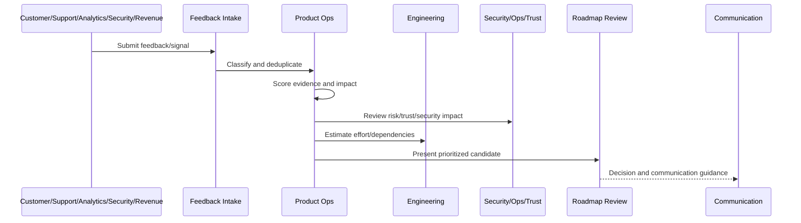
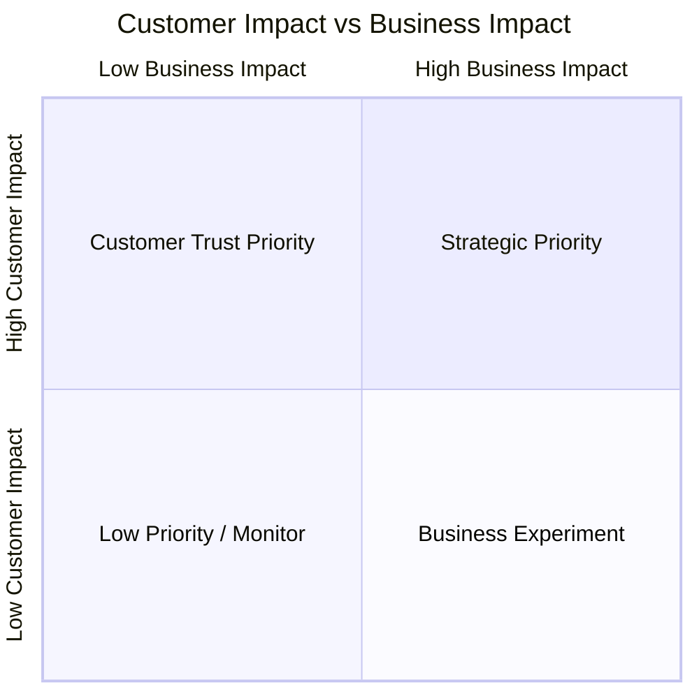

# Customer Impact and Business Impact Scoring

> *"Defines scoring for customer pain, affected segment, workflow criticality, activation/retention impact, revenue impact, churn risk, expansion potential, and support burden."*

---

# Purpose

Defines scoring for customer pain, affected segment, workflow criticality, activation/retention impact, revenue impact, churn risk, expansion potential, and support burden.

---

# Roadmap Operations Problem

A feature can be popular but low impact, or low volume but critical for retention and trust.

---

# Roadmap Operations Decision

## Decision

CLARA should score roadmap candidates by both customer impact and business impact while making assumptions explicit.

## Status

Accepted.

---

# Roadmap Operations Rule

Every CLARA roadmap decision should connect:

```text
Feedback/Signal -> Evidence Score -> Impact Score -> Risk/Trust Score -> Effort/Dependency Review -> Decision -> Owner -> Roadmap/Backlog State -> Communication
```

A roadmap decision is not mature if it cannot answer:

```text
what evidence supports it
what customer segment is affected
what business outcome it supports
what trust/security/reliability risk exists
what trade-off is being made
who owns the decision
what was rejected or deferred
how success will be measured
how stakeholders will be informed
```

---

# Recommended Roadmap Flow



---

# Production-Ready Checklist

- [ ] Feedback source is captured.
- [ ] Feedback category is assigned.
- [ ] Evidence quality is scored.
- [ ] Customer impact is scored.
- [ ] Business impact is scored.
- [ ] Risk/trust impact is scored.
- [ ] Effort/dependencies are reviewed.
- [ ] Decision owner is assigned.
- [ ] Roadmap/backlog state is updated.
- [ ] Communication plan exists where needed.
- [ ] Decision record is created for material decisions.

---

# Acceptance Criteria

- [ ] Feedback is not lost.
- [ ] Roadmap decisions are evidence-backed.
- [ ] Security and reliability work can be prioritized.
- [ ] Backlog stays actionable.
- [ ] Stakeholders understand decisions.
- [ ] AI coding assistants can apply this safely.

---

# Anti-patterns

Avoid:

- Roadmap by loudest voice.
- Sales-only prioritization.
- Engineering-only prioritization.
- Security/reliability always deferred.
- Feedback with no taxonomy.
- Backlog items with no owner.
- Decisions not documented.
- Overpromising roadmap dates.
- Ignoring support themes.
- Roadmap changing weekly without evidence.

---

# Related Documents

- ../PART-01-Product-Operations-Foundation/README.md
- ../PART-03-Support-Operations-and-Knowledge-Loop/README.md
- ../PART-06-Analytics-and-Product-Insights/README.md
- ../../BOOK-05-Engineering-Execution-Plan/
- ../../BOOK-06-Security-Governance-and-Compliance/
- ../../BOOK-07-Operations-Observability-and-Reliability/

---

# Navigation

**Previous:** `76-Roadmap-Prioritization-Framework.md`

**Next:** `78-Risk-and-Trust-Prioritization.md`

---

# Customer Impact Scoring

Score:

```text
number of customers affected
customer segment importance
workflow criticality
pain severity
frequency
time lost
support burden
customer satisfaction impact
retention/churn impact
```

---

# Business Impact Scoring

Score:

```text
activation impact
retention impact
revenue impact
expansion impact
strategic market fit
sales/customer success enablement
cost reduction
support cost reduction
brand/trust impact
```

---

# Impact Matrix



---

# Impact Rule

Customer impact and business impact should both be visible, even when one dominates the decision.
