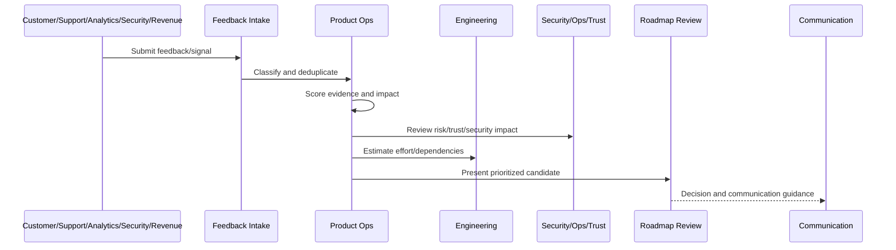

# Product Decision Records

> *"Defines product decision record standards for roadmap decisions, trade-offs, experiments, launches, risk acceptances, and prioritization outcomes."*

---

# Purpose

Defines product decision record standards for roadmap decisions, trade-offs, experiments, launches, risk acceptances, and prioritization outcomes.

---

# Roadmap Operations Problem

Decision memory living only in chat causes repeated debates and inconsistent strategy.

---

# Roadmap Operations Decision

## Decision

CLARA should preserve product decision records so future teams understand why something was prioritized, deferred, changed, or rejected.

## Status

Accepted.

---

# Roadmap Operations Rule

Every CLARA roadmap decision should connect:

```text
Feedback/Signal -> Evidence Score -> Impact Score -> Risk/Trust Score -> Effort/Dependency Review -> Decision -> Owner -> Roadmap/Backlog State -> Communication
```

A roadmap decision is not mature if it cannot answer:

```text
what evidence supports it
what customer segment is affected
what business outcome it supports
what trust/security/reliability risk exists
what trade-off is being made
who owns the decision
what was rejected or deferred
how success will be measured
how stakeholders will be informed
```

---

# Recommended Roadmap Flow



---

# Production-Ready Checklist

- [ ] Feedback source is captured.
- [ ] Feedback category is assigned.
- [ ] Evidence quality is scored.
- [ ] Customer impact is scored.
- [ ] Business impact is scored.
- [ ] Risk/trust impact is scored.
- [ ] Effort/dependencies are reviewed.
- [ ] Decision owner is assigned.
- [ ] Roadmap/backlog state is updated.
- [ ] Communication plan exists where needed.
- [ ] Decision record is created for material decisions.

---

# Acceptance Criteria

- [ ] Feedback is not lost.
- [ ] Roadmap decisions are evidence-backed.
- [ ] Security and reliability work can be prioritized.
- [ ] Backlog stays actionable.
- [ ] Stakeholders understand decisions.
- [ ] AI coding assistants can apply this safely.

---

# Anti-patterns

Avoid:

- Roadmap by loudest voice.
- Sales-only prioritization.
- Engineering-only prioritization.
- Security/reliability always deferred.
- Feedback with no taxonomy.
- Backlog items with no owner.
- Decisions not documented.
- Overpromising roadmap dates.
- Ignoring support themes.
- Roadmap changing weekly without evidence.

---

# Related Documents

- ../PART-01-Product-Operations-Foundation/README.md
- ../PART-03-Support-Operations-and-Knowledge-Loop/README.md
- ../PART-06-Analytics-and-Product-Insights/README.md
- ../../BOOK-05-Engineering-Execution-Plan/
- ../../BOOK-06-Security-Governance-and-Compliance/
- ../../BOOK-07-Operations-Observability-and-Reliability/

---

# Navigation

**Previous:** `79-Roadmap-Planning-Cadence.md`

**Next:** `81-Backlog-Hygiene-and-Lifecycle.md`

---

# Product Decision Record Template

```markdown
# Product Decision Record

Decision:
Date:
Owner:
Context:
Evidence:
Options considered:
Customer impact:
Business impact:
Risk/trust impact:
Decision:
Trade-offs:
What is deferred:
Success metric:
Review date:
```

---

# When to Create PDR

Create PDR for:

```text
major roadmap priority
pricing/package decision
security risk acceptance
AI automation expansion
customer-facing workflow change
large technical debt deferral
launch scope change
feature cancellation
```

---

# PDR States

Use:

```text
draft
accepted
superseded
rejected
under_review
```

---

# Decision Record Rule

If the decision will be debated again later, write it down now.
