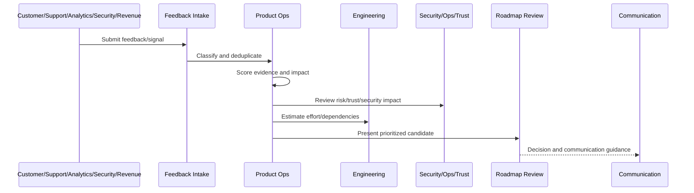

# Roadmap Anti-Patterns

> *"Defines roadmap anti-patterns such as loudest-customer roadmap, sales-driven thrash, hidden risk debt, endless backlog, no decision records, and overcommitment."*

---

# Purpose

Defines roadmap anti-patterns such as loudest-customer roadmap, sales-driven thrash, hidden risk debt, endless backlog, no decision records, and overcommitment.

---

# Roadmap Operations Problem

A roadmap can look busy while failing to move the product toward strategic value.

---

# Roadmap Operations Decision

## Decision

CLARA should actively avoid roadmap anti-patterns that weaken focus, trust, delivery quality, and long-term product health.

## Status

Accepted.

---

# Roadmap Operations Rule

Every CLARA roadmap decision should connect:

```text
Feedback/Signal -> Evidence Score -> Impact Score -> Risk/Trust Score -> Effort/Dependency Review -> Decision -> Owner -> Roadmap/Backlog State -> Communication
```

A roadmap decision is not mature if it cannot answer:

```text
what evidence supports it
what customer segment is affected
what business outcome it supports
what trust/security/reliability risk exists
what trade-off is being made
who owns the decision
what was rejected or deferred
how success will be measured
how stakeholders will be informed
```

---

# Recommended Roadmap Flow



---

# Production-Ready Checklist

- [ ] Feedback source is captured.
- [ ] Feedback category is assigned.
- [ ] Evidence quality is scored.
- [ ] Customer impact is scored.
- [ ] Business impact is scored.
- [ ] Risk/trust impact is scored.
- [ ] Effort/dependencies are reviewed.
- [ ] Decision owner is assigned.
- [ ] Roadmap/backlog state is updated.
- [ ] Communication plan exists where needed.
- [ ] Decision record is created for material decisions.

---

# Acceptance Criteria

- [ ] Feedback is not lost.
- [ ] Roadmap decisions are evidence-backed.
- [ ] Security and reliability work can be prioritized.
- [ ] Backlog stays actionable.
- [ ] Stakeholders understand decisions.
- [ ] AI coding assistants can apply this safely.

---

# Anti-patterns

Avoid:

- Roadmap by loudest voice.
- Sales-only prioritization.
- Engineering-only prioritization.
- Security/reliability always deferred.
- Feedback with no taxonomy.
- Backlog items with no owner.
- Decisions not documented.
- Overpromising roadmap dates.
- Ignoring support themes.
- Roadmap changing weekly without evidence.

---

# Related Documents

- ../PART-01-Product-Operations-Foundation/README.md
- ../PART-03-Support-Operations-and-Knowledge-Loop/README.md
- ../PART-06-Analytics-and-Product-Insights/README.md
- ../../BOOK-05-Engineering-Execution-Plan/
- ../../BOOK-06-Security-Governance-and-Compliance/
- ../../BOOK-07-Operations-Observability-and-Reliability/

---

# Navigation

**Previous:** `82-Roadmap-Communication.md`

**Next:** `84-Part-07-Summary.md`

---

# Roadmap Anti-Patterns

Avoid:

```text
loudest customer wins
sales-driven thrash
executive pet projects without evidence
security/reliability debt always deferred
roadmap as fixed promise calendar
backlog graveyard
no product decision records
priority changes with no explanation
overcommitted roadmap
teams working from different roadmap versions
```

---

# Warning Signs

Watch for:

```text
same decision re-litigated often
support themes ignored
features shipped but metrics do not move
security findings age without owner
many planned items with no capacity
customers hear different roadmap stories
```

---

# Recovery Actions

```text
reset roadmap with evidence review
create prioritization framework
assign owners
archive stale backlog
write decision records
publish confidence levels
include trust/risk work in roadmap
review support/analytics themes
```

---

# Anti-Pattern Rule

A roadmap that cannot say “no” cannot focus.
