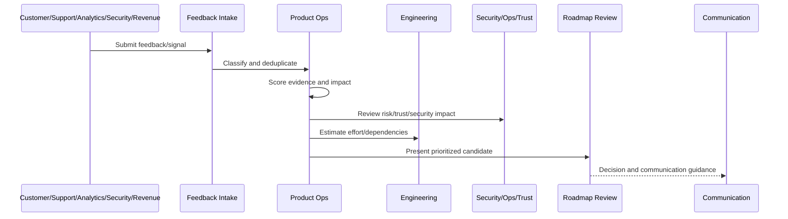

# Part 07 Summary

> *"Summarizes Feedback Prioritization and Roadmap Operations and prepares for Book IX Part 08."*

---

# Purpose

Summarizes Feedback Prioritization and Roadmap Operations and prepares for Book IX Part 08.

---

# Roadmap Operations Problem

Continuous Security and Compliance Operations comes next because roadmap decisions must continuously include trust, security, privacy, and compliance obligations.

---

# Roadmap Operations Decision

## Decision

CLARA should proceed to Continuous Security and Compliance Operations after defining feedback intake, evidence scoring, roadmap prioritization, customer/business scoring, risk/trust prioritization, planning cadence, decision records, backlog hygiene, communication, and anti-patterns.

## Status

Accepted.

---

# Roadmap Operations Rule

Every CLARA roadmap decision should connect:

```text
Feedback/Signal -> Evidence Score -> Impact Score -> Risk/Trust Score -> Effort/Dependency Review -> Decision -> Owner -> Roadmap/Backlog State -> Communication
```

A roadmap decision is not mature if it cannot answer:

```text
what evidence supports it
what customer segment is affected
what business outcome it supports
what trust/security/reliability risk exists
what trade-off is being made
who owns the decision
what was rejected or deferred
how success will be measured
how stakeholders will be informed
```

---

# Recommended Roadmap Flow



---

# Production-Ready Checklist

- [ ] Feedback source is captured.
- [ ] Feedback category is assigned.
- [ ] Evidence quality is scored.
- [ ] Customer impact is scored.
- [ ] Business impact is scored.
- [ ] Risk/trust impact is scored.
- [ ] Effort/dependencies are reviewed.
- [ ] Decision owner is assigned.
- [ ] Roadmap/backlog state is updated.
- [ ] Communication plan exists where needed.
- [ ] Decision record is created for material decisions.

---

# Acceptance Criteria

- [ ] Feedback is not lost.
- [ ] Roadmap decisions are evidence-backed.
- [ ] Security and reliability work can be prioritized.
- [ ] Backlog stays actionable.
- [ ] Stakeholders understand decisions.
- [ ] AI coding assistants can apply this safely.

---

# Anti-patterns

Avoid:

- Roadmap by loudest voice.
- Sales-only prioritization.
- Engineering-only prioritization.
- Security/reliability always deferred.
- Feedback with no taxonomy.
- Backlog items with no owner.
- Decisions not documented.
- Overpromising roadmap dates.
- Ignoring support themes.
- Roadmap changing weekly without evidence.

---

# Related Documents

- ../PART-01-Product-Operations-Foundation/README.md
- ../PART-03-Support-Operations-and-Knowledge-Loop/README.md
- ../PART-06-Analytics-and-Product-Insights/README.md
- ../../BOOK-05-Engineering-Execution-Plan/
- ../../BOOK-06-Security-Governance-and-Compliance/
- ../../BOOK-07-Operations-Observability-and-Reliability/

---

# Navigation

**Previous:** `83-Roadmap-Anti-Patterns.md`

**Next:** `../PART-08-Continuous-Security-and-Compliance-Operations/README.md`

---

# Part 07 Completion

Part 07 establishes:

- Feedback prioritization and roadmap operations overview.
- Feedback intake taxonomy.
- Evidence scoring model.
- Roadmap prioritization framework.
- Customer impact and business impact scoring.
- Risk and trust prioritization.
- Roadmap planning cadence.
- Product decision records.
- Backlog hygiene and lifecycle.
- Roadmap communication.
- Roadmap anti-patterns.

---

# Ready for Part 08

The next part should be:

```text
BOOK IX — PART 08: Continuous Security and Compliance Operations
```

It should define:

- Continuous security/compliance overview.
- Product security feedback loop.
- Continuous access review.
- Vulnerability and patch review cadence.
- Privacy and data handling review.
- Compliance evidence operations.
- Security customer communication.
- Security roadmap prioritization.
- Trust center/content operations.
- Security/compliance metrics.
- Security/compliance anti-patterns.
- Part 08 summary.
