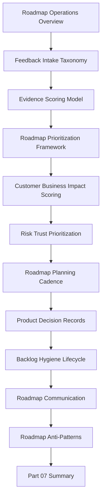

# PART-07 — Feedback Prioritization and Roadmap Operations

> *"A roadmap is not a wishlist. A roadmap is an evidence-backed sequence of product bets, risk reductions, and customer value decisions."*

---

# Purpose

Part 07 defines CLARA's feedback prioritization and roadmap operations standards.

It covers:

- Feedback Prioritization and Roadmap Operations Overview.
- Feedback Intake Taxonomy.
- Evidence Scoring Model.
- Roadmap Prioritization Framework.
- Customer Impact and Business Impact Scoring.
- Risk and Trust Prioritization.
- Roadmap Planning Cadence.
- Product Decision Records.
- Backlog Hygiene and Lifecycle.
- Roadmap Communication.
- Roadmap Anti-Patterns.
- Part 07 Summary.

---

# Chapter Map

| Chapter | Title |
|---:|---|
| 73 | Feedback Prioritization and Roadmap Operations Overview |
| 74 | Feedback Intake Taxonomy |
| 75 | Evidence Scoring Model |
| 76 | Roadmap Prioritization Framework |
| 77 | Customer Impact and Business Impact Scoring |
| 78 | Risk and Trust Prioritization |
| 79 | Roadmap Planning Cadence |
| 80 | Product Decision Records |
| 81 | Backlog Hygiene and Lifecycle |
| 82 | Roadmap Communication |
| 83 | Roadmap Anti-Patterns |
| 84 | Part 07 Summary |

---

# Roadmap Operations Map



---

# Roadmap Operations Non-Negotiables

CLARA roadmap operations must enforce:

```text
central feedback intake
feedback taxonomy
evidence scoring
customer impact scoring
business impact scoring
risk and trust scoring
roadmap prioritization framework
decision ownership
product decision records
backlog hygiene
roadmap review cadence
clear internal communication
careful external communication
no unowned roadmap promises
```

---

# Relationship to Previous Part

Part 06 defines analytics and product insights.

Part 07 turns analytics, feedback, support themes, and risk signals into roadmap and backlog decisions.

---

# Navigation

**Previous:** `../PART-06-Analytics-and-Product-Insights/72-Part-06-Summary.md`

**Next:** `73-Feedback-Prioritization-and-Roadmap-Operations-Overview.md`
