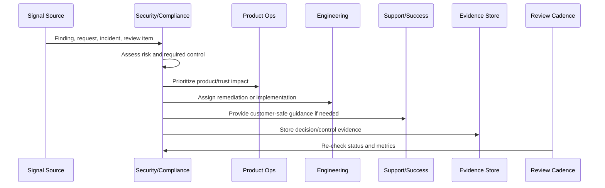
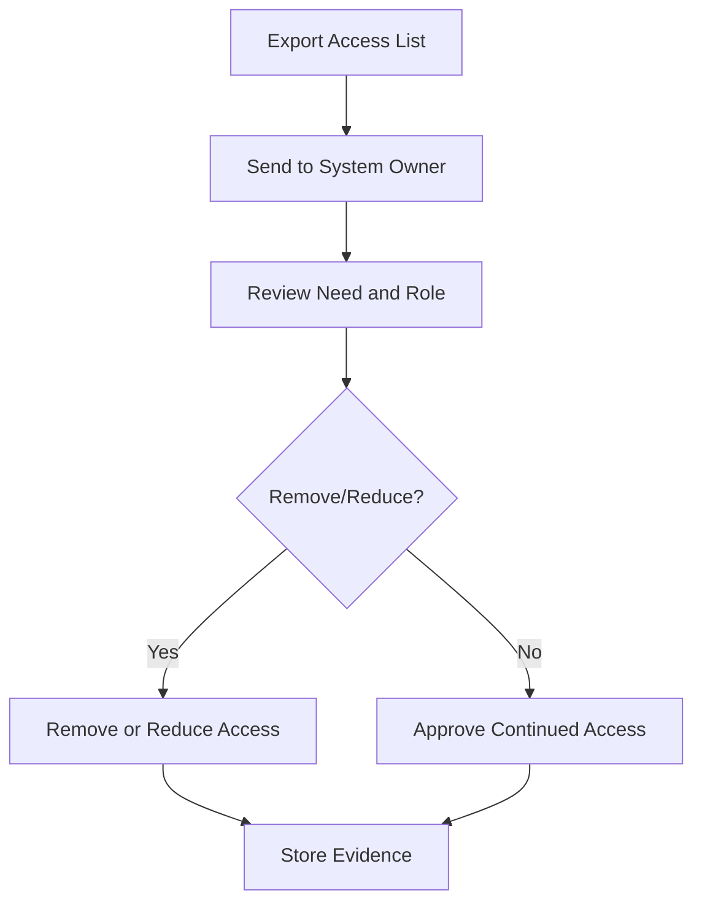

# Continuous Access Review

> *"Defines recurring access review for production systems, admin tooling, customer data, support access, billing systems, AI tooling, cloud resources, and third-party providers."*

---

# Purpose

Defines recurring access review for production systems, admin tooling, customer data, support access, billing systems, AI tooling, cloud resources, and third-party providers.

---

# Security and Compliance Problem

Access creep is one of the most common long-term security risks after launch.

---

# Security and Compliance Decision

## Decision

CLARA should review access continuously using least privilege, role ownership, approval evidence, audit trails, and removal workflows.

## Status

Accepted.

---

# Continuous Trust Rule

Every CLARA security/compliance operation should connect:

```text
Signal -> Risk Assessment -> Control/Action -> Owner -> Evidence -> Review Cadence -> Product/Roadmap Feedback
```

A security or compliance operation is not mature if it cannot answer:

```text
what trust risk exists
what control addresses it
who owns the control
how often it is reviewed
where evidence is stored
what exception exists, if any
what customer/product impact exists
what roadmap or support follow-up is needed
```

---

# Recommended Continuous Trust Flow



---

# Production-Ready Checklist

- [ ] Security signal is captured.
- [ ] Risk is assessed.
- [ ] Owner is assigned.
- [ ] Remediation or control is defined.
- [ ] Evidence location is defined.
- [ ] Review cadence exists.
- [ ] Customer communication path is known.
- [ ] Roadmap/backlog link exists where needed.
- [ ] Exception is documented if accepted.
- [ ] Metrics track control health.

---

# Acceptance Criteria

- [ ] Security and compliance are continuous operations.
- [ ] Access is reviewed.
- [ ] Vulnerabilities are triaged.
- [ ] Privacy/data changes are reviewed.
- [ ] Evidence is audit-ready.
- [ ] Trust content is current.
- [ ] Security work feeds roadmap.
- [ ] AI coding assistants can apply this safely.

---

# Anti-patterns

Avoid:

- Checkbox compliance.
- Security work only before launch.
- Access reviews with no removal action.
- Stale vulnerability exceptions.
- Privacy review skipped for analytics or AI changes.
- Evidence reconstructed during audit.
- Trust center content not maintained.
- Customer security questions answered from memory.
- Security roadmap always deferred.
- Secrets in code, logs, tickets, or documentation.

---

# Related Documents

- ../PART-07-Feedback-Prioritization-and-Roadmap-Operations/README.md
- ../../BOOK-06-Security-Governance-and-Compliance/
- ../../BOOK-07-Operations-Observability-and-Reliability/
- ../../BOOK-08-Implementation-Delivery-and-Production-Launch/
- ../PART-06-Analytics-and-Product-Insights/README.md

---

# Navigation

**Previous:** `86-Product-Security-Feedback-Loop.md`

**Next:** `88-Vulnerability-and-Patch-Review-Cadence.md`

---

# Access Review Scope

Review access to:

```text
production infrastructure
databases
admin dashboards
support tooling
billing systems
AI provider/admin tooling
cloud provider accounts
CI/CD secrets
analytics tools
logs/observability systems
third-party integrations
```

---

# Review Checklist

- [ ] User still needs access.
- [ ] Role matches job responsibility.
- [ ] Privilege level is least-privilege.
- [ ] Access has owner/approver.
- [ ] Dormant accounts are removed.
- [ ] Contractor/vendor access is time-bound.
- [ ] Break-glass access is reviewed.
- [ ] Privileged actions are logged.

---

# Access Review Flow



---

# Access Rule

Access should expire or be reviewed. Permanent access should still have recurring justification.
