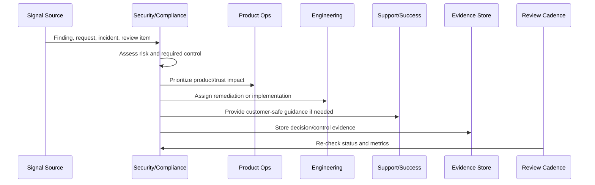
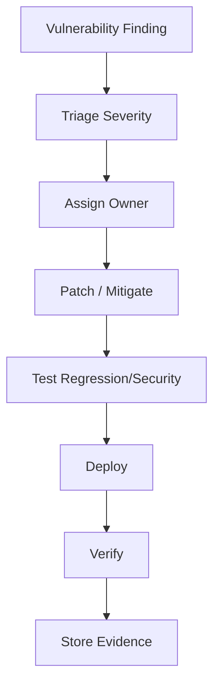

# Vulnerability and Patch Review Cadence

> *"Defines recurring vulnerability management, dependency review, patch prioritization, remediation ownership, exception handling, and evidence collection."*

---

# Purpose

Defines recurring vulnerability management, dependency review, patch prioritization, remediation ownership, exception handling, and evidence collection.

---

# Security and Compliance Problem

Unpatched vulnerabilities accumulate silently when there is no recurring owner or cadence.

---

# Security and Compliance Decision

## Decision

CLARA vulnerability and patch operations should run on a predictable cadence with severity-based remediation and documented risk exceptions.

## Status

Accepted.

---

# Continuous Trust Rule

Every CLARA security/compliance operation should connect:

```text
Signal -> Risk Assessment -> Control/Action -> Owner -> Evidence -> Review Cadence -> Product/Roadmap Feedback
```

A security or compliance operation is not mature if it cannot answer:

```text
what trust risk exists
what control addresses it
who owns the control
how often it is reviewed
where evidence is stored
what exception exists, if any
what customer/product impact exists
what roadmap or support follow-up is needed
```

---

# Recommended Continuous Trust Flow



---

# Production-Ready Checklist

- [ ] Security signal is captured.
- [ ] Risk is assessed.
- [ ] Owner is assigned.
- [ ] Remediation or control is defined.
- [ ] Evidence location is defined.
- [ ] Review cadence exists.
- [ ] Customer communication path is known.
- [ ] Roadmap/backlog link exists where needed.
- [ ] Exception is documented if accepted.
- [ ] Metrics track control health.

---

# Acceptance Criteria

- [ ] Security and compliance are continuous operations.
- [ ] Access is reviewed.
- [ ] Vulnerabilities are triaged.
- [ ] Privacy/data changes are reviewed.
- [ ] Evidence is audit-ready.
- [ ] Trust content is current.
- [ ] Security work feeds roadmap.
- [ ] AI coding assistants can apply this safely.

---

# Anti-patterns

Avoid:

- Checkbox compliance.
- Security work only before launch.
- Access reviews with no removal action.
- Stale vulnerability exceptions.
- Privacy review skipped for analytics or AI changes.
- Evidence reconstructed during audit.
- Trust center content not maintained.
- Customer security questions answered from memory.
- Security roadmap always deferred.
- Secrets in code, logs, tickets, or documentation.

---

# Related Documents

- ../PART-07-Feedback-Prioritization-and-Roadmap-Operations/README.md
- ../../BOOK-06-Security-Governance-and-Compliance/
- ../../BOOK-07-Operations-Observability-and-Reliability/
- ../../BOOK-08-Implementation-Delivery-and-Production-Launch/
- ../PART-06-Analytics-and-Product-Insights/README.md

---

# Navigation

**Previous:** `87-Continuous-Access-Review.md`

**Next:** `89-Privacy-and-Data-Handling-Review.md`

---

# Vulnerability Inputs

Use:

```text
dependency scan
container scan
SAST
DAST
cloud posture scan
manual penetration test finding
bug bounty/security report
provider advisory
incident root cause
```

---

# Remediation Targets

Example targets:

```text
critical: urgent remediation or explicit exception
high: prioritized remediation
medium: scheduled remediation
low: backlog or risk-accepted with review
```

Exact timelines should be defined by CLARA policy and customer/compliance commitments.

---

# Patch Workflow



---

# Vulnerability Rule

A vulnerability exception must have owner, reason, expiration date, compensating control, and review date.
