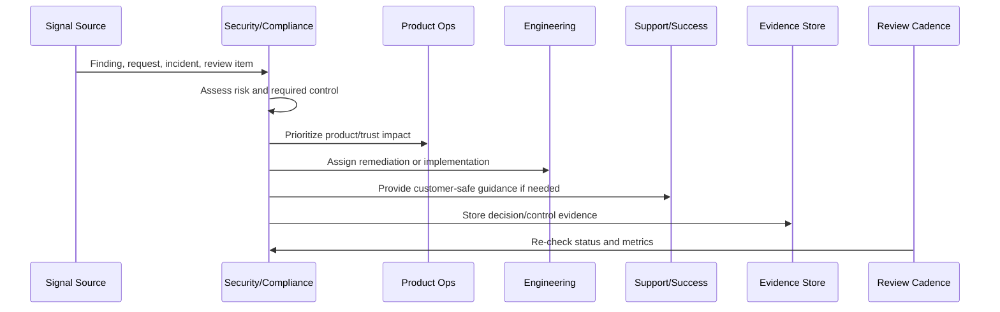
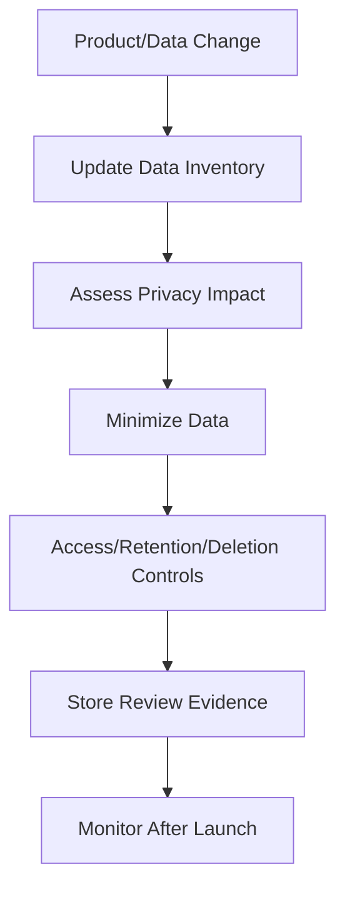

# Privacy and Data Handling Review

> *"Defines privacy review for data collection, retention, deletion, exports, analytics events, AI processing, support troubleshooting, and third-party data sharing."*

---

# Purpose

Defines privacy review for data collection, retention, deletion, exports, analytics events, AI processing, support troubleshooting, and third-party data sharing.

---

# Security and Compliance Problem

Product teams can accidentally collect, expose, retain, or process data beyond the original privacy expectation.

---

# Security and Compliance Decision

## Decision

CLARA should review data handling continuously so product changes do not silently expand privacy risk.

## Status

Accepted.

---

# Continuous Trust Rule

Every CLARA security/compliance operation should connect:

```text
Signal -> Risk Assessment -> Control/Action -> Owner -> Evidence -> Review Cadence -> Product/Roadmap Feedback
```

A security or compliance operation is not mature if it cannot answer:

```text
what trust risk exists
what control addresses it
who owns the control
how often it is reviewed
where evidence is stored
what exception exists, if any
what customer/product impact exists
what roadmap or support follow-up is needed
```

---

# Recommended Continuous Trust Flow



---

# Production-Ready Checklist

- [ ] Security signal is captured.
- [ ] Risk is assessed.
- [ ] Owner is assigned.
- [ ] Remediation or control is defined.
- [ ] Evidence location is defined.
- [ ] Review cadence exists.
- [ ] Customer communication path is known.
- [ ] Roadmap/backlog link exists where needed.
- [ ] Exception is documented if accepted.
- [ ] Metrics track control health.

---

# Acceptance Criteria

- [ ] Security and compliance are continuous operations.
- [ ] Access is reviewed.
- [ ] Vulnerabilities are triaged.
- [ ] Privacy/data changes are reviewed.
- [ ] Evidence is audit-ready.
- [ ] Trust content is current.
- [ ] Security work feeds roadmap.
- [ ] AI coding assistants can apply this safely.

---

# Anti-patterns

Avoid:

- Checkbox compliance.
- Security work only before launch.
- Access reviews with no removal action.
- Stale vulnerability exceptions.
- Privacy review skipped for analytics or AI changes.
- Evidence reconstructed during audit.
- Trust center content not maintained.
- Customer security questions answered from memory.
- Security roadmap always deferred.
- Secrets in code, logs, tickets, or documentation.

---

# Related Documents

- ../PART-07-Feedback-Prioritization-and-Roadmap-Operations/README.md
- ../../BOOK-06-Security-Governance-and-Compliance/
- ../../BOOK-07-Operations-Observability-and-Reliability/
- ../../BOOK-08-Implementation-Delivery-and-Production-Launch/
- ../PART-06-Analytics-and-Product-Insights/README.md

---

# Navigation

**Previous:** `88-Vulnerability-and-Patch-Review-Cadence.md`

**Next:** `90-Compliance-Evidence-Operations.md`

---

# Privacy Review Scope

Review changes involving:

```text
new analytics event
new AI processing
new data retention behavior
new export/import feature
new integration/provider
support access to customer data
billing/customer data usage
logs containing customer data
data deletion/retention workflow
```

---

# Data Handling Questions

Ask:

```text
what data is collected
why it is needed
where it is stored
who can access it
how long it is retained
how deletion works
whether AI/provider processing occurs
whether customer consent/notice is needed
whether data is logged or exported
```

---

# Privacy Review Flow



---

# Privacy Rule

Do not collect data because it might be useful someday. Collect only what is justified, protected, and governed.
