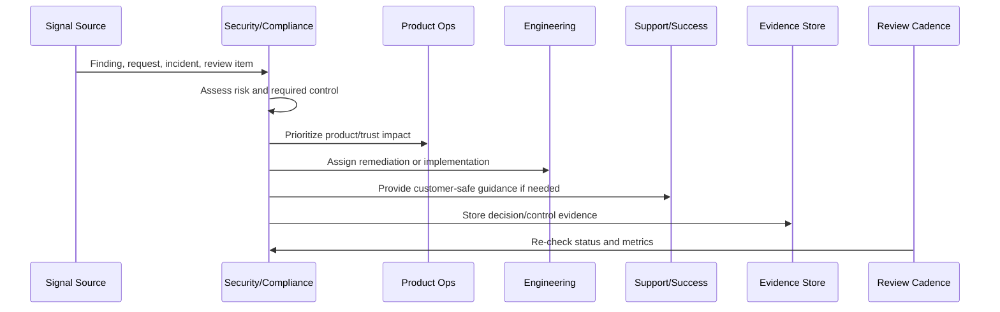

# Security Customer Communication

> *"Defines customer communication for security questions, privacy questions, incidents, trust updates, vulnerability disclosure, data handling inquiries, and compliance requests."*

---

# Purpose

Defines customer communication for security questions, privacy questions, incidents, trust updates, vulnerability disclosure, data handling inquiries, and compliance requests.

---

# Security and Compliance Problem

Security communication mistakes can create legal, reputational, and customer trust damage.

---

# Security and Compliance Decision

## Decision

CLARA security communication should be accurate, timely, approved, privacy-safe, and aligned with legal/compliance/security owners.

## Status

Accepted.

---

# Continuous Trust Rule

Every CLARA security/compliance operation should connect:

```text
Signal -> Risk Assessment -> Control/Action -> Owner -> Evidence -> Review Cadence -> Product/Roadmap Feedback
```

A security or compliance operation is not mature if it cannot answer:

```text
what trust risk exists
what control addresses it
who owns the control
how often it is reviewed
where evidence is stored
what exception exists, if any
what customer/product impact exists
what roadmap or support follow-up is needed
```

---

# Recommended Continuous Trust Flow



---

# Production-Ready Checklist

- [ ] Security signal is captured.
- [ ] Risk is assessed.
- [ ] Owner is assigned.
- [ ] Remediation or control is defined.
- [ ] Evidence location is defined.
- [ ] Review cadence exists.
- [ ] Customer communication path is known.
- [ ] Roadmap/backlog link exists where needed.
- [ ] Exception is documented if accepted.
- [ ] Metrics track control health.

---

# Acceptance Criteria

- [ ] Security and compliance are continuous operations.
- [ ] Access is reviewed.
- [ ] Vulnerabilities are triaged.
- [ ] Privacy/data changes are reviewed.
- [ ] Evidence is audit-ready.
- [ ] Trust content is current.
- [ ] Security work feeds roadmap.
- [ ] AI coding assistants can apply this safely.

---

# Anti-patterns

Avoid:

- Checkbox compliance.
- Security work only before launch.
- Access reviews with no removal action.
- Stale vulnerability exceptions.
- Privacy review skipped for analytics or AI changes.
- Evidence reconstructed during audit.
- Trust center content not maintained.
- Customer security questions answered from memory.
- Security roadmap always deferred.
- Secrets in code, logs, tickets, or documentation.

---

# Related Documents

- ../PART-07-Feedback-Prioritization-and-Roadmap-Operations/README.md
- ../../BOOK-06-Security-Governance-and-Compliance/
- ../../BOOK-07-Operations-Observability-and-Reliability/
- ../../BOOK-08-Implementation-Delivery-and-Production-Launch/
- ../PART-06-Analytics-and-Product-Insights/README.md

---

# Navigation

**Previous:** `90-Compliance-Evidence-Operations.md`

**Next:** `92-Security-Roadmap-Prioritization.md`

---

# Communication Types

Security communication may include:

```text
customer security questionnaire
privacy/data handling response
incident notification
vulnerability disclosure response
trust center update
subprocessor update
compliance documentation request
security feature explanation
```

---

# Approval Requirements

Sensitive communication should be reviewed by:

```text
security owner
privacy/legal owner where relevant
product owner
support/customer success owner
leadership for high-impact incidents
```

---

# Customer-Safe Communication Checklist

- [ ] Factual.
- [ ] No speculation.
- [ ] No unrelated customer data.
- [ ] Clear impact statement.
- [ ] Clear remediation/status.
- [ ] Approved wording for sensitive topics.
- [ ] Next update or contact path.
- [ ] Evidence stored.

---

# Communication Rule

Security communication should reduce uncertainty without exposing unnecessary detail or creating accidental commitments.
