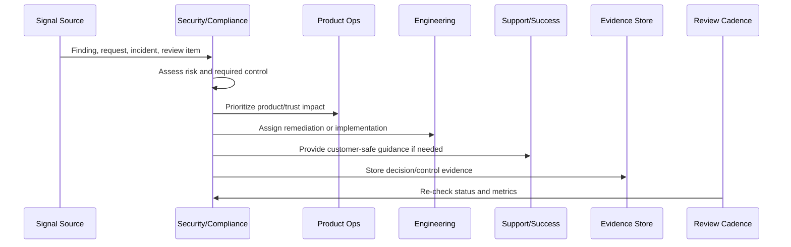
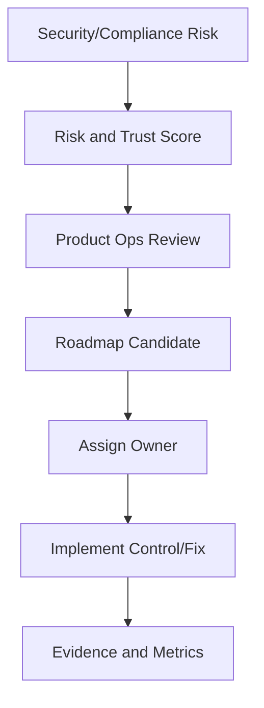

# Security Roadmap Prioritization

> *"Defines how security, privacy, compliance, reliability, AI safety, data integrity, and trust-center work are prioritized in the product roadmap."*

---

# Purpose

Defines how security, privacy, compliance, reliability, AI safety, data integrity, and trust-center work are prioritized in the product roadmap.

---

# Security and Compliance Problem

Security roadmap work is often deferred until incidents force emergency remediation.

---

# Security and Compliance Decision

## Decision

CLARA should treat security and compliance roadmap work as customer value and trust preservation, not as optional cleanup.

## Status

Accepted.

---

# Continuous Trust Rule

Every CLARA security/compliance operation should connect:

```text
Signal -> Risk Assessment -> Control/Action -> Owner -> Evidence -> Review Cadence -> Product/Roadmap Feedback
```

A security or compliance operation is not mature if it cannot answer:

```text
what trust risk exists
what control addresses it
who owns the control
how often it is reviewed
where evidence is stored
what exception exists, if any
what customer/product impact exists
what roadmap or support follow-up is needed
```

---

# Recommended Continuous Trust Flow



---

# Production-Ready Checklist

- [ ] Security signal is captured.
- [ ] Risk is assessed.
- [ ] Owner is assigned.
- [ ] Remediation or control is defined.
- [ ] Evidence location is defined.
- [ ] Review cadence exists.
- [ ] Customer communication path is known.
- [ ] Roadmap/backlog link exists where needed.
- [ ] Exception is documented if accepted.
- [ ] Metrics track control health.

---

# Acceptance Criteria

- [ ] Security and compliance are continuous operations.
- [ ] Access is reviewed.
- [ ] Vulnerabilities are triaged.
- [ ] Privacy/data changes are reviewed.
- [ ] Evidence is audit-ready.
- [ ] Trust content is current.
- [ ] Security work feeds roadmap.
- [ ] AI coding assistants can apply this safely.

---

# Anti-patterns

Avoid:

- Checkbox compliance.
- Security work only before launch.
- Access reviews with no removal action.
- Stale vulnerability exceptions.
- Privacy review skipped for analytics or AI changes.
- Evidence reconstructed during audit.
- Trust center content not maintained.
- Customer security questions answered from memory.
- Security roadmap always deferred.
- Secrets in code, logs, tickets, or documentation.

---

# Related Documents

- ../PART-07-Feedback-Prioritization-and-Roadmap-Operations/README.md
- ../../BOOK-06-Security-Governance-and-Compliance/
- ../../BOOK-07-Operations-Observability-and-Reliability/
- ../../BOOK-08-Implementation-Delivery-and-Production-Launch/
- ../PART-06-Analytics-and-Product-Insights/README.md

---

# Navigation

**Previous:** `91-Security-Customer-Communication.md`

**Next:** `93-Trust-Center-and-Security-Content-Operations.md`

---

# Security Roadmap Inputs

Prioritize from:

```text
security findings
privacy review outcomes
compliance gaps
incident root causes
customer security requests
trust center gaps
vulnerability trends
access review issues
AI safety risks
integration security gaps
billing/access disputes
```

---

# Priority Dimensions

Score:

```text
risk severity
customer trust impact
compliance impact
exploitability
affected customer scope
revenue/sales blocker impact
engineering effort
dependency complexity
control maturity improvement
```

---

# Roadmap Flow



---

# Roadmap Rule

Security work must compete as product trust work, not disappear as invisible technical debt.
