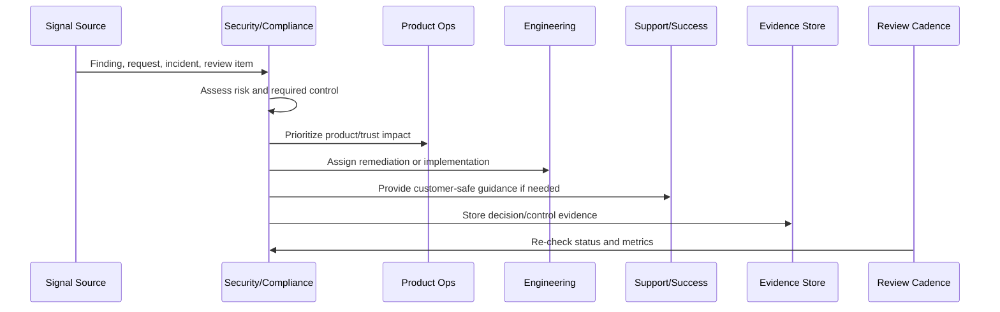
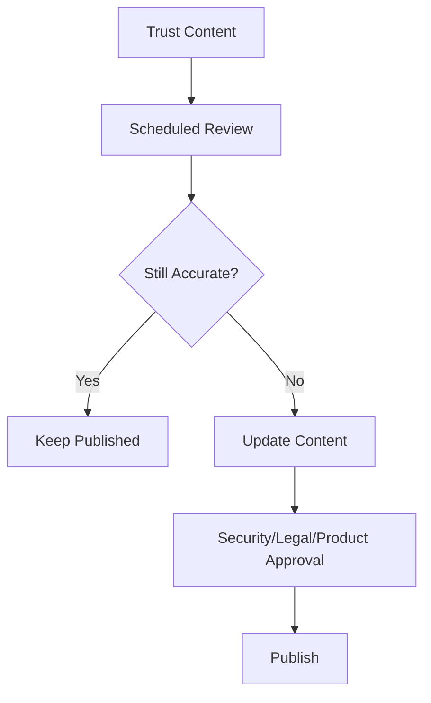

# Trust Center and Security Content Operations

> *"Defines trust center content, security FAQs, compliance documentation, subprocessors, data handling notes, vulnerability disclosure content, and review cadence."*

---

# Purpose

Defines trust center content, security FAQs, compliance documentation, subprocessors, data handling notes, vulnerability disclosure content, and review cadence.

---

# Security and Compliance Problem

Outdated trust content can mislead customers and weaken sales/support/security confidence.

---

# Security and Compliance Decision

## Decision

CLARA trust content should be accurate, current, customer-facing, and owned by security/compliance/product operations.

## Status

Accepted.

---

# Continuous Trust Rule

Every CLARA security/compliance operation should connect:

```text
Signal -> Risk Assessment -> Control/Action -> Owner -> Evidence -> Review Cadence -> Product/Roadmap Feedback
```

A security or compliance operation is not mature if it cannot answer:

```text
what trust risk exists
what control addresses it
who owns the control
how often it is reviewed
where evidence is stored
what exception exists, if any
what customer/product impact exists
what roadmap or support follow-up is needed
```

---

# Recommended Continuous Trust Flow



---

# Production-Ready Checklist

- [ ] Security signal is captured.
- [ ] Risk is assessed.
- [ ] Owner is assigned.
- [ ] Remediation or control is defined.
- [ ] Evidence location is defined.
- [ ] Review cadence exists.
- [ ] Customer communication path is known.
- [ ] Roadmap/backlog link exists where needed.
- [ ] Exception is documented if accepted.
- [ ] Metrics track control health.

---

# Acceptance Criteria

- [ ] Security and compliance are continuous operations.
- [ ] Access is reviewed.
- [ ] Vulnerabilities are triaged.
- [ ] Privacy/data changes are reviewed.
- [ ] Evidence is audit-ready.
- [ ] Trust content is current.
- [ ] Security work feeds roadmap.
- [ ] AI coding assistants can apply this safely.

---

# Anti-patterns

Avoid:

- Checkbox compliance.
- Security work only before launch.
- Access reviews with no removal action.
- Stale vulnerability exceptions.
- Privacy review skipped for analytics or AI changes.
- Evidence reconstructed during audit.
- Trust center content not maintained.
- Customer security questions answered from memory.
- Security roadmap always deferred.
- Secrets in code, logs, tickets, or documentation.

---

# Related Documents

- ../PART-07-Feedback-Prioritization-and-Roadmap-Operations/README.md
- ../../BOOK-06-Security-Governance-and-Compliance/
- ../../BOOK-07-Operations-Observability-and-Reliability/
- ../../BOOK-08-Implementation-Delivery-and-Production-Launch/
- ../PART-06-Analytics-and-Product-Insights/README.md

---

# Navigation

**Previous:** `92-Security-Roadmap-Prioritization.md`

**Next:** `94-Security-and-Compliance-Metrics.md`

---

# Trust Center Content

Maintain:

```text
security overview
privacy overview
data processing notes
subprocessor list
compliance documents
vulnerability disclosure policy
incident communication policy
availability/reliability overview
AI/data handling explanation
contact path for security requests
```

---

# Content Ownership

Each trust content item should define:

```text
owner
reviewer
source of truth
last reviewed date
review cadence
customer-facing status
approval requirement
```

---

# Trust Content Review Flow



---

# Trust Center Rule

Customer-facing trust content must never drift away from actual implementation and operations.
