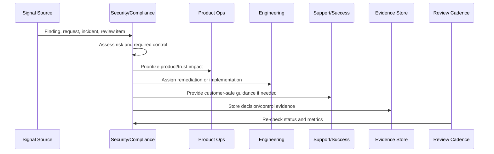

# Security and Compliance Anti-Patterns

> *"Defines anti-patterns such as checkbox compliance, stale access, undocumented exceptions, hidden data collection, security work always deferred, and trust content drift."*

---

# Purpose

Defines anti-patterns such as checkbox compliance, stale access, undocumented exceptions, hidden data collection, security work always deferred, and trust content drift.

---

# Security and Compliance Problem

Security and compliance anti-patterns usually look harmless until audit, incident, or customer review exposes them.

---

# Security and Compliance Decision

## Decision

CLARA should actively avoid security and compliance anti-patterns that create silent trust debt.

## Status

Accepted.

---

# Continuous Trust Rule

Every CLARA security/compliance operation should connect:

```text
Signal -> Risk Assessment -> Control/Action -> Owner -> Evidence -> Review Cadence -> Product/Roadmap Feedback
```

A security or compliance operation is not mature if it cannot answer:

```text
what trust risk exists
what control addresses it
who owns the control
how often it is reviewed
where evidence is stored
what exception exists, if any
what customer/product impact exists
what roadmap or support follow-up is needed
```

---

# Recommended Continuous Trust Flow



---

# Production-Ready Checklist

- [ ] Security signal is captured.
- [ ] Risk is assessed.
- [ ] Owner is assigned.
- [ ] Remediation or control is defined.
- [ ] Evidence location is defined.
- [ ] Review cadence exists.
- [ ] Customer communication path is known.
- [ ] Roadmap/backlog link exists where needed.
- [ ] Exception is documented if accepted.
- [ ] Metrics track control health.

---

# Acceptance Criteria

- [ ] Security and compliance are continuous operations.
- [ ] Access is reviewed.
- [ ] Vulnerabilities are triaged.
- [ ] Privacy/data changes are reviewed.
- [ ] Evidence is audit-ready.
- [ ] Trust content is current.
- [ ] Security work feeds roadmap.
- [ ] AI coding assistants can apply this safely.

---

# Anti-patterns

Avoid:

- Checkbox compliance.
- Security work only before launch.
- Access reviews with no removal action.
- Stale vulnerability exceptions.
- Privacy review skipped for analytics or AI changes.
- Evidence reconstructed during audit.
- Trust center content not maintained.
- Customer security questions answered from memory.
- Security roadmap always deferred.
- Secrets in code, logs, tickets, or documentation.

---

# Related Documents

- ../PART-07-Feedback-Prioritization-and-Roadmap-Operations/README.md
- ../../BOOK-06-Security-Governance-and-Compliance/
- ../../BOOK-07-Operations-Observability-and-Reliability/
- ../../BOOK-08-Implementation-Delivery-and-Production-Launch/
- ../PART-06-Analytics-and-Product-Insights/README.md

---

# Navigation

**Previous:** `94-Security-and-Compliance-Metrics.md`

**Next:** `96-Part-08-Summary.md`

---

# Common Anti-Patterns

Avoid:

```text
checkbox compliance
audit-season evidence scramble
permanent admin access
stale access reviews
vulnerability exceptions without expiration
privacy review skipped for analytics
trust center content copied once and forgotten
customer security answers improvised
security roadmap always deferred
secrets in code/logs/tickets/docs
```

---

# Warning Signs

Watch for:

```text
many users with production access
same vulnerability category recurring
evidence missing during review
customer security questions take too long
privacy questions have no owner
trust center content outdated
support asks engineering repeatedly for standard security answers
```

---

# Recovery Actions

```text
run access cleanup
create evidence repository
define review cadence
create security support macros
update trust center
patch vulnerability backlog
document exceptions
prioritize risk work in roadmap
review data inventory
```

---

# Anti-Pattern Rule

Silent trust debt becomes visible during incidents, audits, and customer security reviews.
