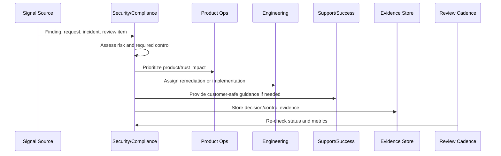

# Part 08 Summary

> *"Summarizes Continuous Security and Compliance Operations and prepares for Book IX Part 09."*

---

# Purpose

Summarizes Continuous Security and Compliance Operations and prepares for Book IX Part 09.

---

# Security and Compliance Problem

Continuous Reliability and Performance Improvement comes next because customer trust also depends on stable, fast, resilient product operations.

---

# Security and Compliance Decision

## Decision

CLARA should proceed to Continuous Reliability and Performance Improvement after defining continuous security/compliance overview, feedback loop, access review, vulnerability cadence, privacy review, evidence operations, customer communication, security roadmap, trust center, metrics, and anti-patterns.

## Status

Accepted.

---

# Continuous Trust Rule

Every CLARA security/compliance operation should connect:

```text
Signal -> Risk Assessment -> Control/Action -> Owner -> Evidence -> Review Cadence -> Product/Roadmap Feedback
```

A security or compliance operation is not mature if it cannot answer:

```text
what trust risk exists
what control addresses it
who owns the control
how often it is reviewed
where evidence is stored
what exception exists, if any
what customer/product impact exists
what roadmap or support follow-up is needed
```

---

# Recommended Continuous Trust Flow



---

# Production-Ready Checklist

- [ ] Security signal is captured.
- [ ] Risk is assessed.
- [ ] Owner is assigned.
- [ ] Remediation or control is defined.
- [ ] Evidence location is defined.
- [ ] Review cadence exists.
- [ ] Customer communication path is known.
- [ ] Roadmap/backlog link exists where needed.
- [ ] Exception is documented if accepted.
- [ ] Metrics track control health.

---

# Acceptance Criteria

- [ ] Security and compliance are continuous operations.
- [ ] Access is reviewed.
- [ ] Vulnerabilities are triaged.
- [ ] Privacy/data changes are reviewed.
- [ ] Evidence is audit-ready.
- [ ] Trust content is current.
- [ ] Security work feeds roadmap.
- [ ] AI coding assistants can apply this safely.

---

# Anti-patterns

Avoid:

- Checkbox compliance.
- Security work only before launch.
- Access reviews with no removal action.
- Stale vulnerability exceptions.
- Privacy review skipped for analytics or AI changes.
- Evidence reconstructed during audit.
- Trust center content not maintained.
- Customer security questions answered from memory.
- Security roadmap always deferred.
- Secrets in code, logs, tickets, or documentation.

---

# Related Documents

- ../PART-07-Feedback-Prioritization-and-Roadmap-Operations/README.md
- ../../BOOK-06-Security-Governance-and-Compliance/
- ../../BOOK-07-Operations-Observability-and-Reliability/
- ../../BOOK-08-Implementation-Delivery-and-Production-Launch/
- ../PART-06-Analytics-and-Product-Insights/README.md

---

# Navigation

**Previous:** `95-Security-and-Compliance-Anti-Patterns.md`

**Next:** `../PART-09-Continuous-Reliability-and-Performance-Improvement/README.md`

---

# Part 08 Completion

Part 08 establishes:

- Continuous security and compliance operations overview.
- Product security feedback loop.
- Continuous access review.
- Vulnerability and patch review cadence.
- Privacy and data handling review.
- Compliance evidence operations.
- Security customer communication.
- Security roadmap prioritization.
- Trust center and security content operations.
- Security and compliance metrics.
- Security and compliance anti-patterns.

---

# Ready for Part 09

The next part should be:

```text
BOOK IX — PART 09: Continuous Reliability and Performance Improvement
```

It should define:

- Continuous reliability/performance overview.
- Reliability feedback loop.
- SLO and error budget product review.
- Performance review cadence.
- Capacity and scaling review.
- Incident-to-roadmap improvement.
- Customer-impact reliability analytics.
- Integration and AI reliability improvement.
- Reliability communication standards.
- Reliability/performance metrics.
- Reliability/performance anti-patterns.
- Part 09 summary.
