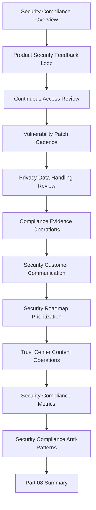

# PART-08 — Continuous Security and Compliance Operations

> *"Security after launch is not a static checklist. It is a recurring trust operation."*

---

# Purpose

Part 08 defines CLARA's continuous security and compliance operations standards.

It covers:

- Continuous Security and Compliance Operations Overview.
- Product Security Feedback Loop.
- Continuous Access Review.
- Vulnerability and Patch Review Cadence.
- Privacy and Data Handling Review.
- Compliance Evidence Operations.
- Security Customer Communication.
- Security Roadmap Prioritization.
- Trust Center and Security Content Operations.
- Security and Compliance Metrics.
- Security and Compliance Anti-Patterns.
- Part 08 Summary.

---

# Chapter Map

| Chapter | Title |
|---:|---|
| 85 | Continuous Security and Compliance Operations Overview |
| 86 | Product Security Feedback Loop |
| 87 | Continuous Access Review |
| 88 | Vulnerability and Patch Review Cadence |
| 89 | Privacy and Data Handling Review |
| 90 | Compliance Evidence Operations |
| 91 | Security Customer Communication |
| 92 | Security Roadmap Prioritization |
| 93 | Trust Center and Security Content Operations |
| 94 | Security and Compliance Metrics |
| 95 | Security and Compliance Anti-Patterns |
| 96 | Part 08 Summary |

---

# Continuous Trust Operations Map



---

# Security and Compliance Non-Negotiables

CLARA continuous security and compliance operations must enforce:

```text
least privilege access
recurring access reviews
vulnerability and patch cadence
privacy review for data changes
compliance evidence ownership
security customer communication workflow
risk-based roadmap prioritization
trust center accuracy
security metrics
compliance metrics
documented exceptions
customer data protection
no hard-coded secrets
no silent expansion of data collection
```

---

# Relationship to Previous Part

Part 07 defines feedback prioritization and roadmap operations.

Part 08 ensures security, privacy, compliance, and trust work are continuously fed into roadmap, support, customer communication, and product operations.

---

# Navigation

**Previous:** `../PART-07-Feedback-Prioritization-and-Roadmap-Operations/84-Part-07-Summary.md`

**Next:** `85-Continuous-Security-and-Compliance-Operations-Overview.md`
