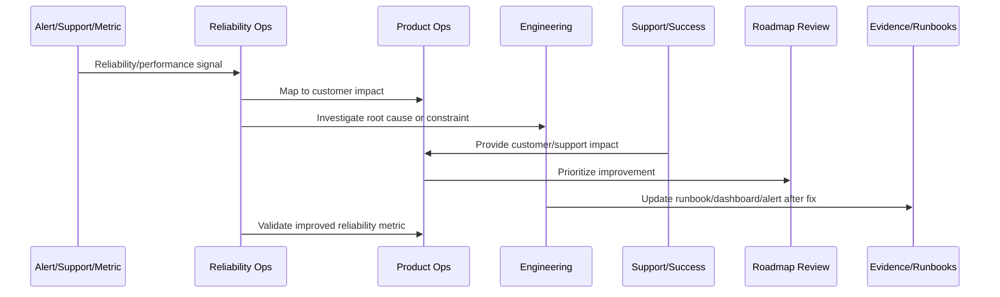
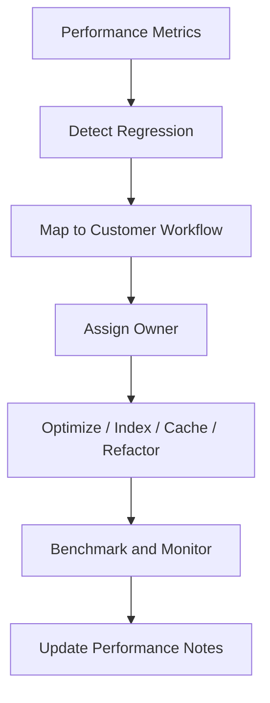

# Performance Review Cadence

> *"Defines recurring performance review for API latency, frontend responsiveness, database queries, workers, queues, AI latency, integrations, and customer workflows."*

---

# Purpose

Defines recurring performance review for API latency, frontend responsiveness, database queries, workers, queues, AI latency, integrations, and customer workflows.

---

# Reliability and Performance Problem

Performance problems often grow slowly until customers experience the product as unreliable.

---

# Reliability and Performance Decision

## Decision

CLARA performance should be reviewed on a predictable cadence with regression detection, performance budgets, owner assignment, and improvement backlog.

## Status

Accepted.

---

# Continuous Reliability Rule

Every CLARA reliability or performance improvement should connect:

```text
Signal -> Customer Impact -> SLO/Metric Review -> Root Cause/Constraint -> Owner -> Roadmap/Backlog Item -> Validation -> Runbook/Knowledge Update
```

A reliability operation is not mature if it cannot answer:

```text
which customer journey was affected
what customer impact occurred
which metric/SLO detected or missed it
what root cause or constraint exists
who owns remediation
what will prevent recurrence
how success will be validated
what runbook/dashboard/alert should be updated
```

---

# Recommended Reliability Improvement Flow



---

# Production-Ready Checklist

- [ ] Customer-impact signal is captured.
- [ ] Affected workflow is identified.
- [ ] Metric/SLO impact is reviewed.
- [ ] Root cause or bottleneck is documented.
- [ ] Owner is assigned.
- [ ] Improvement item is linked to roadmap/backlog.
- [ ] Validation metric is defined.
- [ ] Runbook/dashboard/alert updates are identified.
- [ ] Support/customer communication path is clear.
- [ ] Follow-up review is scheduled.

---

# Acceptance Criteria

- [ ] Reliability work is customer-impact driven.
- [ ] SLOs inform product decisions.
- [ ] Performance regressions are reviewed.
- [ ] Capacity risks are visible.
- [ ] Incidents feed roadmap improvements.
- [ ] External dependency reliability is managed.
- [ ] AI coding assistants can apply this safely.

---

# Anti-patterns

Avoid:

- Measuring uptime only.
- Ignoring customer-specific impact.
- Postmortem action items with no owner.
- Alert fatigue.
- Unbounded retries.
- No capacity planning.
- Performance regressions treated as minor forever.
- Integration failures blamed on providers without mitigation.
- AI degraded mode missing.
- Customers receiving no clear update during degradation.

---

# Related Documents

- ../PART-08-Continuous-Security-and-Compliance-Operations/README.md
- ../../BOOK-07-Operations-Observability-and-Reliability/
- ../../BOOK-08-Implementation-Delivery-and-Production-Launch/
- ../PART-06-Analytics-and-Product-Insights/README.md
- ../PART-07-Feedback-Prioritization-and-Roadmap-Operations/README.md

---

# Navigation

**Previous:** `99-SLO-and-Error-Budget-Product-Review.md`

**Next:** `101-Capacity-and-Scaling-Review.md`

---

# Performance Review Areas

Review:

```text
API p50/p95/p99 latency
frontend load and interaction time
database slow queries
queue wait time
worker job duration
AI Gateway latency
integration provider latency
webhook processing time
report/export generation time
search/query performance
```

---

# Performance Budget Example

Define budgets for:

```text
critical API endpoint latency
dashboard initial load
message/conversation retrieval
AI draft generation
webhook ingestion
ticket creation
search response
```

---

# Performance Review Flow



---

# Performance Rule

Performance improvements should prioritize high-impact customer workflows, not only easy optimizations.
