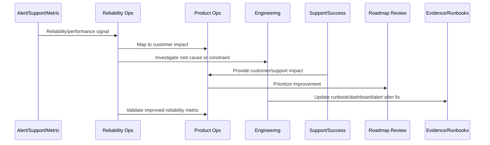
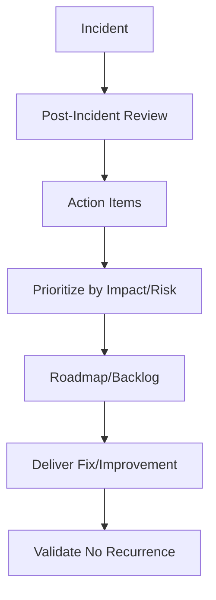

# Incident to Roadmap Improvement

> *"Defines how incident learnings, post-incident actions, root causes, customer impact, and operational gaps feed roadmap and backlog improvements."*

---

# Purpose

Defines how incident learnings, post-incident actions, root causes, customer impact, and operational gaps feed roadmap and backlog improvements.

---

# Reliability and Performance Problem

Postmortems fail when action items are not owned, prioritized, tracked, or connected to roadmap.

---

# Reliability and Performance Decision

## Decision

CLARA incidents should produce prioritized product, engineering, security, reliability, support, documentation, and runbook improvements.

## Status

Accepted.

---

# Continuous Reliability Rule

Every CLARA reliability or performance improvement should connect:

```text
Signal -> Customer Impact -> SLO/Metric Review -> Root Cause/Constraint -> Owner -> Roadmap/Backlog Item -> Validation -> Runbook/Knowledge Update
```

A reliability operation is not mature if it cannot answer:

```text
which customer journey was affected
what customer impact occurred
which metric/SLO detected or missed it
what root cause or constraint exists
who owns remediation
what will prevent recurrence
how success will be validated
what runbook/dashboard/alert should be updated
```

---

# Recommended Reliability Improvement Flow



---

# Production-Ready Checklist

- [ ] Customer-impact signal is captured.
- [ ] Affected workflow is identified.
- [ ] Metric/SLO impact is reviewed.
- [ ] Root cause or bottleneck is documented.
- [ ] Owner is assigned.
- [ ] Improvement item is linked to roadmap/backlog.
- [ ] Validation metric is defined.
- [ ] Runbook/dashboard/alert updates are identified.
- [ ] Support/customer communication path is clear.
- [ ] Follow-up review is scheduled.

---

# Acceptance Criteria

- [ ] Reliability work is customer-impact driven.
- [ ] SLOs inform product decisions.
- [ ] Performance regressions are reviewed.
- [ ] Capacity risks are visible.
- [ ] Incidents feed roadmap improvements.
- [ ] External dependency reliability is managed.
- [ ] AI coding assistants can apply this safely.

---

# Anti-patterns

Avoid:

- Measuring uptime only.
- Ignoring customer-specific impact.
- Postmortem action items with no owner.
- Alert fatigue.
- Unbounded retries.
- No capacity planning.
- Performance regressions treated as minor forever.
- Integration failures blamed on providers without mitigation.
- AI degraded mode missing.
- Customers receiving no clear update during degradation.

---

# Related Documents

- ../PART-08-Continuous-Security-and-Compliance-Operations/README.md
- ../../BOOK-07-Operations-Observability-and-Reliability/
- ../../BOOK-08-Implementation-Delivery-and-Production-Launch/
- ../PART-06-Analytics-and-Product-Insights/README.md
- ../PART-07-Feedback-Prioritization-and-Roadmap-Operations/README.md

---

# Navigation

**Previous:** `101-Capacity-and-Scaling-Review.md`

**Next:** `103-Customer-Impact-Reliability-Analytics.md`

---

# Incident Improvement Types

Incidents can produce:

```text
product fix
architecture improvement
performance optimization
alert tuning
dashboard improvement
runbook update
support macro update
customer communication improvement
test coverage improvement
security/privacy hardening
process improvement
```

---

# Incident Action Requirements

Each action item should include:

```text
owner
due date
priority
customer impact
root cause link
validation method
roadmap/backlog link
status
```

---

# Incident-to-Roadmap Flow



---

# Incident Rule

A postmortem is incomplete until the highest-value prevention work has owner, priority, and tracking.
