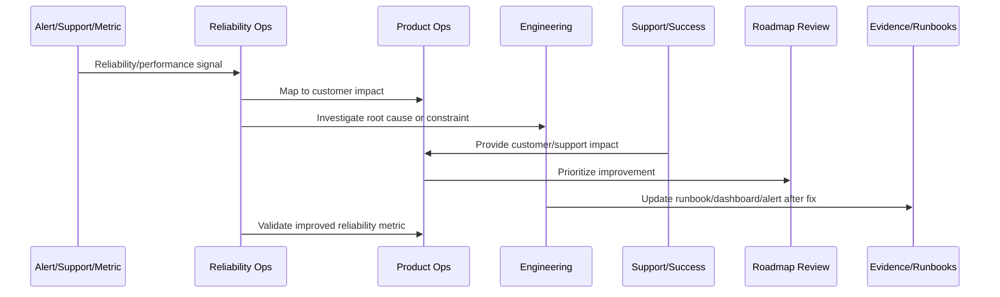
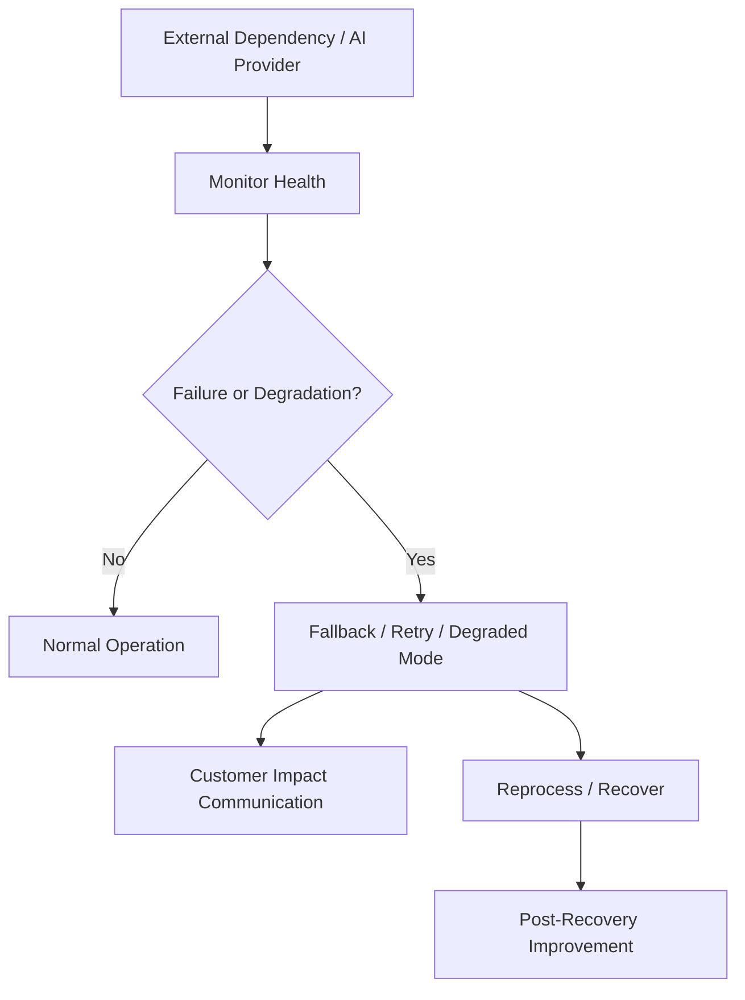

# Integration and AI Reliability Improvement

> *"Defines reliability improvement for external integrations, webhooks, provider failures, rate limits, AI latency, AI fallback, degraded mode, and human review."*

---

# Purpose

Defines reliability improvement for external integrations, webhooks, provider failures, rate limits, AI latency, AI fallback, degraded mode, and human review.

---

# Reliability and Performance Problem

External dependency failures become product failures when CLARA does not manage fallback and customer impact.

---

# Reliability and Performance Decision

## Decision

CLARA should treat integrations and AI as reliability-sensitive product dependencies with monitoring, fallback, retry, and customer communication strategies.

## Status

Accepted.

---

# Continuous Reliability Rule

Every CLARA reliability or performance improvement should connect:

```text
Signal -> Customer Impact -> SLO/Metric Review -> Root Cause/Constraint -> Owner -> Roadmap/Backlog Item -> Validation -> Runbook/Knowledge Update
```

A reliability operation is not mature if it cannot answer:

```text
which customer journey was affected
what customer impact occurred
which metric/SLO detected or missed it
what root cause or constraint exists
who owns remediation
what will prevent recurrence
how success will be validated
what runbook/dashboard/alert should be updated
```

---

# Recommended Reliability Improvement Flow



---

# Production-Ready Checklist

- [ ] Customer-impact signal is captured.
- [ ] Affected workflow is identified.
- [ ] Metric/SLO impact is reviewed.
- [ ] Root cause or bottleneck is documented.
- [ ] Owner is assigned.
- [ ] Improvement item is linked to roadmap/backlog.
- [ ] Validation metric is defined.
- [ ] Runbook/dashboard/alert updates are identified.
- [ ] Support/customer communication path is clear.
- [ ] Follow-up review is scheduled.

---

# Acceptance Criteria

- [ ] Reliability work is customer-impact driven.
- [ ] SLOs inform product decisions.
- [ ] Performance regressions are reviewed.
- [ ] Capacity risks are visible.
- [ ] Incidents feed roadmap improvements.
- [ ] External dependency reliability is managed.
- [ ] AI coding assistants can apply this safely.

---

# Anti-patterns

Avoid:

- Measuring uptime only.
- Ignoring customer-specific impact.
- Postmortem action items with no owner.
- Alert fatigue.
- Unbounded retries.
- No capacity planning.
- Performance regressions treated as minor forever.
- Integration failures blamed on providers without mitigation.
- AI degraded mode missing.
- Customers receiving no clear update during degradation.

---

# Related Documents

- ../PART-08-Continuous-Security-and-Compliance-Operations/README.md
- ../../BOOK-07-Operations-Observability-and-Reliability/
- ../../BOOK-08-Implementation-Delivery-and-Production-Launch/
- ../PART-06-Analytics-and-Product-Insights/README.md
- ../PART-07-Feedback-Prioritization-and-Roadmap-Operations/README.md

---

# Navigation

**Previous:** `103-Customer-Impact-Reliability-Analytics.md`

**Next:** `105-Reliability-Communication-Standards.md`

---

# Integration Reliability Controls

Use:

```text
signature verification monitoring
idempotency
retry with backoff
rate limit handling
dead-letter queues
provider health monitoring
reprocessing workflow
customer-visible sync status
integration-specific dashboards
```

---

# AI Reliability Controls

Use:

```text
timeout controls
fallback model/provider
human review
kill switch
degraded mode
prompt/version monitoring
RAG retrieval quality monitoring
schema validation
cost and latency limits
safety block monitoring
```

---

# Dependency Reliability Flow



---

# Dependency Rule

External dependency failure is still CLARA customer experience responsibility.
