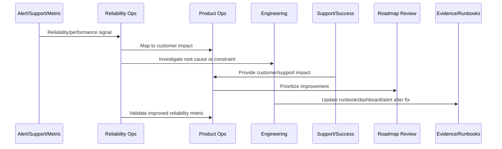

# Reliability and Performance Metrics

> *"Defines reliability and performance metrics including availability, latency, error rate, saturation, queue depth, job success, integration success, AI reliability, and customer-impact metrics."*

---

# Purpose

Defines reliability and performance metrics including availability, latency, error rate, saturation, queue depth, job success, integration success, AI reliability, and customer-impact metrics.

---

# Reliability and Performance Problem

Metrics that only measure infrastructure can miss real customer pain.

---

# Reliability and Performance Decision

## Decision

CLARA reliability and performance metrics should combine technical health with customer workflow outcomes.

## Status

Accepted.

---

# Continuous Reliability Rule

Every CLARA reliability or performance improvement should connect:

```text
Signal -> Customer Impact -> SLO/Metric Review -> Root Cause/Constraint -> Owner -> Roadmap/Backlog Item -> Validation -> Runbook/Knowledge Update
```

A reliability operation is not mature if it cannot answer:

```text
which customer journey was affected
what customer impact occurred
which metric/SLO detected or missed it
what root cause or constraint exists
who owns remediation
what will prevent recurrence
how success will be validated
what runbook/dashboard/alert should be updated
```

---

# Recommended Reliability Improvement Flow



---

# Production-Ready Checklist

- [ ] Customer-impact signal is captured.
- [ ] Affected workflow is identified.
- [ ] Metric/SLO impact is reviewed.
- [ ] Root cause or bottleneck is documented.
- [ ] Owner is assigned.
- [ ] Improvement item is linked to roadmap/backlog.
- [ ] Validation metric is defined.
- [ ] Runbook/dashboard/alert updates are identified.
- [ ] Support/customer communication path is clear.
- [ ] Follow-up review is scheduled.

---

# Acceptance Criteria

- [ ] Reliability work is customer-impact driven.
- [ ] SLOs inform product decisions.
- [ ] Performance regressions are reviewed.
- [ ] Capacity risks are visible.
- [ ] Incidents feed roadmap improvements.
- [ ] External dependency reliability is managed.
- [ ] AI coding assistants can apply this safely.

---

# Anti-patterns

Avoid:

- Measuring uptime only.
- Ignoring customer-specific impact.
- Postmortem action items with no owner.
- Alert fatigue.
- Unbounded retries.
- No capacity planning.
- Performance regressions treated as minor forever.
- Integration failures blamed on providers without mitigation.
- AI degraded mode missing.
- Customers receiving no clear update during degradation.

---

# Related Documents

- ../PART-08-Continuous-Security-and-Compliance-Operations/README.md
- ../../BOOK-07-Operations-Observability-and-Reliability/
- ../../BOOK-08-Implementation-Delivery-and-Production-Launch/
- ../PART-06-Analytics-and-Product-Insights/README.md
- ../PART-07-Feedback-Prioritization-and-Roadmap-Operations/README.md

---

# Navigation

**Previous:** `105-Reliability-Communication-Standards.md`

**Next:** `107-Reliability-and-Performance-Anti-Patterns.md`

---

# Reliability Metrics

Track:

```text
availability
error rate
request success rate
workflow success rate
SLO attainment
error budget remaining
incident count
incident duration
MTTA
MTTR
repeat incident rate
```

---

# Performance Metrics

Track:

```text
API p95/p99 latency
frontend load/interaction time
database query latency
queue wait time
worker job duration
AI latency
integration latency
webhook processing latency
search/report/export duration
```

---

# Saturation and Capacity Metrics

Track:

```text
CPU/memory saturation
database connections
queue depth
worker utilization
rate limit usage
storage growth
AI token/cost growth
provider quota usage
```

---

# Metrics Rule

Reliability metrics should combine system health, workflow success, and customer impact.
