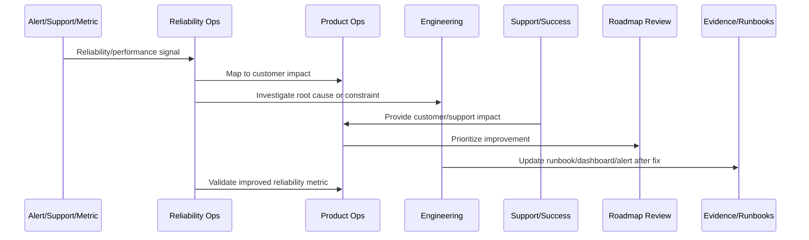

# Reliability and Performance Anti-Patterns

> *"Defines anti-patterns such as alert fatigue, ignored SLOs, no capacity planning, postmortem action decay, customer-impact blindness, and unbounded retries."*

---

# Purpose

Defines anti-patterns such as alert fatigue, ignored SLOs, no capacity planning, postmortem action decay, customer-impact blindness, and unbounded retries.

---

# Reliability and Performance Problem

Reliability anti-patterns often hide behind dashboards until customer trust is already damaged.

---

# Reliability and Performance Decision

## Decision

CLARA should actively avoid reliability and performance anti-patterns that create repeated incidents, slow product experience, and hidden operational debt.

## Status

Accepted.

---

# Continuous Reliability Rule

Every CLARA reliability or performance improvement should connect:

```text
Signal -> Customer Impact -> SLO/Metric Review -> Root Cause/Constraint -> Owner -> Roadmap/Backlog Item -> Validation -> Runbook/Knowledge Update
```

A reliability operation is not mature if it cannot answer:

```text
which customer journey was affected
what customer impact occurred
which metric/SLO detected or missed it
what root cause or constraint exists
who owns remediation
what will prevent recurrence
how success will be validated
what runbook/dashboard/alert should be updated
```

---

# Recommended Reliability Improvement Flow



---

# Production-Ready Checklist

- [ ] Customer-impact signal is captured.
- [ ] Affected workflow is identified.
- [ ] Metric/SLO impact is reviewed.
- [ ] Root cause or bottleneck is documented.
- [ ] Owner is assigned.
- [ ] Improvement item is linked to roadmap/backlog.
- [ ] Validation metric is defined.
- [ ] Runbook/dashboard/alert updates are identified.
- [ ] Support/customer communication path is clear.
- [ ] Follow-up review is scheduled.

---

# Acceptance Criteria

- [ ] Reliability work is customer-impact driven.
- [ ] SLOs inform product decisions.
- [ ] Performance regressions are reviewed.
- [ ] Capacity risks are visible.
- [ ] Incidents feed roadmap improvements.
- [ ] External dependency reliability is managed.
- [ ] AI coding assistants can apply this safely.

---

# Anti-patterns

Avoid:

- Measuring uptime only.
- Ignoring customer-specific impact.
- Postmortem action items with no owner.
- Alert fatigue.
- Unbounded retries.
- No capacity planning.
- Performance regressions treated as minor forever.
- Integration failures blamed on providers without mitigation.
- AI degraded mode missing.
- Customers receiving no clear update during degradation.

---

# Related Documents

- ../PART-08-Continuous-Security-and-Compliance-Operations/README.md
- ../../BOOK-07-Operations-Observability-and-Reliability/
- ../../BOOK-08-Implementation-Delivery-and-Production-Launch/
- ../PART-06-Analytics-and-Product-Insights/README.md
- ../PART-07-Feedback-Prioritization-and-Roadmap-Operations/README.md

---

# Navigation

**Previous:** `106-Reliability-and-Performance-Metrics.md`

**Next:** `108-Part-09-Summary.md`

---

# Common Anti-Patterns

Avoid:

```text
uptime-only reliability
ignored SLO breaches
postmortem actions not tracked
alert fatigue
unbounded retries
no degraded mode
capacity review only after incident
performance issues deferred indefinitely
external provider failures treated as not our problem
customer impact not measured
runbooks stale
```

---

# Warning Signs

Watch for:

```text
same incident type repeats
alerts frequently ignored
support reports issues before monitoring does
customers complain about slowness but dashboards look green
queue backlog grows slowly over weeks
AI latency/cost increases without review
integration retries spike silently
```

---

# Recovery Actions

```text
review critical user journey SLOs
tune alerts
update dashboards
assign incident action owners
run capacity review
create degraded mode plan
improve support communication
prioritize reliability roadmap item
load test critical workflows
```

---

# Anti-Pattern Rule

Reliability debt is product debt because customers experience it directly.
