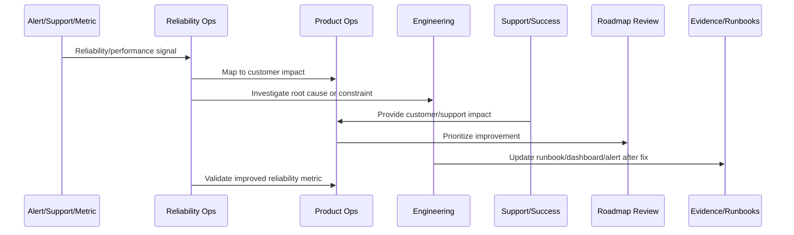

# Part 09 Summary

> *"Summarizes Continuous Reliability and Performance Improvement and prepares for Book IX Part 10."*

---

# Purpose

Summarizes Continuous Reliability and Performance Improvement and prepares for Book IX Part 10.

---

# Reliability and Performance Problem

AI Quality and Automation Improvement comes next because AI and automation are high-impact product capabilities that require continuous quality, safety, cost, and trust improvement.

---

# Reliability and Performance Decision

## Decision

CLARA should proceed to AI Quality and Automation Improvement after defining reliability/performance overview, feedback loop, SLO review, performance cadence, capacity review, incident-to-roadmap workflow, customer-impact analytics, integration/AI reliability, communication standards, metrics, and anti-patterns.

## Status

Accepted.

---

# Continuous Reliability Rule

Every CLARA reliability or performance improvement should connect:

```text
Signal -> Customer Impact -> SLO/Metric Review -> Root Cause/Constraint -> Owner -> Roadmap/Backlog Item -> Validation -> Runbook/Knowledge Update
```

A reliability operation is not mature if it cannot answer:

```text
which customer journey was affected
what customer impact occurred
which metric/SLO detected or missed it
what root cause or constraint exists
who owns remediation
what will prevent recurrence
how success will be validated
what runbook/dashboard/alert should be updated
```

---

# Recommended Reliability Improvement Flow



---

# Production-Ready Checklist

- [ ] Customer-impact signal is captured.
- [ ] Affected workflow is identified.
- [ ] Metric/SLO impact is reviewed.
- [ ] Root cause or bottleneck is documented.
- [ ] Owner is assigned.
- [ ] Improvement item is linked to roadmap/backlog.
- [ ] Validation metric is defined.
- [ ] Runbook/dashboard/alert updates are identified.
- [ ] Support/customer communication path is clear.
- [ ] Follow-up review is scheduled.

---

# Acceptance Criteria

- [ ] Reliability work is customer-impact driven.
- [ ] SLOs inform product decisions.
- [ ] Performance regressions are reviewed.
- [ ] Capacity risks are visible.
- [ ] Incidents feed roadmap improvements.
- [ ] External dependency reliability is managed.
- [ ] AI coding assistants can apply this safely.

---

# Anti-patterns

Avoid:

- Measuring uptime only.
- Ignoring customer-specific impact.
- Postmortem action items with no owner.
- Alert fatigue.
- Unbounded retries.
- No capacity planning.
- Performance regressions treated as minor forever.
- Integration failures blamed on providers without mitigation.
- AI degraded mode missing.
- Customers receiving no clear update during degradation.

---

# Related Documents

- ../PART-08-Continuous-Security-and-Compliance-Operations/README.md
- ../../BOOK-07-Operations-Observability-and-Reliability/
- ../../BOOK-08-Implementation-Delivery-and-Production-Launch/
- ../PART-06-Analytics-and-Product-Insights/README.md
- ../PART-07-Feedback-Prioritization-and-Roadmap-Operations/README.md

---

# Navigation

**Previous:** `107-Reliability-and-Performance-Anti-Patterns.md`

**Next:** `../PART-10-AI-Quality-and-Automation-Improvement/README.md`

---

# Part 09 Completion

Part 09 establishes:

- Continuous reliability and performance improvement overview.
- Reliability feedback loop.
- SLO and error budget product review.
- Performance review cadence.
- Capacity and scaling review.
- Incident to roadmap improvement.
- Customer impact reliability analytics.
- Integration and AI reliability improvement.
- Reliability communication standards.
- Reliability and performance metrics.
- Reliability and performance anti-patterns.

---

# Ready for Part 10

The next part should be:

```text
BOOK IX — PART 10: AI Quality and Automation Improvement
```

It should define:

- AI quality and automation improvement overview.
- AI quality feedback loop.
- Human review analytics.
- Prompt and RAG improvement lifecycle.
- AI safety and guardrail review.
- Automation success and failure review.
- Cost and latency optimization.
- AI customer trust and explainability.
- AI incident and rollback workflow.
- AI quality metrics.
- AI/automation anti-patterns.
- Part 10 summary.
