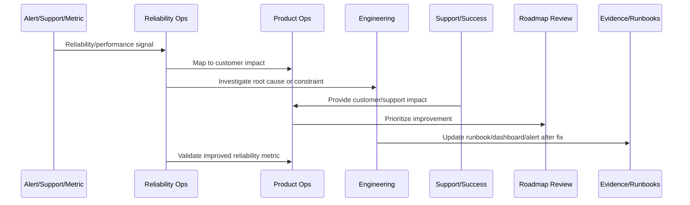
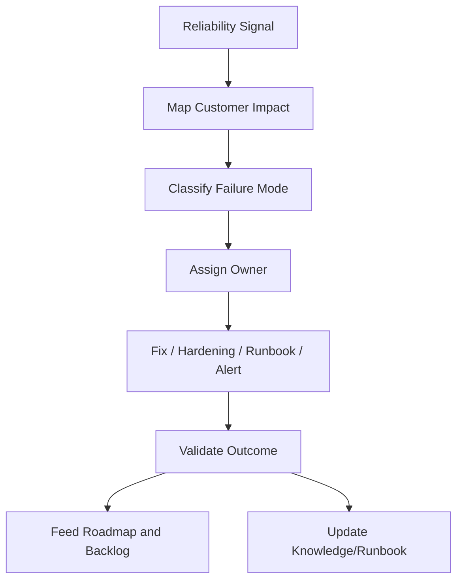

# Reliability Feedback Loop

> *"Defines how incidents, alerts, customer complaints, support tickets, SLO breaches, performance regressions, integration failures, and AI failures become reliability improvements."*

---

# Purpose

Defines how incidents, alerts, customer complaints, support tickets, SLO breaches, performance regressions, integration failures, and AI failures become reliability improvements.

---

# Reliability and Performance Problem

Reliability issues repeat when incidents and support signals do not become system improvements.

---

# Reliability and Performance Decision

## Decision

CLARA reliability feedback should flow into incident follow-up, roadmap prioritization, runbook updates, product fixes, and operational hardening.

## Status

Accepted.

---

# Continuous Reliability Rule

Every CLARA reliability or performance improvement should connect:

```text
Signal -> Customer Impact -> SLO/Metric Review -> Root Cause/Constraint -> Owner -> Roadmap/Backlog Item -> Validation -> Runbook/Knowledge Update
```

A reliability operation is not mature if it cannot answer:

```text
which customer journey was affected
what customer impact occurred
which metric/SLO detected or missed it
what root cause or constraint exists
who owns remediation
what will prevent recurrence
how success will be validated
what runbook/dashboard/alert should be updated
```

---

# Recommended Reliability Improvement Flow



---

# Production-Ready Checklist

- [ ] Customer-impact signal is captured.
- [ ] Affected workflow is identified.
- [ ] Metric/SLO impact is reviewed.
- [ ] Root cause or bottleneck is documented.
- [ ] Owner is assigned.
- [ ] Improvement item is linked to roadmap/backlog.
- [ ] Validation metric is defined.
- [ ] Runbook/dashboard/alert updates are identified.
- [ ] Support/customer communication path is clear.
- [ ] Follow-up review is scheduled.

---

# Acceptance Criteria

- [ ] Reliability work is customer-impact driven.
- [ ] SLOs inform product decisions.
- [ ] Performance regressions are reviewed.
- [ ] Capacity risks are visible.
- [ ] Incidents feed roadmap improvements.
- [ ] External dependency reliability is managed.
- [ ] AI coding assistants can apply this safely.

---

# Anti-patterns

Avoid:

- Measuring uptime only.
- Ignoring customer-specific impact.
- Postmortem action items with no owner.
- Alert fatigue.
- Unbounded retries.
- No capacity planning.
- Performance regressions treated as minor forever.
- Integration failures blamed on providers without mitigation.
- AI degraded mode missing.
- Customers receiving no clear update during degradation.

---

# Related Documents

- ../PART-08-Continuous-Security-and-Compliance-Operations/README.md
- ../../BOOK-07-Operations-Observability-and-Reliability/
- ../../BOOK-08-Implementation-Delivery-and-Production-Launch/
- ../PART-06-Analytics-and-Product-Insights/README.md
- ../PART-07-Feedback-Prioritization-and-Roadmap-Operations/README.md

---

# Navigation

**Previous:** `97-Continuous-Reliability-and-Performance-Improvement-Overview.md`

**Next:** `99-SLO-and-Error-Budget-Product-Review.md`

---

# Reliability Signal Sources

Capture signals from:

```text
alerts
SLO breach
error budget burn
support ticket
customer complaint
incident review
performance regression
integration failure
AI fallback spike
queue backlog
database slow query
frontend error
```

---

# Feedback Loop Flow



---

# Failure Categories

Use:

```text
availability
latency
correctness
data_consistency
integration_failure
AI_failure
queue_delay
capacity_saturation
deployment_regression
observability_gap
```

---

# Feedback Rule

Every repeated reliability issue should become a fix, alert improvement, runbook update, product change, or documented risk decision.
