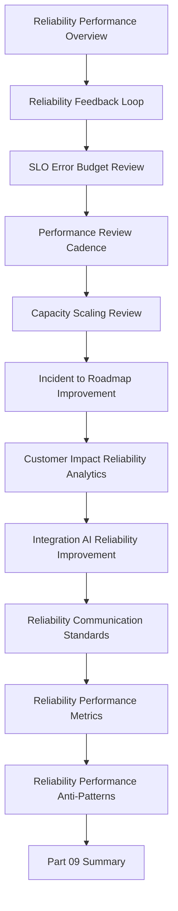

# PART-09 — Continuous Reliability and Performance Improvement

> *"Reliability is not only uptime. Reliability is whether customers can trust CLARA to complete their important workflows when they need it."*

---

# Purpose

Part 09 defines CLARA's continuous reliability and performance improvement standards.

It covers:

- Continuous Reliability and Performance Improvement Overview.
- Reliability Feedback Loop.
- SLO and Error Budget Product Review.
- Performance Review Cadence.
- Capacity and Scaling Review.
- Incident to Roadmap Improvement.
- Customer Impact Reliability Analytics.
- Integration and AI Reliability Improvement.
- Reliability Communication Standards.
- Reliability and Performance Metrics.
- Reliability and Performance Anti-Patterns.
- Part 09 Summary.

---

# Chapter Map

| Chapter | Title |
|---:|---|
| 97 | Continuous Reliability and Performance Improvement Overview |
| 98 | Reliability Feedback Loop |
| 99 | SLO and Error Budget Product Review |
| 100 | Performance Review Cadence |
| 101 | Capacity and Scaling Review |
| 102 | Incident to Roadmap Improvement |
| 103 | Customer Impact Reliability Analytics |
| 104 | Integration and AI Reliability Improvement |
| 105 | Reliability Communication Standards |
| 106 | Reliability and Performance Metrics |
| 107 | Reliability and Performance Anti-Patterns |
| 108 | Part 09 Summary |

---

# Reliability Improvement Map



---

# Reliability and Performance Non-Negotiables

CLARA continuous reliability and performance improvement must enforce:

```text
customer-impact reliability view
critical user journey ownership
SLO and error budget reviews
incident action tracking
performance review cadence
capacity planning
degraded mode planning
integration reliability monitoring
AI reliability and fallback monitoring
queue/worker health monitoring
customer communication standards
post-incident roadmap loop
runbook updates
no ignored recurring incidents
```

---

# Relationship to Previous Part

Part 08 defines continuous security and compliance operations.

Part 09 ensures reliability and performance also operate as continuous trust systems after launch.

---

# Navigation

**Previous:** `../PART-08-Continuous-Security-and-Compliance-Operations/96-Part-08-Summary.md`

**Next:** `97-Continuous-Reliability-and-Performance-Improvement-Overview.md`
