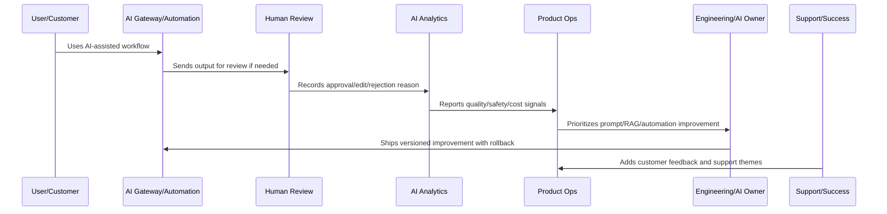

# AI Quality and Automation Improvement Overview

> *"Introduces CLARA's continuous AI quality and automation improvement model for keeping AI-assisted workflows useful, safe, explainable, cost-aware, and operationally reliable after launch."*

---

# Purpose

Introduces CLARA's continuous AI quality and automation improvement model for keeping AI-assisted workflows useful, safe, explainable, cost-aware, and operationally reliable after launch.

---

# AI and Automation Problem

AI and automation can look successful by usage volume while silently producing low-quality, risky, expensive, or customer-confusing outcomes.

---

# AI and Automation Decision

## Decision

CLARA should operate AI and automation as continuously reviewed product systems with quality feedback, human review analytics, guardrail review, cost/latency monitoring, rollback, and customer trust controls.

## Status

Accepted.

---

# AI Quality Rule

Every CLARA AI or automation improvement should connect:

```text
Signal -> Quality/Safety Classification -> Human Review Evidence -> Prompt/RAG/Automation Change -> Evaluation -> Rollout -> Monitoring -> Rollback Path -> Documentation
```

An AI or automation operation is not mature if it cannot answer:

```text
what quality or safety issue exists
what workflow/customer segment is affected
what human review evidence exists
what prompt/RAG/model/automation version is involved
what guardrail or fallback applies
how cost and latency are affected
how rollback works
how success will be validated
what customer/support communication is needed
```

---

# Recommended AI Improvement Flow



---

# Production-Ready Checklist

- [ ] AI quality signal is captured.
- [ ] Human review data is structured.
- [ ] Prompt/RAG version is identifiable.
- [ ] Safety guardrails are reviewed.
- [ ] Automation failure modes are known.
- [ ] Cost and latency are monitored.
- [ ] Rollback and kill switch exist.
- [ ] Customer trust/explainability is considered.
- [ ] Metrics validate improvement.
- [ ] Documentation and support guidance are updated.

---

# Acceptance Criteria

- [ ] AI quality is measurable.
- [ ] Automation failures are detectable.
- [ ] High-impact actions have guardrails.
- [ ] Prompt/RAG changes are versioned.
- [ ] Rollback paths exist.
- [ ] Cost and latency are controlled.
- [ ] Customer trust is preserved.
- [ ] AI coding assistants can apply this safely.

---

# Anti-patterns

Avoid:

- Automating before measuring.
- No human review for risky actions.
- Unversioned prompt changes.
- No RAG source quality review.
- Ignoring hallucination reports.
- Measuring AI only by usage volume.
- No kill switch.
- No rollback.
- Over-collecting sensitive data for AI context.
- Provider/model changes without evaluation.
- Cost increases hidden from product review.

---

# Related Documents

- ../../BOOK-04-Data-API-AI-and-Integration-Design/
- ../../BOOK-06-Security-Governance-and-Compliance/
- ../../BOOK-07-Operations-Observability-and-Reliability/
- ../../BOOK-08-Implementation-Delivery-and-Production-Launch/
- ../PART-06-Analytics-and-Product-Insights/README.md
- ../PART-09-Continuous-Reliability-and-Performance-Improvement/README.md

---

# Navigation

**Previous:** `../PART-09-Continuous-Reliability-and-Performance-Improvement/108-Part-09-Summary.md`

**Next:** `110-AI-Quality-Feedback-Loop.md`

---

# AI Quality Scope

CLARA AI quality and automation improvement covers:

```text
AI-generated replies
AI summarization
AI classification
AI routing suggestions
RAG/context retrieval
prompt templates
provider/model behavior
human review workflow
automation triggers
automation actions
fallback/degraded mode
AI cost and latency
AI safety and trust
```

---

# Operating Inputs

Use:

```text
approval rate
edit rate
rejection reasons
safety blocks
hallucination reports
support tickets
customer complaints
latency metrics
cost metrics
fallback metrics
automation failure metrics
incident records
```

---

# Guiding Question

```text
Is CLARA's AI making the workflow safer, faster, clearer, and more useful — or only more automated?
```
