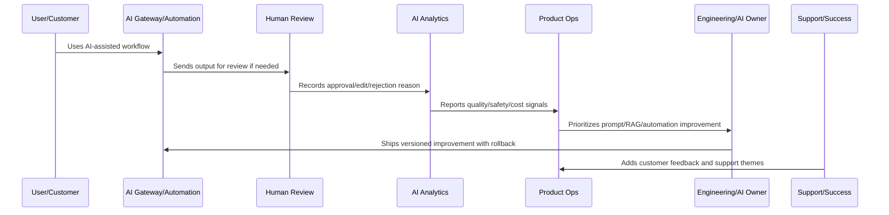
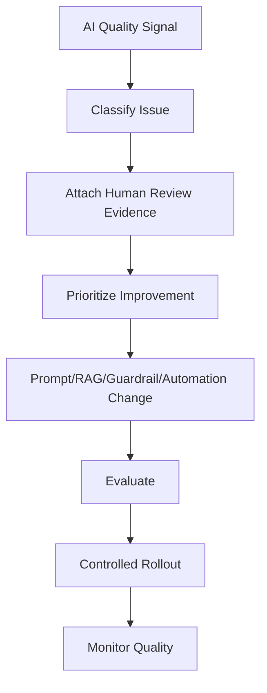

# AI Quality Feedback Loop

> *"Defines how AI output reviews, user edits, rejection reasons, safety blocks, support tickets, customer complaints, incidents, and analytics feed AI quality improvement."*

---

# Purpose

Defines how AI output reviews, user edits, rejection reasons, safety blocks, support tickets, customer complaints, incidents, and analytics feed AI quality improvement.

---

# AI and Automation Problem

AI quality does not improve automatically unless feedback is captured, classified, prioritized, and converted into action.

---

# AI and Automation Decision

## Decision

CLARA AI quality signals should flow into prompt updates, RAG improvements, guardrail tuning, model/provider decisions, product UX changes, and support knowledge.

## Status

Accepted.

---

# AI Quality Rule

Every CLARA AI or automation improvement should connect:

```text
Signal -> Quality/Safety Classification -> Human Review Evidence -> Prompt/RAG/Automation Change -> Evaluation -> Rollout -> Monitoring -> Rollback Path -> Documentation
```

An AI or automation operation is not mature if it cannot answer:

```text
what quality or safety issue exists
what workflow/customer segment is affected
what human review evidence exists
what prompt/RAG/model/automation version is involved
what guardrail or fallback applies
how cost and latency are affected
how rollback works
how success will be validated
what customer/support communication is needed
```

---

# Recommended AI Improvement Flow



---

# Production-Ready Checklist

- [ ] AI quality signal is captured.
- [ ] Human review data is structured.
- [ ] Prompt/RAG version is identifiable.
- [ ] Safety guardrails are reviewed.
- [ ] Automation failure modes are known.
- [ ] Cost and latency are monitored.
- [ ] Rollback and kill switch exist.
- [ ] Customer trust/explainability is considered.
- [ ] Metrics validate improvement.
- [ ] Documentation and support guidance are updated.

---

# Acceptance Criteria

- [ ] AI quality is measurable.
- [ ] Automation failures are detectable.
- [ ] High-impact actions have guardrails.
- [ ] Prompt/RAG changes are versioned.
- [ ] Rollback paths exist.
- [ ] Cost and latency are controlled.
- [ ] Customer trust is preserved.
- [ ] AI coding assistants can apply this safely.

---

# Anti-patterns

Avoid:

- Automating before measuring.
- No human review for risky actions.
- Unversioned prompt changes.
- No RAG source quality review.
- Ignoring hallucination reports.
- Measuring AI only by usage volume.
- No kill switch.
- No rollback.
- Over-collecting sensitive data for AI context.
- Provider/model changes without evaluation.
- Cost increases hidden from product review.

---

# Related Documents

- ../../BOOK-04-Data-API-AI-and-Integration-Design/
- ../../BOOK-06-Security-Governance-and-Compliance/
- ../../BOOK-07-Operations-Observability-and-Reliability/
- ../../BOOK-08-Implementation-Delivery-and-Production-Launch/
- ../PART-06-Analytics-and-Product-Insights/README.md
- ../PART-09-Continuous-Reliability-and-Performance-Improvement/README.md

---

# Navigation

**Previous:** `109-AI-Quality-and-Automation-Improvement-Overview.md`

**Next:** `111-Human-Review-Analytics.md`

---

# AI Quality Signal Sources

Capture signals from:

```text
human review outcome
user edit/rejection reason
customer feedback
support ticket
AI safety block
prompt injection attempt
RAG retrieval miss
model/provider error
automation rollback
incident report
cost/latency anomaly
```

---

# Feedback Taxonomy

Use categories:

```text
accurate_helpful
minor_edit_needed
wrong_intent
missing_context
hallucination
unsafe_or_policy_violation
tone_mismatch
privacy_sensitive
too_verbose
too_short
automation_wrong_trigger
automation_wrong_action
fallback_required
```

---

# Feedback Loop



---

# Feedback Rule

AI feedback should produce an improvement candidate, safety review, support update, or documented decision.
