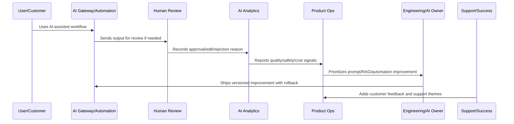
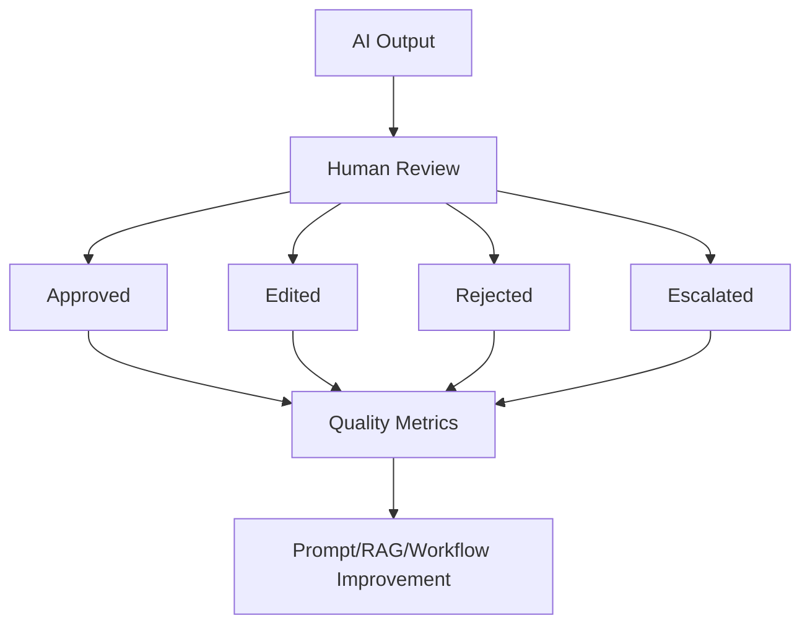

# Human Review Analytics

> *"Defines analytics for human review approval, edit rate, rejection reasons, escalation, reviewer confidence, review time, and quality outcomes."*

---

# Purpose

Defines analytics for human review approval, edit rate, rejection reasons, escalation, reviewer confidence, review time, and quality outcomes.

---

# AI and Automation Problem

Human review data is one of the strongest signals of AI quality, but it is often ignored or not structured.

---

# AI and Automation Decision

## Decision

CLARA should use human review analytics to understand AI usefulness, risk, reviewer burden, and workflow readiness for automation.

## Status

Accepted.

---

# AI Quality Rule

Every CLARA AI or automation improvement should connect:

```text
Signal -> Quality/Safety Classification -> Human Review Evidence -> Prompt/RAG/Automation Change -> Evaluation -> Rollout -> Monitoring -> Rollback Path -> Documentation
```

An AI or automation operation is not mature if it cannot answer:

```text
what quality or safety issue exists
what workflow/customer segment is affected
what human review evidence exists
what prompt/RAG/model/automation version is involved
what guardrail or fallback applies
how cost and latency are affected
how rollback works
how success will be validated
what customer/support communication is needed
```

---

# Recommended AI Improvement Flow



---

# Production-Ready Checklist

- [ ] AI quality signal is captured.
- [ ] Human review data is structured.
- [ ] Prompt/RAG version is identifiable.
- [ ] Safety guardrails are reviewed.
- [ ] Automation failure modes are known.
- [ ] Cost and latency are monitored.
- [ ] Rollback and kill switch exist.
- [ ] Customer trust/explainability is considered.
- [ ] Metrics validate improvement.
- [ ] Documentation and support guidance are updated.

---

# Acceptance Criteria

- [ ] AI quality is measurable.
- [ ] Automation failures are detectable.
- [ ] High-impact actions have guardrails.
- [ ] Prompt/RAG changes are versioned.
- [ ] Rollback paths exist.
- [ ] Cost and latency are controlled.
- [ ] Customer trust is preserved.
- [ ] AI coding assistants can apply this safely.

---

# Anti-patterns

Avoid:

- Automating before measuring.
- No human review for risky actions.
- Unversioned prompt changes.
- No RAG source quality review.
- Ignoring hallucination reports.
- Measuring AI only by usage volume.
- No kill switch.
- No rollback.
- Over-collecting sensitive data for AI context.
- Provider/model changes without evaluation.
- Cost increases hidden from product review.

---

# Related Documents

- ../../BOOK-04-Data-API-AI-and-Integration-Design/
- ../../BOOK-06-Security-Governance-and-Compliance/
- ../../BOOK-07-Operations-Observability-and-Reliability/
- ../../BOOK-08-Implementation-Delivery-and-Production-Launch/
- ../PART-06-Analytics-and-Product-Insights/README.md
- ../PART-09-Continuous-Reliability-and-Performance-Improvement/README.md

---

# Navigation

**Previous:** `110-AI-Quality-Feedback-Loop.md`

**Next:** `112-Prompt-and-RAG-Improvement-Lifecycle.md`

---

# Human Review Metrics

Track:

```text
approval rate
edit rate
rejection rate
review time
reviewer confidence
rejection reason distribution
escalation rate
manual override rate
unsafe output reports
customer-visible correction rate
```

---

# Review Outcome States

Use:

```text
approved_as_is
approved_with_minor_edit
approved_with_major_edit
rejected_wrong
rejected_unsafe
rejected_missing_context
escalated
manual_response_required
```

---

# Review Analytics Map



---

# Human Review Rule

Human review is not only approval. It is training-quality evidence for product improvement.
