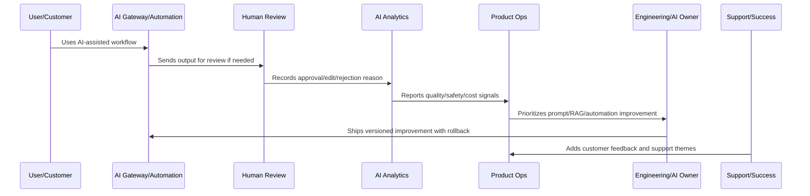
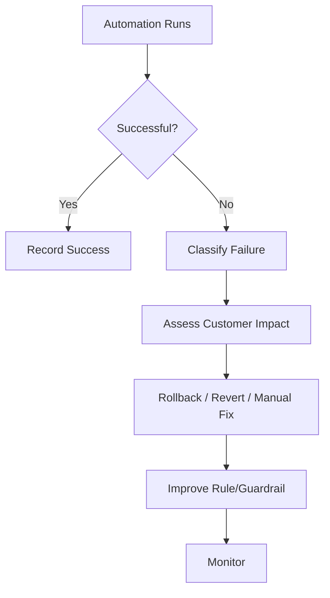

# Automation Success and Failure Review

> *"Defines review for automation triggers, success rate, failure rate, false positives, false negatives, manual overrides, retries, rollback, and customer impact."*

---

# Purpose

Defines review for automation triggers, success rate, failure rate, false positives, false negatives, manual overrides, retries, rollback, and customer impact.

---

# AI and Automation Problem

Automation failures can cause damage faster than manual workflow failures because they can repeat at scale.

---

# AI and Automation Decision

## Decision

CLARA automation should be reviewed as a production workflow with success criteria, failure detection, customer impact analysis, and rollback capability.

## Status

Accepted.

---

# AI Quality Rule

Every CLARA AI or automation improvement should connect:

```text
Signal -> Quality/Safety Classification -> Human Review Evidence -> Prompt/RAG/Automation Change -> Evaluation -> Rollout -> Monitoring -> Rollback Path -> Documentation
```

An AI or automation operation is not mature if it cannot answer:

```text
what quality or safety issue exists
what workflow/customer segment is affected
what human review evidence exists
what prompt/RAG/model/automation version is involved
what guardrail or fallback applies
how cost and latency are affected
how rollback works
how success will be validated
what customer/support communication is needed
```

---

# Recommended AI Improvement Flow



---

# Production-Ready Checklist

- [ ] AI quality signal is captured.
- [ ] Human review data is structured.
- [ ] Prompt/RAG version is identifiable.
- [ ] Safety guardrails are reviewed.
- [ ] Automation failure modes are known.
- [ ] Cost and latency are monitored.
- [ ] Rollback and kill switch exist.
- [ ] Customer trust/explainability is considered.
- [ ] Metrics validate improvement.
- [ ] Documentation and support guidance are updated.

---

# Acceptance Criteria

- [ ] AI quality is measurable.
- [ ] Automation failures are detectable.
- [ ] High-impact actions have guardrails.
- [ ] Prompt/RAG changes are versioned.
- [ ] Rollback paths exist.
- [ ] Cost and latency are controlled.
- [ ] Customer trust is preserved.
- [ ] AI coding assistants can apply this safely.

---

# Anti-patterns

Avoid:

- Automating before measuring.
- No human review for risky actions.
- Unversioned prompt changes.
- No RAG source quality review.
- Ignoring hallucination reports.
- Measuring AI only by usage volume.
- No kill switch.
- No rollback.
- Over-collecting sensitive data for AI context.
- Provider/model changes without evaluation.
- Cost increases hidden from product review.

---

# Related Documents

- ../../BOOK-04-Data-API-AI-and-Integration-Design/
- ../../BOOK-06-Security-Governance-and-Compliance/
- ../../BOOK-07-Operations-Observability-and-Reliability/
- ../../BOOK-08-Implementation-Delivery-and-Production-Launch/
- ../PART-06-Analytics-and-Product-Insights/README.md
- ../PART-09-Continuous-Reliability-and-Performance-Improvement/README.md

---

# Navigation

**Previous:** `113-AI-Safety-and-Guardrail-Review.md`

**Next:** `115-Cost-and-Latency-Optimization.md`

---

# Automation Metrics

Track:

```text
trigger count
success rate
failure rate
false positive rate
false negative rate
retry count
manual override rate
rollback count
customer impact
support escalation count
```

---

# Automation Review Questions

Ask:

```text
Did automation trigger correctly?
Was the action correct?
Was the outcome reversible?
Did customer understand what happened?
Did support receive more tickets?
Did reliability or security risk increase?
Should human approval be required?
```

---

# Automation Failure Flow



---

# Automation Rule

Do not automate a workflow until failure detection and rollback are designed.
