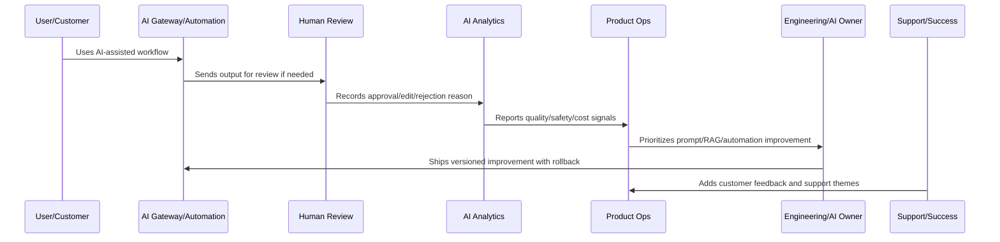

# AI Customer Trust and Explainability

> *"Defines how CLARA communicates AI involvement, confidence, limitations, review status, source/context usage, and customer control."*

---

# Purpose

Defines how CLARA communicates AI involvement, confidence, limitations, review status, source/context usage, and customer control.

---

# AI and Automation Problem

Users lose trust when AI actions appear magical, opaque, overconfident, or hard to override.

---

# AI and Automation Decision

## Decision

CLARA should make AI-assisted behavior understandable enough for users to trust, review, correct, and control.

## Status

Accepted.

---

# AI Quality Rule

Every CLARA AI or automation improvement should connect:

```text
Signal -> Quality/Safety Classification -> Human Review Evidence -> Prompt/RAG/Automation Change -> Evaluation -> Rollout -> Monitoring -> Rollback Path -> Documentation
```

An AI or automation operation is not mature if it cannot answer:

```text
what quality or safety issue exists
what workflow/customer segment is affected
what human review evidence exists
what prompt/RAG/model/automation version is involved
what guardrail or fallback applies
how cost and latency are affected
how rollback works
how success will be validated
what customer/support communication is needed
```

---

# Recommended AI Improvement Flow



---

# Production-Ready Checklist

- [ ] AI quality signal is captured.
- [ ] Human review data is structured.
- [ ] Prompt/RAG version is identifiable.
- [ ] Safety guardrails are reviewed.
- [ ] Automation failure modes are known.
- [ ] Cost and latency are monitored.
- [ ] Rollback and kill switch exist.
- [ ] Customer trust/explainability is considered.
- [ ] Metrics validate improvement.
- [ ] Documentation and support guidance are updated.

---

# Acceptance Criteria

- [ ] AI quality is measurable.
- [ ] Automation failures are detectable.
- [ ] High-impact actions have guardrails.
- [ ] Prompt/RAG changes are versioned.
- [ ] Rollback paths exist.
- [ ] Cost and latency are controlled.
- [ ] Customer trust is preserved.
- [ ] AI coding assistants can apply this safely.

---

# Anti-patterns

Avoid:

- Automating before measuring.
- No human review for risky actions.
- Unversioned prompt changes.
- No RAG source quality review.
- Ignoring hallucination reports.
- Measuring AI only by usage volume.
- No kill switch.
- No rollback.
- Over-collecting sensitive data for AI context.
- Provider/model changes without evaluation.
- Cost increases hidden from product review.

---

# Related Documents

- ../../BOOK-04-Data-API-AI-and-Integration-Design/
- ../../BOOK-06-Security-Governance-and-Compliance/
- ../../BOOK-07-Operations-Observability-and-Reliability/
- ../../BOOK-08-Implementation-Delivery-and-Production-Launch/
- ../PART-06-Analytics-and-Product-Insights/README.md
- ../PART-09-Continuous-Reliability-and-Performance-Improvement/README.md

---

# Navigation

**Previous:** `115-Cost-and-Latency-Optimization.md`

**Next:** `117-AI-Incident-and-Rollback-Workflow.md`

---

# Trust and Explainability Requirements

Users should understand:

```text
when AI was used
what AI is suggesting
whether human review is required
what data/context influenced output where appropriate
what limitations exist
how to edit or reject
how to disable or control AI-assisted behavior
```

---

# UI/UX Trust Patterns

Use:

```text
AI-assisted label
confidence/quality warning where useful
source/context reference where useful
editable draft state
human approval step
clear undo/revert
audit trail for AI-assisted action
```

---

# Explainability Boundaries

Explain enough to support trust and action, but avoid:

```text
exposing hidden system prompts
revealing sensitive internal security controls
showing other customer data
overstating certainty
```

---

# Trust Rule

AI should assist users without making them feel trapped, confused, or unable to verify the result.
