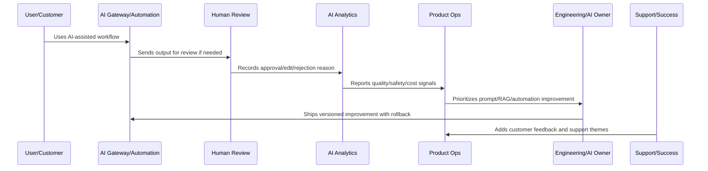
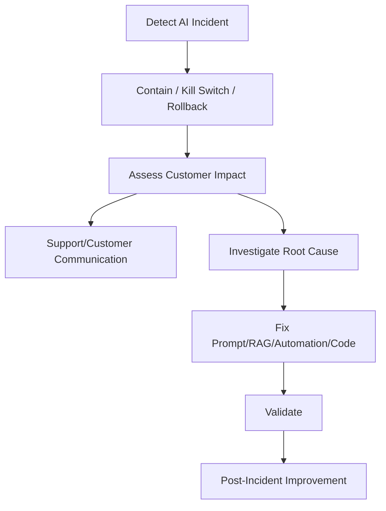

# AI Incident and Rollback Workflow

> *"Defines incident workflow for unsafe AI output, hallucination spikes, automation misfire, provider outage, prompt regression, data leakage risk, and cost runaway."*

---

# Purpose

Defines incident workflow for unsafe AI output, hallucination spikes, automation misfire, provider outage, prompt regression, data leakage risk, and cost runaway.

---

# AI and Automation Problem

AI incidents require fast containment because quality or safety regressions can spread through many customer workflows.

---

# AI and Automation Decision

## Decision

CLARA should have AI-specific incident response, rollback, kill switch, degraded mode, evidence capture, and post-incident improvement workflow.

## Status

Accepted.

---

# AI Quality Rule

Every CLARA AI or automation improvement should connect:

```text
Signal -> Quality/Safety Classification -> Human Review Evidence -> Prompt/RAG/Automation Change -> Evaluation -> Rollout -> Monitoring -> Rollback Path -> Documentation
```

An AI or automation operation is not mature if it cannot answer:

```text
what quality or safety issue exists
what workflow/customer segment is affected
what human review evidence exists
what prompt/RAG/model/automation version is involved
what guardrail or fallback applies
how cost and latency are affected
how rollback works
how success will be validated
what customer/support communication is needed
```

---

# Recommended AI Improvement Flow



---

# Production-Ready Checklist

- [ ] AI quality signal is captured.
- [ ] Human review data is structured.
- [ ] Prompt/RAG version is identifiable.
- [ ] Safety guardrails are reviewed.
- [ ] Automation failure modes are known.
- [ ] Cost and latency are monitored.
- [ ] Rollback and kill switch exist.
- [ ] Customer trust/explainability is considered.
- [ ] Metrics validate improvement.
- [ ] Documentation and support guidance are updated.

---

# Acceptance Criteria

- [ ] AI quality is measurable.
- [ ] Automation failures are detectable.
- [ ] High-impact actions have guardrails.
- [ ] Prompt/RAG changes are versioned.
- [ ] Rollback paths exist.
- [ ] Cost and latency are controlled.
- [ ] Customer trust is preserved.
- [ ] AI coding assistants can apply this safely.

---

# Anti-patterns

Avoid:

- Automating before measuring.
- No human review for risky actions.
- Unversioned prompt changes.
- No RAG source quality review.
- Ignoring hallucination reports.
- Measuring AI only by usage volume.
- No kill switch.
- No rollback.
- Over-collecting sensitive data for AI context.
- Provider/model changes without evaluation.
- Cost increases hidden from product review.

---

# Related Documents

- ../../BOOK-04-Data-API-AI-and-Integration-Design/
- ../../BOOK-06-Security-Governance-and-Compliance/
- ../../BOOK-07-Operations-Observability-and-Reliability/
- ../../BOOK-08-Implementation-Delivery-and-Production-Launch/
- ../PART-06-Analytics-and-Product-Insights/README.md
- ../PART-09-Continuous-Reliability-and-Performance-Improvement/README.md

---

# Navigation

**Previous:** `116-AI-Customer-Trust-and-Explainability.md`

**Next:** `118-AI-Quality-Metrics.md`

---

# AI Incident Types

AI incidents may include:

```text
unsafe output spike
hallucination causing customer impact
cross-tenant context risk
prompt injection success
automation misfire
provider outage
model regression
cost runaway
latency outage
RAG retrieval failure
```

---

# Rollback Controls

Required controls:

```text
prompt rollback
RAG source rollback
model/provider fallback
automation disable switch
feature flag disable
human-review-only mode
customer workflow degraded mode
provider quota/rate limit control
```

---

# AI Incident Flow



---

# Incident Rule

AI incident response should favor containment first, then diagnosis.
