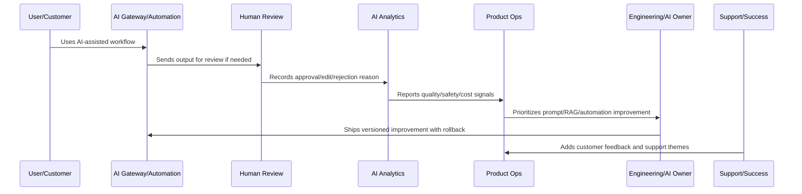

# AI Quality Metrics

> *"Defines AI quality metrics including approval rate, edit rate, rejection rate, safety block rate, hallucination reports, latency, cost, fallback, automation success, and customer impact."*

---

# Purpose

Defines AI quality metrics including approval rate, edit rate, rejection rate, safety block rate, hallucination reports, latency, cost, fallback, automation success, and customer impact.

---

# AI and Automation Problem

AI usage metrics alone are misleading because frequent AI use does not prove useful or safe outcomes.

---

# AI and Automation Decision

## Decision

CLARA AI metrics should measure usefulness, safety, reliability, cost, review burden, and customer workflow impact.

## Status

Accepted.

---

# AI Quality Rule

Every CLARA AI or automation improvement should connect:

```text
Signal -> Quality/Safety Classification -> Human Review Evidence -> Prompt/RAG/Automation Change -> Evaluation -> Rollout -> Monitoring -> Rollback Path -> Documentation
```

An AI or automation operation is not mature if it cannot answer:

```text
what quality or safety issue exists
what workflow/customer segment is affected
what human review evidence exists
what prompt/RAG/model/automation version is involved
what guardrail or fallback applies
how cost and latency are affected
how rollback works
how success will be validated
what customer/support communication is needed
```

---

# Recommended AI Improvement Flow



---

# Production-Ready Checklist

- [ ] AI quality signal is captured.
- [ ] Human review data is structured.
- [ ] Prompt/RAG version is identifiable.
- [ ] Safety guardrails are reviewed.
- [ ] Automation failure modes are known.
- [ ] Cost and latency are monitored.
- [ ] Rollback and kill switch exist.
- [ ] Customer trust/explainability is considered.
- [ ] Metrics validate improvement.
- [ ] Documentation and support guidance are updated.

---

# Acceptance Criteria

- [ ] AI quality is measurable.
- [ ] Automation failures are detectable.
- [ ] High-impact actions have guardrails.
- [ ] Prompt/RAG changes are versioned.
- [ ] Rollback paths exist.
- [ ] Cost and latency are controlled.
- [ ] Customer trust is preserved.
- [ ] AI coding assistants can apply this safely.

---

# Anti-patterns

Avoid:

- Automating before measuring.
- No human review for risky actions.
- Unversioned prompt changes.
- No RAG source quality review.
- Ignoring hallucination reports.
- Measuring AI only by usage volume.
- No kill switch.
- No rollback.
- Over-collecting sensitive data for AI context.
- Provider/model changes without evaluation.
- Cost increases hidden from product review.

---

# Related Documents

- ../../BOOK-04-Data-API-AI-and-Integration-Design/
- ../../BOOK-06-Security-Governance-and-Compliance/
- ../../BOOK-07-Operations-Observability-and-Reliability/
- ../../BOOK-08-Implementation-Delivery-and-Production-Launch/
- ../PART-06-Analytics-and-Product-Insights/README.md
- ../PART-09-Continuous-Reliability-and-Performance-Improvement/README.md

---

# Navigation

**Previous:** `117-AI-Incident-and-Rollback-Workflow.md`

**Next:** `119-AI-and-Automation-Anti-Patterns.md`

---

# Core AI Quality Metrics

Track:

```text
approval_rate
minor_edit_rate
major_edit_rate
rejection_rate
hallucination_report_rate
unsafe_output_rate
safety_block_rate
human_review_time
fallback_rate
model_error_rate
```

---

# Cost and Latency Metrics

Track:

```text
p50/p95/p99_ai_latency
tokens_per_request
cost_per_request
cost_per_customer
cost_per_successful_workflow
provider_error_rate
timeout_rate
retry_rate
```

---

# Automation Metrics

Track:

```text
automation_success_rate
automation_failure_rate
manual_override_rate
rollback_rate
false_positive_rate
false_negative_rate
customer_impact_count
```

---

# Metrics Rule

AI quality metrics should measure usefulness, safety, reliability, cost, and customer impact together.
