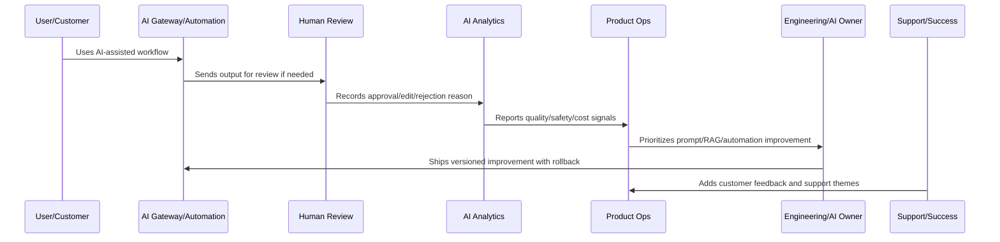

# AI and Automation Anti-Patterns

> *"Defines anti-patterns such as automating too early, no human review, unversioned prompts, no rollback, cost blindness, hallucination denial, and over-trusting model output."*

---

# Purpose

Defines anti-patterns such as automating too early, no human review, unversioned prompts, no rollback, cost blindness, hallucination denial, and over-trusting model output.

---

# AI and Automation Problem

AI anti-patterns often look like productivity improvements until a customer-impacting failure occurs.

---

# AI and Automation Decision

## Decision

CLARA should actively avoid AI and automation anti-patterns that create quality, safety, trust, cost, and operational risk.

## Status

Accepted.

---

# AI Quality Rule

Every CLARA AI or automation improvement should connect:

```text
Signal -> Quality/Safety Classification -> Human Review Evidence -> Prompt/RAG/Automation Change -> Evaluation -> Rollout -> Monitoring -> Rollback Path -> Documentation
```

An AI or automation operation is not mature if it cannot answer:

```text
what quality or safety issue exists
what workflow/customer segment is affected
what human review evidence exists
what prompt/RAG/model/automation version is involved
what guardrail or fallback applies
how cost and latency are affected
how rollback works
how success will be validated
what customer/support communication is needed
```

---

# Recommended AI Improvement Flow



---

# Production-Ready Checklist

- [ ] AI quality signal is captured.
- [ ] Human review data is structured.
- [ ] Prompt/RAG version is identifiable.
- [ ] Safety guardrails are reviewed.
- [ ] Automation failure modes are known.
- [ ] Cost and latency are monitored.
- [ ] Rollback and kill switch exist.
- [ ] Customer trust/explainability is considered.
- [ ] Metrics validate improvement.
- [ ] Documentation and support guidance are updated.

---

# Acceptance Criteria

- [ ] AI quality is measurable.
- [ ] Automation failures are detectable.
- [ ] High-impact actions have guardrails.
- [ ] Prompt/RAG changes are versioned.
- [ ] Rollback paths exist.
- [ ] Cost and latency are controlled.
- [ ] Customer trust is preserved.
- [ ] AI coding assistants can apply this safely.

---

# Anti-patterns

Avoid:

- Automating before measuring.
- No human review for risky actions.
- Unversioned prompt changes.
- No RAG source quality review.
- Ignoring hallucination reports.
- Measuring AI only by usage volume.
- No kill switch.
- No rollback.
- Over-collecting sensitive data for AI context.
- Provider/model changes without evaluation.
- Cost increases hidden from product review.

---

# Related Documents

- ../../BOOK-04-Data-API-AI-and-Integration-Design/
- ../../BOOK-06-Security-Governance-and-Compliance/
- ../../BOOK-07-Operations-Observability-and-Reliability/
- ../../BOOK-08-Implementation-Delivery-and-Production-Launch/
- ../PART-06-Analytics-and-Product-Insights/README.md
- ../PART-09-Continuous-Reliability-and-Performance-Improvement/README.md

---

# Navigation

**Previous:** `118-AI-Quality-Metrics.md`

**Next:** `120-Part-10-Summary.md`

---

# Common Anti-Patterns

Avoid:

```text
AI usage volume treated as success
no human review
unversioned prompts
no evaluation set
prompt changes directly in production
no rollback
no kill switch
ignoring hallucination reports
automating high-impact actions too early
RAG retrieval without permission checks
cost blindness
provider lock-in without fallback
```

---

# Warning Signs

Watch for:

```text
reviewers edit most AI outputs
support receives AI confusion complaints
AI costs grow faster than active customers
latency increases after prompt/context expansion
same rejection reason repeats
automation rollback happens manually
AI incident has no owner
```

---

# Recovery Actions

```text
pause automation expansion
create evaluation set
version prompts
add human review
add guardrail checks
reduce context size
add fallback path
define kill switch
review RAG permissions
create AI quality dashboard
```

---

# Anti-Pattern Rule

AI debt becomes customer trust debt when outputs are wrong, unsafe, expensive, or hard to control.
