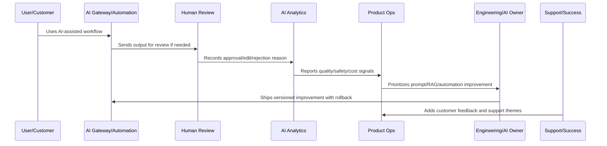

# Part 10 Summary

> *"Summarizes AI Quality and Automation Improvement and prepares for Book IX Part 11."*

---

# Purpose

Summarizes AI Quality and Automation Improvement and prepares for Book IX Part 11.

---

# AI and Automation Problem

Business Review and Operating Cadence comes next because AI, product, revenue, reliability, security, and customer outcomes must be reviewed together at leadership and operating cadence.

---

# AI and Automation Decision

## Decision

CLARA should proceed to Business Review and Operating Cadence after defining AI quality overview, feedback loop, human review analytics, prompt/RAG lifecycle, guardrail review, automation review, cost/latency optimization, trust/explainability, incident rollback, metrics, and anti-patterns.

## Status

Accepted.

---

# AI Quality Rule

Every CLARA AI or automation improvement should connect:

```text
Signal -> Quality/Safety Classification -> Human Review Evidence -> Prompt/RAG/Automation Change -> Evaluation -> Rollout -> Monitoring -> Rollback Path -> Documentation
```

An AI or automation operation is not mature if it cannot answer:

```text
what quality or safety issue exists
what workflow/customer segment is affected
what human review evidence exists
what prompt/RAG/model/automation version is involved
what guardrail or fallback applies
how cost and latency are affected
how rollback works
how success will be validated
what customer/support communication is needed
```

---

# Recommended AI Improvement Flow



---

# Production-Ready Checklist

- [ ] AI quality signal is captured.
- [ ] Human review data is structured.
- [ ] Prompt/RAG version is identifiable.
- [ ] Safety guardrails are reviewed.
- [ ] Automation failure modes are known.
- [ ] Cost and latency are monitored.
- [ ] Rollback and kill switch exist.
- [ ] Customer trust/explainability is considered.
- [ ] Metrics validate improvement.
- [ ] Documentation and support guidance are updated.

---

# Acceptance Criteria

- [ ] AI quality is measurable.
- [ ] Automation failures are detectable.
- [ ] High-impact actions have guardrails.
- [ ] Prompt/RAG changes are versioned.
- [ ] Rollback paths exist.
- [ ] Cost and latency are controlled.
- [ ] Customer trust is preserved.
- [ ] AI coding assistants can apply this safely.

---

# Anti-patterns

Avoid:

- Automating before measuring.
- No human review for risky actions.
- Unversioned prompt changes.
- No RAG source quality review.
- Ignoring hallucination reports.
- Measuring AI only by usage volume.
- No kill switch.
- No rollback.
- Over-collecting sensitive data for AI context.
- Provider/model changes without evaluation.
- Cost increases hidden from product review.

---

# Related Documents

- ../../BOOK-04-Data-API-AI-and-Integration-Design/
- ../../BOOK-06-Security-Governance-and-Compliance/
- ../../BOOK-07-Operations-Observability-and-Reliability/
- ../../BOOK-08-Implementation-Delivery-and-Production-Launch/
- ../PART-06-Analytics-and-Product-Insights/README.md
- ../PART-09-Continuous-Reliability-and-Performance-Improvement/README.md

---

# Navigation

**Previous:** `119-AI-and-Automation-Anti-Patterns.md`

**Next:** `../PART-11-Business-Review-and-Operating-Cadence/README.md`

---

# Part 10 Completion

Part 10 establishes:

- AI quality and automation improvement overview.
- AI quality feedback loop.
- Human review analytics.
- Prompt and RAG improvement lifecycle.
- AI safety and guardrail review.
- Automation success and failure review.
- Cost and latency optimization.
- AI customer trust and explainability.
- AI incident and rollback workflow.
- AI quality metrics.
- AI and automation anti-patterns.

---

# Ready for Part 11

The next part should be:

```text
BOOK IX — PART 11: Business Review and Operating Cadence
```

It should define:

- Business review and cadence overview.
- Weekly product operations review.
- Monthly business review.
- Quarterly strategy review.
- KPI and OKR review model.
- Cross-functional operating rhythm.
- Risk and trust review cadence.
- Customer and revenue review cadence.
- Decision and action tracking.
- Leadership reporting standards.
- Business review anti-patterns.
- Part 11 summary.
