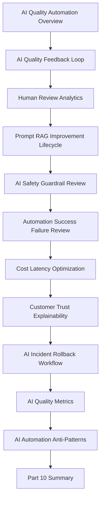

# PART-10 — AI Quality and Automation Improvement

> *"AI is not production-ready because it responds. AI is production-ready when its usefulness, safety, cost, latency, and failures are continuously measured and controlled."*

---

# Purpose

Part 10 defines CLARA's AI quality and automation improvement standards.

It covers:

- AI Quality and Automation Improvement Overview.
- AI Quality Feedback Loop.
- Human Review Analytics.
- Prompt and RAG Improvement Lifecycle.
- AI Safety and Guardrail Review.
- Automation Success and Failure Review.
- Cost and Latency Optimization.
- AI Customer Trust and Explainability.
- AI Incident and Rollback Workflow.
- AI Quality Metrics.
- AI and Automation Anti-Patterns.
- Part 10 Summary.

---

# Chapter Map

| Chapter | Title |
|---:|---|
| 109 | AI Quality and Automation Improvement Overview |
| 110 | AI Quality Feedback Loop |
| 111 | Human Review Analytics |
| 112 | Prompt and RAG Improvement Lifecycle |
| 113 | AI Safety and Guardrail Review |
| 114 | Automation Success and Failure Review |
| 115 | Cost and Latency Optimization |
| 116 | AI Customer Trust and Explainability |
| 117 | AI Incident and Rollback Workflow |
| 118 | AI Quality Metrics |
| 119 | AI and Automation Anti-Patterns |
| 120 | Part 10 Summary |

---

# AI Quality Improvement Map



---

# AI and Automation Non-Negotiables

CLARA AI and automation operations must enforce:

```text
human review for high-impact workflows
prompt and RAG versioning
quality feedback classification
AI safety guardrails
prompt injection awareness
sensitive data protection
automation rollback
kill switch/degraded mode
cost and latency monitoring
model/provider fallback strategy
AI quality metrics
customer-visible review/control where needed
support escalation path
post-incident improvement
```

---

# Relationship to Previous Part

Part 09 defines continuous reliability and performance improvement.

Part 10 applies continuous improvement specifically to AI and automation systems, which are high-impact product capabilities with quality, safety, reliability, cost, and trust dimensions.

---

# Navigation

**Previous:** `../PART-09-Continuous-Reliability-and-Performance-Improvement/108-Part-09-Summary.md`

**Next:** `109-AI-Quality-and-Automation-Improvement-Overview.md`
