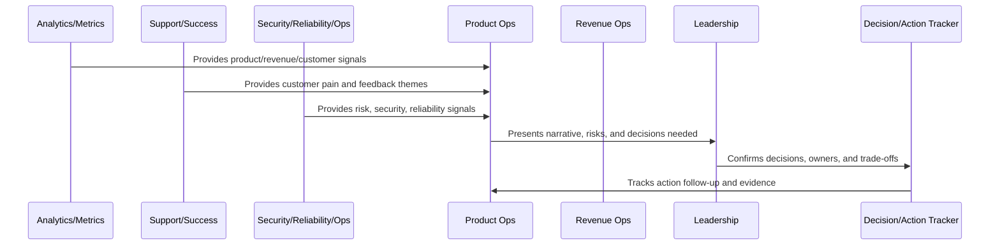

# Business Review and Operating Cadence Overview

> *"Introduces CLARA's business review and operating cadence model for aligning product, engineering, security, operations, support, customer success, growth, revenue, and leadership around evidence-based decisions."*

---

# Purpose

Introduces CLARA's business review and operating cadence model for aligning product, engineering, security, operations, support, customer success, growth, revenue, and leadership around evidence-based decisions.

---

# Operating Cadence Problem

A product can have strong documentation and strong telemetry but still drift if teams do not review evidence and make decisions on a consistent rhythm.

---

# Operating Cadence Decision

## Decision

CLARA should operate with a predictable business cadence that turns metrics, customer evidence, risks, roadmap decisions, and operational signals into owned actions.

## Status

Accepted.

---

# Business Review Rule

Every CLARA business review should connect:

```text
Operating Question -> Evidence -> Insight -> Decision -> Owner -> Action -> Follow-Up Review -> Documentation
```

A business review is not mature if it cannot answer:

```text
what question the review answers
what evidence was reviewed
what decision was made
who owns the next action
what deadline or review date exists
what risk remains unresolved
what customer or business impact exists
what was communicated and to whom
```

---

# Recommended Business Review Flow



---

# Production-Ready Checklist

- [ ] Review purpose is defined.
- [ ] Required metrics are available.
- [ ] Customer impact is visible.
- [ ] Revenue/business impact is visible.
- [ ] Trust/risk status is visible.
- [ ] Roadmap impact is visible.
- [ ] Decisions needed are explicit.
- [ ] Owners are assigned.
- [ ] Action items have deadlines.
- [ ] Follow-up review is scheduled.
- [ ] Summary/evidence is documented.

---

# Acceptance Criteria

- [ ] Business reviews create decisions.
- [ ] Risks are surfaced.
- [ ] Customer and revenue signals are connected.
- [ ] Cross-functional owners are aligned.
- [ ] Actions are tracked to closure.
- [ ] Leadership reports are decision-oriented.
- [ ] AI coding assistants can apply this safely.

---

# Anti-patterns

Avoid:

- Dashboard theater.
- Meetings with no decisions.
- Action items with no owner.
- Risk hidden to make reports look good.
- Cherry-picked metrics.
- Separate reviews that contradict each other.
- Leadership reports with no asks.
- Roadmap changes without documented decision.
- Customer health ignored in revenue review.
- Security/reliability ignored in business review.

---

# Related Documents

- ../PART-06-Analytics-and-Product-Insights/README.md
- ../PART-07-Feedback-Prioritization-and-Roadmap-Operations/README.md
- ../PART-08-Continuous-Security-and-Compliance-Operations/README.md
- ../PART-09-Continuous-Reliability-and-Performance-Improvement/README.md
- ../PART-10-AI-Quality-and-Automation-Improvement/README.md

---

# Navigation

**Previous:** `../PART-10-AI-Quality-and-Automation-Improvement/120-Part-10-Summary.md`

**Next:** `122-Weekly-Product-Operations-Review.md`

---

# Operating Cadence Scope

CLARA operating cadence covers:

```text
weekly product operations review
monthly business review
quarterly strategy review
KPI and OKR review
customer/revenue review
risk and trust review
roadmap review
AI quality review
reliability review
support/customer success review
decision and action tracking
leadership reporting
```

---

# Cadence Inputs

Use:

```text
product metrics
customer health
support themes
onboarding metrics
growth experiments
revenue/churn metrics
security/compliance posture
reliability/performance metrics
AI quality/cost metrics
roadmap progress
incident/action follow-up
```

---

# Guiding Question

```text
What decision should CLARA make now based on the latest evidence?
```
