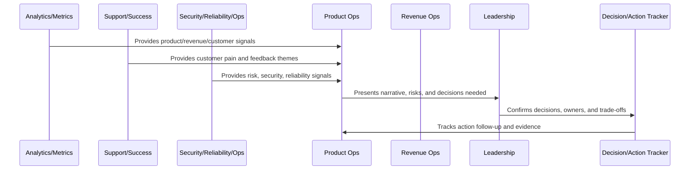
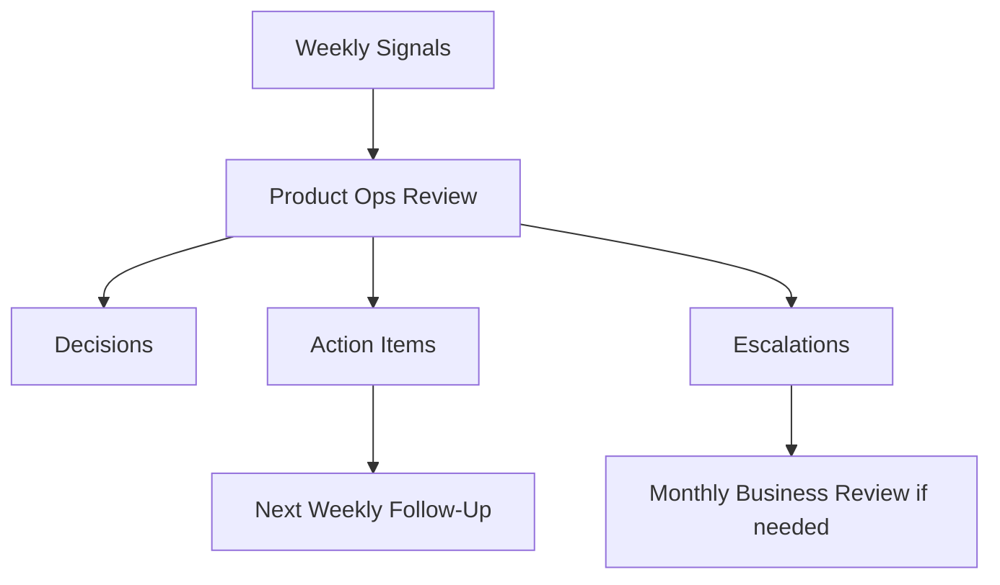

# Weekly Product Operations Review

> *"Defines the weekly product operations review for customer feedback, support themes, activation, reliability, AI quality, experiments, roadmap blockers, and action tracking."*

---

# Purpose

Defines the weekly product operations review for customer feedback, support themes, activation, reliability, AI quality, experiments, roadmap blockers, and action tracking.

---

# Operating Cadence Problem

Without weekly product review, customer issues and product risks can accumulate silently between larger business reviews.

---

# Operating Cadence Decision

## Decision

CLARA should run a weekly product operations review to detect product friction early and keep product, support, success, engineering, and operations aligned.

## Status

Accepted.

---

# Business Review Rule

Every CLARA business review should connect:

```text
Operating Question -> Evidence -> Insight -> Decision -> Owner -> Action -> Follow-Up Review -> Documentation
```

A business review is not mature if it cannot answer:

```text
what question the review answers
what evidence was reviewed
what decision was made
who owns the next action
what deadline or review date exists
what risk remains unresolved
what customer or business impact exists
what was communicated and to whom
```

---

# Recommended Business Review Flow



---

# Production-Ready Checklist

- [ ] Review purpose is defined.
- [ ] Required metrics are available.
- [ ] Customer impact is visible.
- [ ] Revenue/business impact is visible.
- [ ] Trust/risk status is visible.
- [ ] Roadmap impact is visible.
- [ ] Decisions needed are explicit.
- [ ] Owners are assigned.
- [ ] Action items have deadlines.
- [ ] Follow-up review is scheduled.
- [ ] Summary/evidence is documented.

---

# Acceptance Criteria

- [ ] Business reviews create decisions.
- [ ] Risks are surfaced.
- [ ] Customer and revenue signals are connected.
- [ ] Cross-functional owners are aligned.
- [ ] Actions are tracked to closure.
- [ ] Leadership reports are decision-oriented.
- [ ] AI coding assistants can apply this safely.

---

# Anti-patterns

Avoid:

- Dashboard theater.
- Meetings with no decisions.
- Action items with no owner.
- Risk hidden to make reports look good.
- Cherry-picked metrics.
- Separate reviews that contradict each other.
- Leadership reports with no asks.
- Roadmap changes without documented decision.
- Customer health ignored in revenue review.
- Security/reliability ignored in business review.

---

# Related Documents

- ../PART-06-Analytics-and-Product-Insights/README.md
- ../PART-07-Feedback-Prioritization-and-Roadmap-Operations/README.md
- ../PART-08-Continuous-Security-and-Compliance-Operations/README.md
- ../PART-09-Continuous-Reliability-and-Performance-Improvement/README.md
- ../PART-10-AI-Quality-and-Automation-Improvement/README.md

---

# Navigation

**Previous:** `121-Business-Review-and-Operating-Cadence-Overview.md`

**Next:** `123-Monthly-Business-Review.md`

---

# Weekly Review Agenda

Recommended agenda:

```text
activation and onboarding changes
top support themes
customer health changes
open known issues
roadmap blockers
active experiments
AI quality issues
reliability/performance issues
security/trust concerns
decisions needed
action item follow-up
```

---

# Weekly Review Output

Each weekly review should produce:

```text
decisions
owners
action items
customer risks
roadmap changes
support/docs updates
experiments to start/stop
issues to escalate
```

---

# Weekly Review Flow



---

# Weekly Rule

Weekly review should detect drift early before it becomes a business review surprise.
