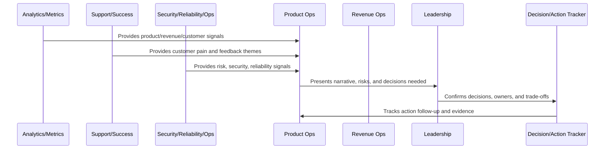
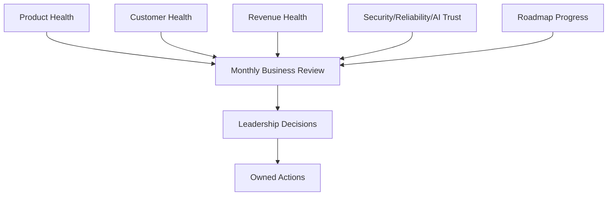

# Monthly Business Review

> *"Defines the monthly business review for product health, revenue, churn, growth, customer health, support, reliability, security, AI quality, and roadmap progress."*

---

# Purpose

Defines the monthly business review for product health, revenue, churn, growth, customer health, support, reliability, security, AI quality, and roadmap progress.

---

# Operating Cadence Problem

Monthly reviews fail when they only report numbers and do not create decisions, owners, and follow-up actions.

---

# Operating Cadence Decision

## Decision

CLARA should run a monthly business review that connects product outcomes, customer value, operational health, trust posture, and revenue performance.

## Status

Accepted.

---

# Business Review Rule

Every CLARA business review should connect:

```text
Operating Question -> Evidence -> Insight -> Decision -> Owner -> Action -> Follow-Up Review -> Documentation
```

A business review is not mature if it cannot answer:

```text
what question the review answers
what evidence was reviewed
what decision was made
who owns the next action
what deadline or review date exists
what risk remains unresolved
what customer or business impact exists
what was communicated and to whom
```

---

# Recommended Business Review Flow



---

# Production-Ready Checklist

- [ ] Review purpose is defined.
- [ ] Required metrics are available.
- [ ] Customer impact is visible.
- [ ] Revenue/business impact is visible.
- [ ] Trust/risk status is visible.
- [ ] Roadmap impact is visible.
- [ ] Decisions needed are explicit.
- [ ] Owners are assigned.
- [ ] Action items have deadlines.
- [ ] Follow-up review is scheduled.
- [ ] Summary/evidence is documented.

---

# Acceptance Criteria

- [ ] Business reviews create decisions.
- [ ] Risks are surfaced.
- [ ] Customer and revenue signals are connected.
- [ ] Cross-functional owners are aligned.
- [ ] Actions are tracked to closure.
- [ ] Leadership reports are decision-oriented.
- [ ] AI coding assistants can apply this safely.

---

# Anti-patterns

Avoid:

- Dashboard theater.
- Meetings with no decisions.
- Action items with no owner.
- Risk hidden to make reports look good.
- Cherry-picked metrics.
- Separate reviews that contradict each other.
- Leadership reports with no asks.
- Roadmap changes without documented decision.
- Customer health ignored in revenue review.
- Security/reliability ignored in business review.

---

# Related Documents

- ../PART-06-Analytics-and-Product-Insights/README.md
- ../PART-07-Feedback-Prioritization-and-Roadmap-Operations/README.md
- ../PART-08-Continuous-Security-and-Compliance-Operations/README.md
- ../PART-09-Continuous-Reliability-and-Performance-Improvement/README.md
- ../PART-10-AI-Quality-and-Automation-Improvement/README.md

---

# Navigation

**Previous:** `122-Weekly-Product-Operations-Review.md`

**Next:** `124-Quarterly-Strategy-Review.md`

---

# Monthly Review Agenda

Review:

```text
north star/product health
activation and retention
customer health and churn risk
revenue and monetization
support burden and quality
roadmap progress
growth experiment outcomes
security and compliance posture
reliability and performance posture
AI quality/cost posture
strategic risks and decisions
```

---

# Monthly Business Narrative

Each monthly review should explain:

```text
what changed
why it changed
what worked
what failed
what risk increased
what decision is needed
what investment is recommended
```

---

# Monthly Review Map



---

# Monthly Rule

Monthly review should connect product performance with customer value, trust posture, and revenue health.
