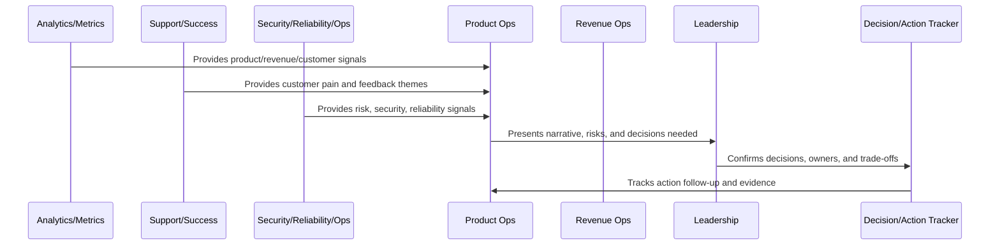
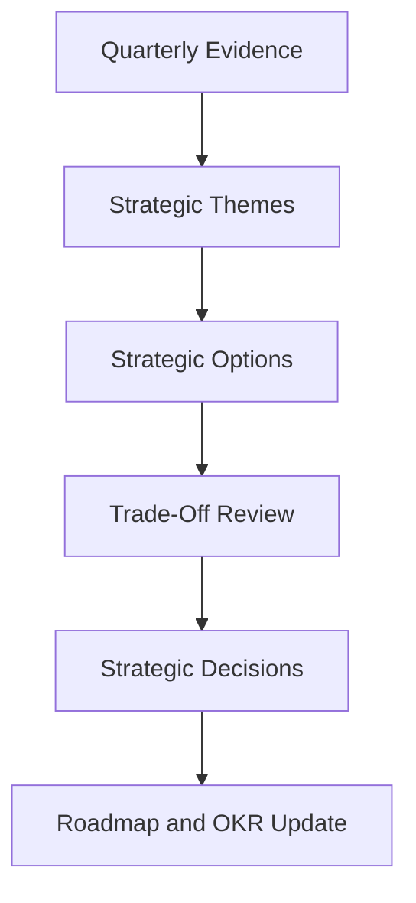

# Quarterly Strategy Review

> *"Defines quarterly strategy review for market direction, product bets, roadmap trade-offs, customer segments, monetization, trust investment, and operating model improvements."*

---

# Purpose

Defines quarterly strategy review for market direction, product bets, roadmap trade-offs, customer segments, monetization, trust investment, and operating model improvements.

---

# Operating Cadence Problem

Strategy becomes disconnected from reality when quarterly planning ignores product telemetry, customer feedback, support friction, and operational risk.

---

# Operating Cadence Decision

## Decision

CLARA should use quarterly strategy review to make larger product and business trade-offs based on accumulated evidence.

## Status

Accepted.

---

# Business Review Rule

Every CLARA business review should connect:

```text
Operating Question -> Evidence -> Insight -> Decision -> Owner -> Action -> Follow-Up Review -> Documentation
```

A business review is not mature if it cannot answer:

```text
what question the review answers
what evidence was reviewed
what decision was made
who owns the next action
what deadline or review date exists
what risk remains unresolved
what customer or business impact exists
what was communicated and to whom
```

---

# Recommended Business Review Flow



---

# Production-Ready Checklist

- [ ] Review purpose is defined.
- [ ] Required metrics are available.
- [ ] Customer impact is visible.
- [ ] Revenue/business impact is visible.
- [ ] Trust/risk status is visible.
- [ ] Roadmap impact is visible.
- [ ] Decisions needed are explicit.
- [ ] Owners are assigned.
- [ ] Action items have deadlines.
- [ ] Follow-up review is scheduled.
- [ ] Summary/evidence is documented.

---

# Acceptance Criteria

- [ ] Business reviews create decisions.
- [ ] Risks are surfaced.
- [ ] Customer and revenue signals are connected.
- [ ] Cross-functional owners are aligned.
- [ ] Actions are tracked to closure.
- [ ] Leadership reports are decision-oriented.
- [ ] AI coding assistants can apply this safely.

---

# Anti-patterns

Avoid:

- Dashboard theater.
- Meetings with no decisions.
- Action items with no owner.
- Risk hidden to make reports look good.
- Cherry-picked metrics.
- Separate reviews that contradict each other.
- Leadership reports with no asks.
- Roadmap changes without documented decision.
- Customer health ignored in revenue review.
- Security/reliability ignored in business review.

---

# Related Documents

- ../PART-06-Analytics-and-Product-Insights/README.md
- ../PART-07-Feedback-Prioritization-and-Roadmap-Operations/README.md
- ../PART-08-Continuous-Security-and-Compliance-Operations/README.md
- ../PART-09-Continuous-Reliability-and-Performance-Improvement/README.md
- ../PART-10-AI-Quality-and-Automation-Improvement/README.md

---

# Navigation

**Previous:** `123-Monthly-Business-Review.md`

**Next:** `125-KPI-and-OKR-Review-Model.md`

---

# Quarterly Review Topics

Review:

```text
market and customer segment learning
major product bets
roadmap themes
revenue model and packaging learning
customer success/churn patterns
security and compliance maturity
reliability investment needs
AI strategy and quality direction
organizational operating model
strategic risks
```

---

# Quarterly Decision Types

Decisions may include:

```text
double down
pivot
stop investment
increase trust/security investment
change packaging/pricing
focus a customer segment
change roadmap themes
expand or reduce AI automation
improve operating model
```

---

# Strategy Review Flow



---

# Quarterly Rule

Quarterly strategy should be grounded in operational evidence, not only ambition.
