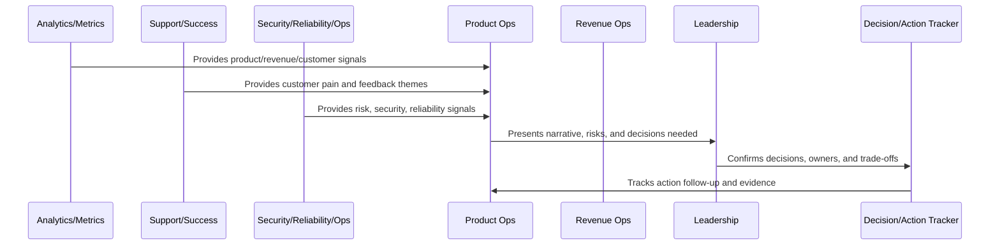

# KPI and OKR Review Model

> *"Defines KPI and OKR review standards, metric hierarchy, objective ownership, key result quality, review cadence, confidence scoring, and corrective actions."*

---

# Purpose

Defines KPI and OKR review standards, metric hierarchy, objective ownership, key result quality, review cadence, confidence scoring, and corrective actions.

---

# Operating Cadence Problem

OKRs become performative when they are not tied to actual decisions, trade-offs, or resource allocation.

---

# Operating Cadence Decision

## Decision

CLARA KPIs and OKRs should connect strategic goals with measurable product, customer, revenue, trust, and operational outcomes.

## Status

Accepted.

---

# Business Review Rule

Every CLARA business review should connect:

```text
Operating Question -> Evidence -> Insight -> Decision -> Owner -> Action -> Follow-Up Review -> Documentation
```

A business review is not mature if it cannot answer:

```text
what question the review answers
what evidence was reviewed
what decision was made
who owns the next action
what deadline or review date exists
what risk remains unresolved
what customer or business impact exists
what was communicated and to whom
```

---

# Recommended Business Review Flow



---

# Production-Ready Checklist

- [ ] Review purpose is defined.
- [ ] Required metrics are available.
- [ ] Customer impact is visible.
- [ ] Revenue/business impact is visible.
- [ ] Trust/risk status is visible.
- [ ] Roadmap impact is visible.
- [ ] Decisions needed are explicit.
- [ ] Owners are assigned.
- [ ] Action items have deadlines.
- [ ] Follow-up review is scheduled.
- [ ] Summary/evidence is documented.

---

# Acceptance Criteria

- [ ] Business reviews create decisions.
- [ ] Risks are surfaced.
- [ ] Customer and revenue signals are connected.
- [ ] Cross-functional owners are aligned.
- [ ] Actions are tracked to closure.
- [ ] Leadership reports are decision-oriented.
- [ ] AI coding assistants can apply this safely.

---

# Anti-patterns

Avoid:

- Dashboard theater.
- Meetings with no decisions.
- Action items with no owner.
- Risk hidden to make reports look good.
- Cherry-picked metrics.
- Separate reviews that contradict each other.
- Leadership reports with no asks.
- Roadmap changes without documented decision.
- Customer health ignored in revenue review.
- Security/reliability ignored in business review.

---

# Related Documents

- ../PART-06-Analytics-and-Product-Insights/README.md
- ../PART-07-Feedback-Prioritization-and-Roadmap-Operations/README.md
- ../PART-08-Continuous-Security-and-Compliance-Operations/README.md
- ../PART-09-Continuous-Reliability-and-Performance-Improvement/README.md
- ../PART-10-AI-Quality-and-Automation-Improvement/README.md

---

# Navigation

**Previous:** `124-Quarterly-Strategy-Review.md`

**Next:** `126-Cross-Functional-Operating-Rhythm.md`

---

# KPI Categories

Track KPIs for:

```text
activation
retention
customer health
support quality
growth
revenue
churn
security/trust
reliability/performance
AI quality/cost
roadmap delivery
```

---

# OKR Quality Checklist

An OKR should have:

```text
clear objective
measurable key results
owner
baseline
target
confidence
review cadence
dependencies
risks
decision impact
```

---

# OKR Review States

Use:

```text
on_track
at_risk
off_track
blocked
changed
completed
cancelled
```

---

# KPI/OKR Rule

KPIs show health. OKRs show intentional change. Do not confuse them.
