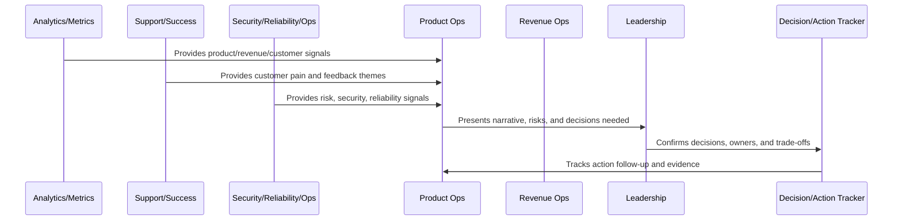
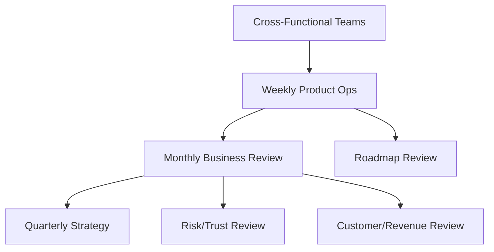

# Cross-Functional Operating Rhythm

> *"Defines the operating rhythm across product, engineering, security, operations, support, customer success, growth, analytics, revenue operations, and leadership."*

---

# Purpose

Defines the operating rhythm across product, engineering, security, operations, support, customer success, growth, analytics, revenue operations, and leadership.

---

# Operating Cadence Problem

Teams move in different directions when each function has its own cadence but no shared operating rhythm.

---

# Operating Cadence Decision

## Decision

CLARA should coordinate cross-functional operating rhythms so every team knows what to review, when to decide, and how to escalate.

## Status

Accepted.

---

# Business Review Rule

Every CLARA business review should connect:

```text
Operating Question -> Evidence -> Insight -> Decision -> Owner -> Action -> Follow-Up Review -> Documentation
```

A business review is not mature if it cannot answer:

```text
what question the review answers
what evidence was reviewed
what decision was made
who owns the next action
what deadline or review date exists
what risk remains unresolved
what customer or business impact exists
what was communicated and to whom
```

---

# Recommended Business Review Flow



---

# Production-Ready Checklist

- [ ] Review purpose is defined.
- [ ] Required metrics are available.
- [ ] Customer impact is visible.
- [ ] Revenue/business impact is visible.
- [ ] Trust/risk status is visible.
- [ ] Roadmap impact is visible.
- [ ] Decisions needed are explicit.
- [ ] Owners are assigned.
- [ ] Action items have deadlines.
- [ ] Follow-up review is scheduled.
- [ ] Summary/evidence is documented.

---

# Acceptance Criteria

- [ ] Business reviews create decisions.
- [ ] Risks are surfaced.
- [ ] Customer and revenue signals are connected.
- [ ] Cross-functional owners are aligned.
- [ ] Actions are tracked to closure.
- [ ] Leadership reports are decision-oriented.
- [ ] AI coding assistants can apply this safely.

---

# Anti-patterns

Avoid:

- Dashboard theater.
- Meetings with no decisions.
- Action items with no owner.
- Risk hidden to make reports look good.
- Cherry-picked metrics.
- Separate reviews that contradict each other.
- Leadership reports with no asks.
- Roadmap changes without documented decision.
- Customer health ignored in revenue review.
- Security/reliability ignored in business review.

---

# Related Documents

- ../PART-06-Analytics-and-Product-Insights/README.md
- ../PART-07-Feedback-Prioritization-and-Roadmap-Operations/README.md
- ../PART-08-Continuous-Security-and-Compliance-Operations/README.md
- ../PART-09-Continuous-Reliability-and-Performance-Improvement/README.md
- ../PART-10-AI-Quality-and-Automation-Improvement/README.md

---

# Navigation

**Previous:** `125-KPI-and-OKR-Review-Model.md`

**Next:** `127-Risk-and-Trust-Review-Cadence.md`

---

# Cross-Functional Cadence

Recommended rhythm:

```text
daily: incident/launch war room only when needed
weekly: product operations review
weekly/biweekly: roadmap/backlog review
monthly: business review
monthly: risk/trust review
monthly: customer/revenue review
quarterly: strategy review
post-incident: learning review
post-launch: validation/hardening review
```

---

# Functional Owners

Include:

```text
product
engineering
security
reliability/operations
support
customer success
analytics
growth
revenue operations
leadership
```

---

# Cadence Alignment Map



---

# Rhythm Rule

Each team can have local rituals, but product decisions need one shared operating rhythm.
