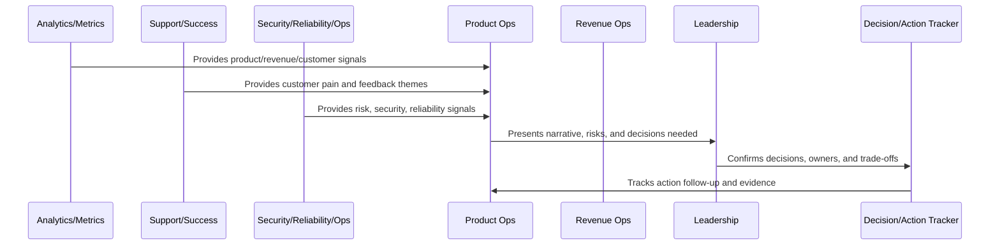
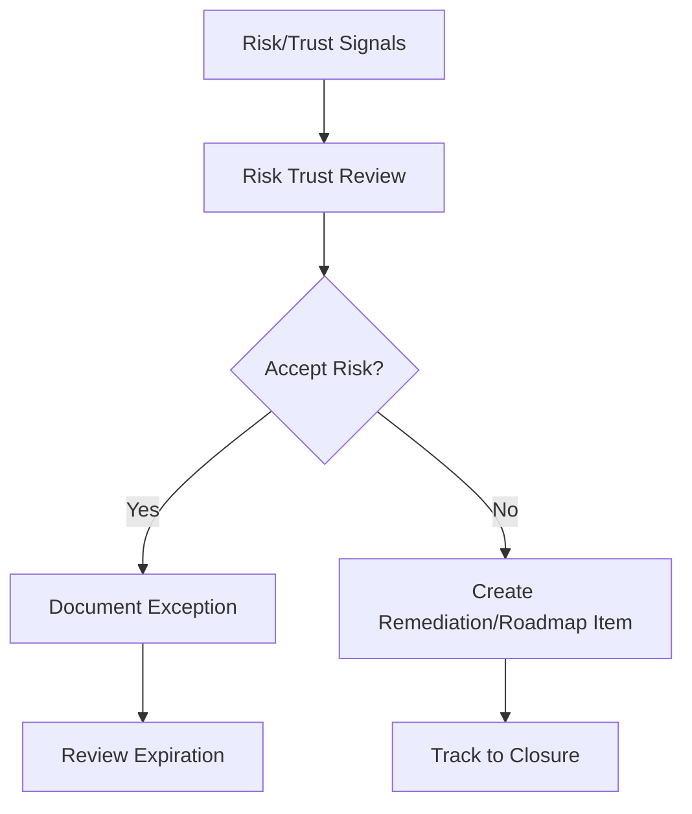

# Risk and Trust Review Cadence

> *"Defines recurring review for security risk, privacy risk, compliance posture, reliability risk, AI safety, data integrity, billing trust, and customer confidence."*

---

# Purpose

Defines recurring review for security risk, privacy risk, compliance posture, reliability risk, AI safety, data integrity, billing trust, and customer confidence.

---

# Operating Cadence Problem

Risk work is often deferred when it is not part of the normal business operating cadence.

---

# Operating Cadence Decision

## Decision

CLARA should review risk and trust on a recurring cadence so trust debt is visible before it becomes incident, audit, or churn risk.

## Status

Accepted.

---

# Business Review Rule

Every CLARA business review should connect:

```text
Operating Question -> Evidence -> Insight -> Decision -> Owner -> Action -> Follow-Up Review -> Documentation
```

A business review is not mature if it cannot answer:

```text
what question the review answers
what evidence was reviewed
what decision was made
who owns the next action
what deadline or review date exists
what risk remains unresolved
what customer or business impact exists
what was communicated and to whom
```

---

# Recommended Business Review Flow



---

# Production-Ready Checklist

- [ ] Review purpose is defined.
- [ ] Required metrics are available.
- [ ] Customer impact is visible.
- [ ] Revenue/business impact is visible.
- [ ] Trust/risk status is visible.
- [ ] Roadmap impact is visible.
- [ ] Decisions needed are explicit.
- [ ] Owners are assigned.
- [ ] Action items have deadlines.
- [ ] Follow-up review is scheduled.
- [ ] Summary/evidence is documented.

---

# Acceptance Criteria

- [ ] Business reviews create decisions.
- [ ] Risks are surfaced.
- [ ] Customer and revenue signals are connected.
- [ ] Cross-functional owners are aligned.
- [ ] Actions are tracked to closure.
- [ ] Leadership reports are decision-oriented.
- [ ] AI coding assistants can apply this safely.

---

# Anti-patterns

Avoid:

- Dashboard theater.
- Meetings with no decisions.
- Action items with no owner.
- Risk hidden to make reports look good.
- Cherry-picked metrics.
- Separate reviews that contradict each other.
- Leadership reports with no asks.
- Roadmap changes without documented decision.
- Customer health ignored in revenue review.
- Security/reliability ignored in business review.

---

# Related Documents

- ../PART-06-Analytics-and-Product-Insights/README.md
- ../PART-07-Feedback-Prioritization-and-Roadmap-Operations/README.md
- ../PART-08-Continuous-Security-and-Compliance-Operations/README.md
- ../PART-09-Continuous-Reliability-and-Performance-Improvement/README.md
- ../PART-10-AI-Quality-and-Automation-Improvement/README.md

---

# Navigation

**Previous:** `126-Cross-Functional-Operating-Rhythm.md`

**Next:** `128-Customer-and-Revenue-Review-Cadence.md`

---

# Risk and Trust Review Areas

Review:

```text
security vulnerabilities
access review status
privacy/data handling changes
compliance evidence gaps
reliability risk
incident follow-up
AI safety issues
billing trust issues
customer security requests
trust center freshness
```

---

# Trust Review Output

Produce:

```text
risk decisions
accepted exceptions
control improvements
roadmap items
customer communication needs
support knowledge updates
evidence updates
owner/deadline list
```

---

# Risk Review Flow



---

# Trust Rule

Risk decisions should be explicit, owned, and time-bound.
