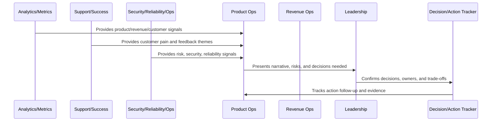
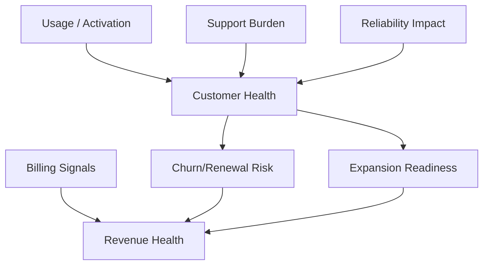

# Customer and Revenue Review Cadence

> *"Defines review cadence for customer health, onboarding, support burden, churn, expansion, renewal risk, trial conversion, billing friction, and revenue performance."*

---

# Purpose

Defines review cadence for customer health, onboarding, support burden, churn, expansion, renewal risk, trial conversion, billing friction, and revenue performance.

---

# Operating Cadence Problem

Revenue analysis is incomplete when separated from activation, support, product usage, reliability, and customer health.

---

# Operating Cadence Decision

## Decision

CLARA should review customer and revenue signals together because revenue health depends on customer value and trust.

## Status

Accepted.

---

# Business Review Rule

Every CLARA business review should connect:

```text
Operating Question -> Evidence -> Insight -> Decision -> Owner -> Action -> Follow-Up Review -> Documentation
```

A business review is not mature if it cannot answer:

```text
what question the review answers
what evidence was reviewed
what decision was made
who owns the next action
what deadline or review date exists
what risk remains unresolved
what customer or business impact exists
what was communicated and to whom
```

---

# Recommended Business Review Flow



---

# Production-Ready Checklist

- [ ] Review purpose is defined.
- [ ] Required metrics are available.
- [ ] Customer impact is visible.
- [ ] Revenue/business impact is visible.
- [ ] Trust/risk status is visible.
- [ ] Roadmap impact is visible.
- [ ] Decisions needed are explicit.
- [ ] Owners are assigned.
- [ ] Action items have deadlines.
- [ ] Follow-up review is scheduled.
- [ ] Summary/evidence is documented.

---

# Acceptance Criteria

- [ ] Business reviews create decisions.
- [ ] Risks are surfaced.
- [ ] Customer and revenue signals are connected.
- [ ] Cross-functional owners are aligned.
- [ ] Actions are tracked to closure.
- [ ] Leadership reports are decision-oriented.
- [ ] AI coding assistants can apply this safely.

---

# Anti-patterns

Avoid:

- Dashboard theater.
- Meetings with no decisions.
- Action items with no owner.
- Risk hidden to make reports look good.
- Cherry-picked metrics.
- Separate reviews that contradict each other.
- Leadership reports with no asks.
- Roadmap changes without documented decision.
- Customer health ignored in revenue review.
- Security/reliability ignored in business review.

---

# Related Documents

- ../PART-06-Analytics-and-Product-Insights/README.md
- ../PART-07-Feedback-Prioritization-and-Roadmap-Operations/README.md
- ../PART-08-Continuous-Security-and-Compliance-Operations/README.md
- ../PART-09-Continuous-Reliability-and-Performance-Improvement/README.md
- ../PART-10-AI-Quality-and-Automation-Improvement/README.md

---

# Navigation

**Previous:** `127-Risk-and-Trust-Review-Cadence.md`

**Next:** `129-Decision-and-Action-Tracking.md`

---

# Customer and Revenue Review Inputs

Review:

```text
customer health score
activation and retention
support burden
churn risk
renewal risk
expansion readiness
trial conversion
MRR/ARR movement
downgrades/upgrades
billing disputes
customer feedback themes
```

---

# Customer-Revenue Questions

Ask:

```text
Which customers are at risk and why?
Which segments are reaching value?
Which segments are struggling?
What support issues are driving churn risk?
What product usage predicts expansion?
What billing/pricing friction exists?
```

---

# Customer Revenue Map



---

# Customer-Revenue Rule

Revenue review should explain customer value, not only financial movement.
