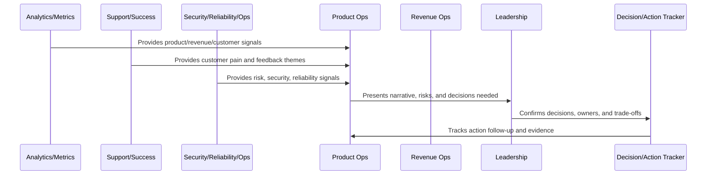
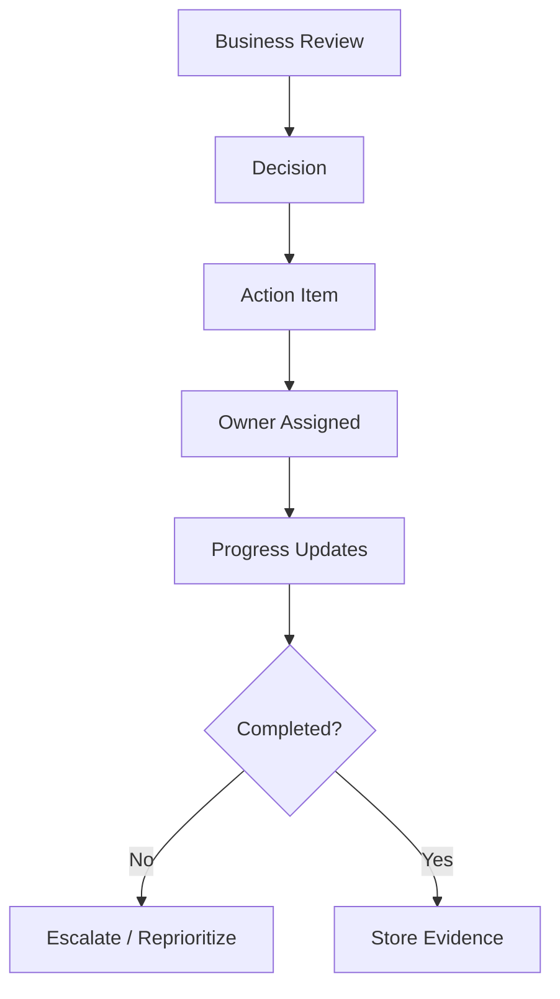

# Decision and Action Tracking

> *"Defines how business reviews create decisions, action items, owners, deadlines, evidence, follow-up checks, escalation, and closure discipline."*

---

# Purpose

Defines how business reviews create decisions, action items, owners, deadlines, evidence, follow-up checks, escalation, and closure discipline.

---

# Operating Cadence Problem

Meetings become expensive noise when decisions and action items are not tracked to completion.

---

# Operating Cadence Decision

## Decision

CLARA operating cadence should turn meetings into decisions and decisions into tracked actions.

## Status

Accepted.

---

# Business Review Rule

Every CLARA business review should connect:

```text
Operating Question -> Evidence -> Insight -> Decision -> Owner -> Action -> Follow-Up Review -> Documentation
```

A business review is not mature if it cannot answer:

```text
what question the review answers
what evidence was reviewed
what decision was made
who owns the next action
what deadline or review date exists
what risk remains unresolved
what customer or business impact exists
what was communicated and to whom
```

---

# Recommended Business Review Flow



---

# Production-Ready Checklist

- [ ] Review purpose is defined.
- [ ] Required metrics are available.
- [ ] Customer impact is visible.
- [ ] Revenue/business impact is visible.
- [ ] Trust/risk status is visible.
- [ ] Roadmap impact is visible.
- [ ] Decisions needed are explicit.
- [ ] Owners are assigned.
- [ ] Action items have deadlines.
- [ ] Follow-up review is scheduled.
- [ ] Summary/evidence is documented.

---

# Acceptance Criteria

- [ ] Business reviews create decisions.
- [ ] Risks are surfaced.
- [ ] Customer and revenue signals are connected.
- [ ] Cross-functional owners are aligned.
- [ ] Actions are tracked to closure.
- [ ] Leadership reports are decision-oriented.
- [ ] AI coding assistants can apply this safely.

---

# Anti-patterns

Avoid:

- Dashboard theater.
- Meetings with no decisions.
- Action items with no owner.
- Risk hidden to make reports look good.
- Cherry-picked metrics.
- Separate reviews that contradict each other.
- Leadership reports with no asks.
- Roadmap changes without documented decision.
- Customer health ignored in revenue review.
- Security/reliability ignored in business review.

---

# Related Documents

- ../PART-06-Analytics-and-Product-Insights/README.md
- ../PART-07-Feedback-Prioritization-and-Roadmap-Operations/README.md
- ../PART-08-Continuous-Security-and-Compliance-Operations/README.md
- ../PART-09-Continuous-Reliability-and-Performance-Improvement/README.md
- ../PART-10-AI-Quality-and-Automation-Improvement/README.md

---

# Navigation

**Previous:** `128-Customer-and-Revenue-Review-Cadence.md`

**Next:** `130-Leadership-Reporting-Standards.md`

---

# Action Item Requirements

Each action item should include:

```text
decision/context
owner
deadline
priority
success criteria
linked evidence
dependencies
status
next review date
```

---

# Decision Log Fields

Track:

```text
date
review forum
decision
owner
rationale
trade-offs
affected teams/customers
follow-up action
status
```

---

# Action Tracking Flow



---

# Tracking Rule

An action item without owner, deadline, and success criteria is not an action item.
