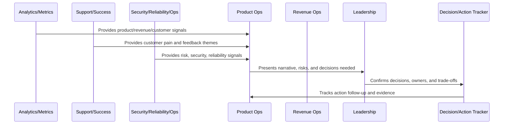

# Leadership Reporting Standards

> *"Defines reporting standards for leadership updates, executive summaries, metric narratives, risks, decisions needed, roadmap progress, and customer/business impact."*

---

# Purpose

Defines reporting standards for leadership updates, executive summaries, metric narratives, risks, decisions needed, roadmap progress, and customer/business impact.

---

# Operating Cadence Problem

Leadership reports lose value when they hide risk, overfit to positive metrics, or lack clear asks.

---

# Operating Cadence Decision

## Decision

CLARA leadership reporting should be concise, evidence-backed, decision-oriented, and honest about risks and uncertainty.

## Status

Accepted.

---

# Business Review Rule

Every CLARA business review should connect:

```text
Operating Question -> Evidence -> Insight -> Decision -> Owner -> Action -> Follow-Up Review -> Documentation
```

A business review is not mature if it cannot answer:

```text
what question the review answers
what evidence was reviewed
what decision was made
who owns the next action
what deadline or review date exists
what risk remains unresolved
what customer or business impact exists
what was communicated and to whom
```

---

# Recommended Business Review Flow



---

# Production-Ready Checklist

- [ ] Review purpose is defined.
- [ ] Required metrics are available.
- [ ] Customer impact is visible.
- [ ] Revenue/business impact is visible.
- [ ] Trust/risk status is visible.
- [ ] Roadmap impact is visible.
- [ ] Decisions needed are explicit.
- [ ] Owners are assigned.
- [ ] Action items have deadlines.
- [ ] Follow-up review is scheduled.
- [ ] Summary/evidence is documented.

---

# Acceptance Criteria

- [ ] Business reviews create decisions.
- [ ] Risks are surfaced.
- [ ] Customer and revenue signals are connected.
- [ ] Cross-functional owners are aligned.
- [ ] Actions are tracked to closure.
- [ ] Leadership reports are decision-oriented.
- [ ] AI coding assistants can apply this safely.

---

# Anti-patterns

Avoid:

- Dashboard theater.
- Meetings with no decisions.
- Action items with no owner.
- Risk hidden to make reports look good.
- Cherry-picked metrics.
- Separate reviews that contradict each other.
- Leadership reports with no asks.
- Roadmap changes without documented decision.
- Customer health ignored in revenue review.
- Security/reliability ignored in business review.

---

# Related Documents

- ../PART-06-Analytics-and-Product-Insights/README.md
- ../PART-07-Feedback-Prioritization-and-Roadmap-Operations/README.md
- ../PART-08-Continuous-Security-and-Compliance-Operations/README.md
- ../PART-09-Continuous-Reliability-and-Performance-Improvement/README.md
- ../PART-10-AI-Quality-and-Automation-Improvement/README.md

---

# Navigation

**Previous:** `129-Decision-and-Action-Tracking.md`

**Next:** `131-Business-Review-Anti-Patterns.md`

---

# Leadership Report Structure

Use:

```text
executive summary
key metrics
what changed
customer impact
revenue/business impact
risk/trust status
roadmap progress
decisions needed
blocked items
recommended actions
appendix/evidence links
```

---

# Reporting Principles

Leadership reports should be:

```text
concise
truthful
evidence-backed
decision-oriented
risk-transparent
customer-impact-aware
clear about uncertainty
clear about asks
```

---

# Decision Ask Template

```markdown
# Decision Needed

Decision:
Context:
Options:
Recommendation:
Customer impact:
Business impact:
Risk/trust impact:
Deadline:
Owner:
```

---

# Reporting Rule

A leadership report should make the next important decision easier.
