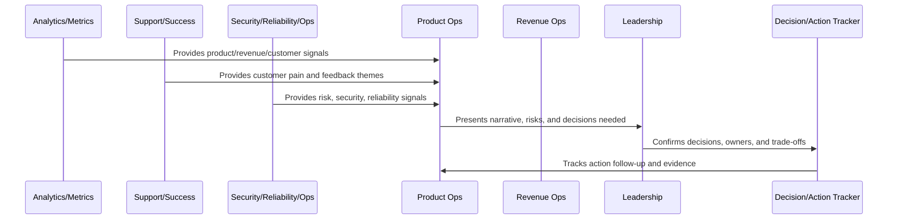

# Business Review Anti-Patterns

> *"Defines anti-patterns such as dashboard theater, meeting overload, no owners, metric cherry-picking, risk hiding, action decay, and reporting without decisions."*

---

# Purpose

Defines anti-patterns such as dashboard theater, meeting overload, no owners, metric cherry-picking, risk hiding, action decay, and reporting without decisions.

---

# Operating Cadence Problem

Operating cadence anti-patterns can make an organization feel busy while decisions, risks, and customer problems remain unresolved.

---

# Operating Cadence Decision

## Decision

CLARA should actively avoid business review anti-patterns that create motion without progress.

## Status

Accepted.

---

# Business Review Rule

Every CLARA business review should connect:

```text
Operating Question -> Evidence -> Insight -> Decision -> Owner -> Action -> Follow-Up Review -> Documentation
```

A business review is not mature if it cannot answer:

```text
what question the review answers
what evidence was reviewed
what decision was made
who owns the next action
what deadline or review date exists
what risk remains unresolved
what customer or business impact exists
what was communicated and to whom
```

---

# Recommended Business Review Flow



---

# Production-Ready Checklist

- [ ] Review purpose is defined.
- [ ] Required metrics are available.
- [ ] Customer impact is visible.
- [ ] Revenue/business impact is visible.
- [ ] Trust/risk status is visible.
- [ ] Roadmap impact is visible.
- [ ] Decisions needed are explicit.
- [ ] Owners are assigned.
- [ ] Action items have deadlines.
- [ ] Follow-up review is scheduled.
- [ ] Summary/evidence is documented.

---

# Acceptance Criteria

- [ ] Business reviews create decisions.
- [ ] Risks are surfaced.
- [ ] Customer and revenue signals are connected.
- [ ] Cross-functional owners are aligned.
- [ ] Actions are tracked to closure.
- [ ] Leadership reports are decision-oriented.
- [ ] AI coding assistants can apply this safely.

---

# Anti-patterns

Avoid:

- Dashboard theater.
- Meetings with no decisions.
- Action items with no owner.
- Risk hidden to make reports look good.
- Cherry-picked metrics.
- Separate reviews that contradict each other.
- Leadership reports with no asks.
- Roadmap changes without documented decision.
- Customer health ignored in revenue review.
- Security/reliability ignored in business review.

---

# Related Documents

- ../PART-06-Analytics-and-Product-Insights/README.md
- ../PART-07-Feedback-Prioritization-and-Roadmap-Operations/README.md
- ../PART-08-Continuous-Security-and-Compliance-Operations/README.md
- ../PART-09-Continuous-Reliability-and-Performance-Improvement/README.md
- ../PART-10-AI-Quality-and-Automation-Improvement/README.md

---

# Navigation

**Previous:** `130-Leadership-Reporting-Standards.md`

**Next:** `132-Part-11-Summary.md`

---

# Common Anti-Patterns

Avoid:

```text
dashboard theater
meeting overload
no decisions
no action owners
metric cherry-picking
risk hiding
reporting only positive metrics
action item decay
no follow-up review
too many disconnected cadences
leadership surprises
same decision repeated every month
```

---

# Warning Signs

Watch for:

```text
meetings end with vague alignment
action items repeat unchanged
teams use different metric definitions
risks surface only during incidents
roadmap changes without decision record
leadership asks basic context every review
dashboards grow but decisions do not improve
```

---

# Recovery Actions

```text
reduce meetings
clarify review purpose
define metric dictionary
assign decision owners
track actions visibly
create decision logs
surface risks earlier
connect reports to asks
review cadence effectiveness quarterly
```

---

# Anti-Pattern Rule

Operating cadence should reduce ambiguity, not create ceremonial overhead.
