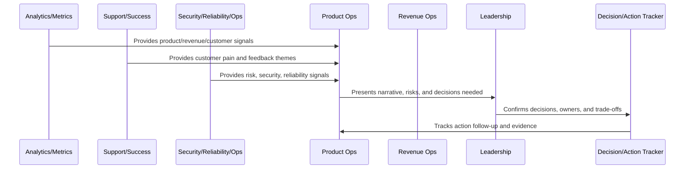

# Part 11 Summary

> *"Summarizes Business Review and Operating Cadence and prepares for Book IX Part 12."*

---

# Purpose

Summarizes Business Review and Operating Cadence and prepares for Book IX Part 12.

---

# Operating Cadence Problem

Product Operations Handover and Master Index comes next because Book IX needs a final handover, closure, and master navigation layer.

---

# Operating Cadence Decision

## Decision

CLARA should proceed to Product Operations Handover and Master Index after defining business review overview, weekly/monthly/quarterly cadence, KPI/OKR review, cross-functional rhythm, risk/trust review, customer/revenue review, action tracking, leadership reporting, and anti-patterns.

## Status

Accepted.

---

# Business Review Rule

Every CLARA business review should connect:

```text
Operating Question -> Evidence -> Insight -> Decision -> Owner -> Action -> Follow-Up Review -> Documentation
```

A business review is not mature if it cannot answer:

```text
what question the review answers
what evidence was reviewed
what decision was made
who owns the next action
what deadline or review date exists
what risk remains unresolved
what customer or business impact exists
what was communicated and to whom
```

---

# Recommended Business Review Flow



---

# Production-Ready Checklist

- [ ] Review purpose is defined.
- [ ] Required metrics are available.
- [ ] Customer impact is visible.
- [ ] Revenue/business impact is visible.
- [ ] Trust/risk status is visible.
- [ ] Roadmap impact is visible.
- [ ] Decisions needed are explicit.
- [ ] Owners are assigned.
- [ ] Action items have deadlines.
- [ ] Follow-up review is scheduled.
- [ ] Summary/evidence is documented.

---

# Acceptance Criteria

- [ ] Business reviews create decisions.
- [ ] Risks are surfaced.
- [ ] Customer and revenue signals are connected.
- [ ] Cross-functional owners are aligned.
- [ ] Actions are tracked to closure.
- [ ] Leadership reports are decision-oriented.
- [ ] AI coding assistants can apply this safely.

---

# Anti-patterns

Avoid:

- Dashboard theater.
- Meetings with no decisions.
- Action items with no owner.
- Risk hidden to make reports look good.
- Cherry-picked metrics.
- Separate reviews that contradict each other.
- Leadership reports with no asks.
- Roadmap changes without documented decision.
- Customer health ignored in revenue review.
- Security/reliability ignored in business review.

---

# Related Documents

- ../PART-06-Analytics-and-Product-Insights/README.md
- ../PART-07-Feedback-Prioritization-and-Roadmap-Operations/README.md
- ../PART-08-Continuous-Security-and-Compliance-Operations/README.md
- ../PART-09-Continuous-Reliability-and-Performance-Improvement/README.md
- ../PART-10-AI-Quality-and-Automation-Improvement/README.md

---

# Navigation

**Previous:** `131-Business-Review-Anti-Patterns.md`

**Next:** `../PART-12-Product-Operations-Handover-and-Master-Index/README.md`

---

# Part 11 Completion

Part 11 establishes:

- Business review and operating cadence overview.
- Weekly product operations review.
- Monthly business review.
- Quarterly strategy review.
- KPI and OKR review model.
- Cross-functional operating rhythm.
- Risk and trust review cadence.
- Customer and revenue review cadence.
- Decision and action tracking.
- Leadership reporting standards.
- Business review anti-patterns.

---

# Ready for Part 12

The next part should be:

```text
BOOK IX — PART 12: Product Operations Handover and Master Index
```

It should define:

- Product operations handover overview.
- Product operations readiness checklist.
- Customer operations handover.
- Support and knowledge loop handover.
- Growth and monetization handover.
- Analytics and roadmap handover.
- Security and reliability continuous ops handover.
- AI quality and automation handover.
- Business cadence handover.
- Book IX closure.
- Part 12 summary.
- Book IX master index preparation.
