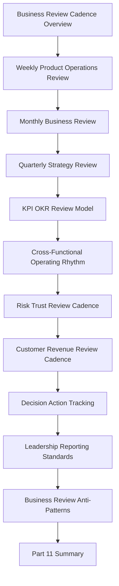

# PART-11 — Business Review and Operating Cadence

> *"Operating cadence is how CLARA turns signals into decisions, decisions into action, and action into continuous improvement."*

---

# Purpose

Part 11 defines CLARA's business review and operating cadence standards.

It covers:

- Business Review and Operating Cadence Overview.
- Weekly Product Operations Review.
- Monthly Business Review.
- Quarterly Strategy Review.
- KPI and OKR Review Model.
- Cross-Functional Operating Rhythm.
- Risk and Trust Review Cadence.
- Customer and Revenue Review Cadence.
- Decision and Action Tracking.
- Leadership Reporting Standards.
- Business Review Anti-Patterns.
- Part 11 Summary.

---

# Chapter Map

| Chapter | Title |
|---:|---|
| 121 | Business Review and Operating Cadence Overview |
| 122 | Weekly Product Operations Review |
| 123 | Monthly Business Review |
| 124 | Quarterly Strategy Review |
| 125 | KPI and OKR Review Model |
| 126 | Cross-Functional Operating Rhythm |
| 127 | Risk and Trust Review Cadence |
| 128 | Customer and Revenue Review Cadence |
| 129 | Decision and Action Tracking |
| 130 | Leadership Reporting Standards |
| 131 | Business Review Anti-Patterns |
| 132 | Part 11 Summary |

---

# Business Cadence Map



---

# Business Review Non-Negotiables

CLARA business review and operating cadence must enforce:

```text
evidence-based review
clear metric definitions
customer impact visibility
revenue and churn visibility
support and onboarding visibility
security and trust review
reliability and performance review
AI quality review
roadmap progress review
decision ownership
action item tracking
risk transparency
leadership reporting clarity
no meeting without decision or follow-up
```

---

# Relationship to Previous Part

Part 10 defines AI quality and automation improvement.

Part 11 defines the operating cadence that ties product, AI, security, reliability, customer, revenue, and roadmap decisions into one review system.

---

# Navigation

**Previous:** `../PART-10-AI-Quality-and-Automation-Improvement/120-Part-10-Summary.md`

**Next:** `121-Business-Review-and-Operating-Cadence-Overview.md`
