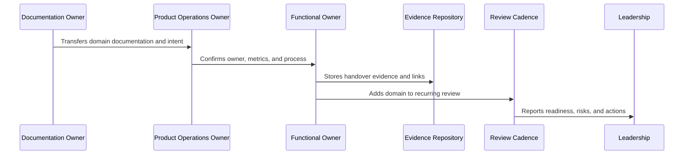

# Product Operations Handover and Master Index Overview

> *"Introduces CLARA's Book IX handover model for transferring product operations, growth, analytics, customer success, support, security, reliability, AI quality, monetization, and business cadence into an operating system."*

---

# Purpose

Introduces CLARA's Book IX handover model for transferring product operations, growth, analytics, customer success, support, security, reliability, AI quality, monetization, and business cadence into an operating system.

---

# Handover Problem

Product operations fail after documentation if there is no handover into actual ownership, cadence, and decision workflow.

---

# Handover Decision

## Decision

CLARA should close Book IX with an explicit handover package, readiness checklist, owner map, evidence map, cadence map, and master index preparation.

## Status

Accepted.

---

# Product Operations Handover Rule

Every CLARA product operations handover should connect:

```text
Domain -> Owner -> Cadence -> Metrics -> Evidence -> Escalation -> Roadmap Link -> Review Date
```

A handover is not mature if it cannot answer:

```text
who owns the domain
what process/cadence runs it
what metrics prove health
where evidence is stored
what escalation path exists
what roadmap/backlog link exists
what decisions are pending
what review date keeps it alive
```

---

# Recommended Handover Flow



---

# Production-Ready Checklist

- [ ] Owner is assigned.
- [ ] Cadence is defined.
- [ ] Metrics are defined.
- [ ] Evidence location is defined.
- [ ] Escalation path is defined.
- [ ] Related docs are linked.
- [ ] Open risks are listed.
- [ ] Action items are tracked.
- [ ] Review date is scheduled.
- [ ] AI coding assistant routing is clear.

---

# Acceptance Criteria

- [ ] Handover can be executed by a new team member.
- [ ] Product operations can continue after launch.
- [ ] Customer, support, growth, analytics, trust, reliability, AI, and cadence owners are visible.
- [ ] Book IX can be navigated from a master index.
- [ ] Decisions and evidence remain traceable.
- [ ] AI coding assistants can apply this safely.

---

# Anti-patterns

Avoid:

- Handover only as a meeting.
- No named owner.
- Metrics without review cadence.
- Cadence without decisions.
- Evidence scattered across chat.
- Roadmap items with no feedback link.
- Security/reliability/AI operations left outside product ops.
- Master index not created after final part.
- Documentation completed but not adopted.

---

# Related Documents

- ../PART-01-Product-Operations-Foundation/README.md
- ../PART-02-Customer-Onboarding-and-Success/README.md
- ../PART-03-Support-Operations-and-Knowledge-Loop/README.md
- ../PART-04-Growth-Experiments-and-Activation/README.md
- ../PART-05-Billing-Packaging-and-Monetization-Operations/README.md
- ../PART-06-Analytics-and-Product-Insights/README.md
- ../PART-07-Feedback-Prioritization-and-Roadmap-Operations/README.md
- ../PART-08-Continuous-Security-and-Compliance-Operations/README.md
- ../PART-09-Continuous-Reliability-and-Performance-Improvement/README.md
- ../PART-10-AI-Quality-and-Automation-Improvement/README.md
- ../PART-11-Business-Review-and-Operating-Cadence/README.md

---

# Navigation

**Previous:** `../PART-11-Business-Review-and-Operating-Cadence/132-Part-11-Summary.md`

**Next:** `134-Product-Operations-Readiness-Checklist.md`

---

# Handover Scope

Book IX handover covers:

```text
product operations foundation
customer onboarding and success
support operations and knowledge loop
growth experiments and activation
billing packaging monetization operations
analytics and product insights
feedback prioritization and roadmap operations
continuous security and compliance operations
continuous reliability and performance improvement
AI quality and automation improvement
business review and operating cadence
```

---

# Handover Outputs

The handover should produce:

```text
owner map
cadence map
metrics map
evidence map
risk map
decision/action tracker
roadmap/backlog linkage
support/customer communication linkage
master index
```

---

# Guiding Question

```text
Can CLARA's product operations continue safely and clearly after the documentation handoff?
```
