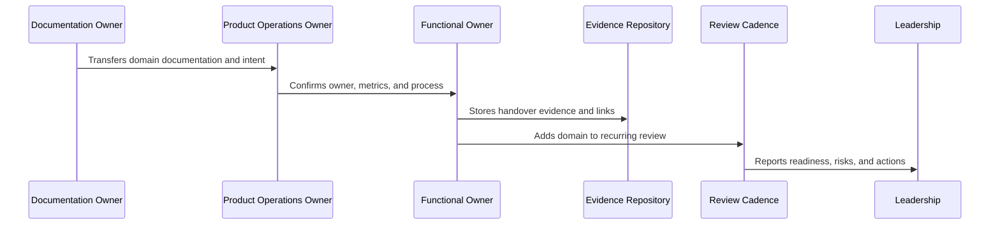
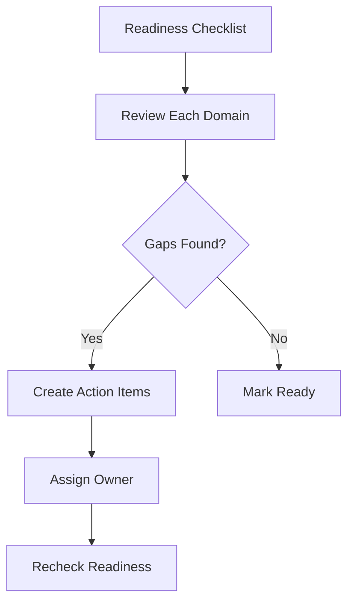

# Product Operations Readiness Checklist

> *"Defines the readiness checklist for CLARA product operations before teams rely on Book IX as the operating model."*

---

# Purpose

Defines the readiness checklist for CLARA product operations before teams rely on Book IX as the operating model.

---

# Handover Problem

A product operations system that is documented but not operationalized can create false confidence.

---

# Handover Decision

## Decision

CLARA product operations should be considered ready only when ownership, metrics, feedback loops, review cadence, support workflows, risk controls, and evidence locations are confirmed.

## Status

Accepted.

---

# Product Operations Handover Rule

Every CLARA product operations handover should connect:

```text
Domain -> Owner -> Cadence -> Metrics -> Evidence -> Escalation -> Roadmap Link -> Review Date
```

A handover is not mature if it cannot answer:

```text
who owns the domain
what process/cadence runs it
what metrics prove health
where evidence is stored
what escalation path exists
what roadmap/backlog link exists
what decisions are pending
what review date keeps it alive
```

---

# Recommended Handover Flow



---

# Production-Ready Checklist

- [ ] Owner is assigned.
- [ ] Cadence is defined.
- [ ] Metrics are defined.
- [ ] Evidence location is defined.
- [ ] Escalation path is defined.
- [ ] Related docs are linked.
- [ ] Open risks are listed.
- [ ] Action items are tracked.
- [ ] Review date is scheduled.
- [ ] AI coding assistant routing is clear.

---

# Acceptance Criteria

- [ ] Handover can be executed by a new team member.
- [ ] Product operations can continue after launch.
- [ ] Customer, support, growth, analytics, trust, reliability, AI, and cadence owners are visible.
- [ ] Book IX can be navigated from a master index.
- [ ] Decisions and evidence remain traceable.
- [ ] AI coding assistants can apply this safely.

---

# Anti-patterns

Avoid:

- Handover only as a meeting.
- No named owner.
- Metrics without review cadence.
- Cadence without decisions.
- Evidence scattered across chat.
- Roadmap items with no feedback link.
- Security/reliability/AI operations left outside product ops.
- Master index not created after final part.
- Documentation completed but not adopted.

---

# Related Documents

- ../PART-01-Product-Operations-Foundation/README.md
- ../PART-02-Customer-Onboarding-and-Success/README.md
- ../PART-03-Support-Operations-and-Knowledge-Loop/README.md
- ../PART-04-Growth-Experiments-and-Activation/README.md
- ../PART-05-Billing-Packaging-and-Monetization-Operations/README.md
- ../PART-06-Analytics-and-Product-Insights/README.md
- ../PART-07-Feedback-Prioritization-and-Roadmap-Operations/README.md
- ../PART-08-Continuous-Security-and-Compliance-Operations/README.md
- ../PART-09-Continuous-Reliability-and-Performance-Improvement/README.md
- ../PART-10-AI-Quality-and-Automation-Improvement/README.md
- ../PART-11-Business-Review-and-Operating-Cadence/README.md

---

# Navigation

**Previous:** `133-Product-Operations-Handover-and-Master-Index-Overview.md`

**Next:** `135-Customer-Operations-Handover.md`

---

# Readiness Checklist

Product operations is ready when:

```text
owners are assigned
weekly/monthly/quarterly cadence exists
customer lifecycle metrics are tracked
support taxonomy and escalation path exist
growth experiments have guardrails
billing and entitlement operations are documented
analytics events and metrics have owners
roadmap prioritization framework is accepted
security/compliance cadence is active
reliability/performance cadence is active
AI quality review is active
decision and action tracking exists
```

---

# Readiness States

Use:

```text
not_ready
partially_ready
ready_with_risks
ready
operating
needs_review
```

---

# Readiness Review Flow



---

# Readiness Rule

Do not declare product operations ready unless owners, cadence, metrics, and evidence are confirmed.
