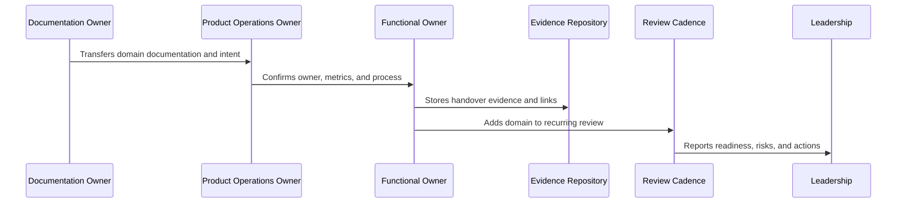

# Growth and Monetization Handover

> *"Defines handover for growth experiments, activation experiments, packaging, entitlements, pricing operations, billing lifecycle, revenue signals, and billing support."*

---

# Purpose

Defines handover for growth experiments, activation experiments, packaging, entitlements, pricing operations, billing lifecycle, revenue signals, and billing support.

---

# Handover Problem

Growth and monetization can damage trust if experiments, pricing, billing, and entitlement operations are not governed.

---

# Handover Decision

## Decision

CLARA growth and monetization handover should preserve ethical growth, trust guardrails, clear packaging, entitlement enforcement, and revenue/customer-value alignment.

## Status

Accepted.

---

# Product Operations Handover Rule

Every CLARA product operations handover should connect:

```text
Domain -> Owner -> Cadence -> Metrics -> Evidence -> Escalation -> Roadmap Link -> Review Date
```

A handover is not mature if it cannot answer:

```text
who owns the domain
what process/cadence runs it
what metrics prove health
where evidence is stored
what escalation path exists
what roadmap/backlog link exists
what decisions are pending
what review date keeps it alive
```

---

# Recommended Handover Flow



---

# Production-Ready Checklist

- [ ] Owner is assigned.
- [ ] Cadence is defined.
- [ ] Metrics are defined.
- [ ] Evidence location is defined.
- [ ] Escalation path is defined.
- [ ] Related docs are linked.
- [ ] Open risks are listed.
- [ ] Action items are tracked.
- [ ] Review date is scheduled.
- [ ] AI coding assistant routing is clear.

---

# Acceptance Criteria

- [ ] Handover can be executed by a new team member.
- [ ] Product operations can continue after launch.
- [ ] Customer, support, growth, analytics, trust, reliability, AI, and cadence owners are visible.
- [ ] Book IX can be navigated from a master index.
- [ ] Decisions and evidence remain traceable.
- [ ] AI coding assistants can apply this safely.

---

# Anti-patterns

Avoid:

- Handover only as a meeting.
- No named owner.
- Metrics without review cadence.
- Cadence without decisions.
- Evidence scattered across chat.
- Roadmap items with no feedback link.
- Security/reliability/AI operations left outside product ops.
- Master index not created after final part.
- Documentation completed but not adopted.

---

# Related Documents

- ../PART-01-Product-Operations-Foundation/README.md
- ../PART-02-Customer-Onboarding-and-Success/README.md
- ../PART-03-Support-Operations-and-Knowledge-Loop/README.md
- ../PART-04-Growth-Experiments-and-Activation/README.md
- ../PART-05-Billing-Packaging-and-Monetization-Operations/README.md
- ../PART-06-Analytics-and-Product-Insights/README.md
- ../PART-07-Feedback-Prioritization-and-Roadmap-Operations/README.md
- ../PART-08-Continuous-Security-and-Compliance-Operations/README.md
- ../PART-09-Continuous-Reliability-and-Performance-Improvement/README.md
- ../PART-10-AI-Quality-and-Automation-Improvement/README.md
- ../PART-11-Business-Review-and-Operating-Cadence/README.md

---

# Navigation

**Previous:** `136-Support-and-Knowledge-Loop-Handover.md`

**Next:** `138-Analytics-and-Roadmap-Handover.md`

---

# Growth Handover Areas

Handover:

```text
activation growth model
experiment hypothesis template
segmentation rules
experiment guardrails
funnel instrumentation
A/B and cohort analysis
growth experiment review
growth risk management
experiment-to-roadmap loop
```

---

# Monetization Handover Areas

Handover:

```text
packaging strategy
plan and entitlement model
pricing operations
trial and conversion monetization
billing lifecycle operations
invoice and payment operations
entitlement enforcement
revenue/churn signals
billing support workflow
```

---

# Growth/Monetization Checklist

- [ ] Growth experiments require guardrails.
- [ ] Experiment review cadence exists.
- [ ] Pricing changes require approval.
- [ ] Entitlements are server-side enforced.
- [ ] Billing support has safe evidence access.
- [ ] Revenue metrics connect to product usage.
- [ ] Dark patterns are explicitly rejected.

---

# Growth Monetization Rule

Growth and monetization handover must protect customer trust while improving activation and revenue.
