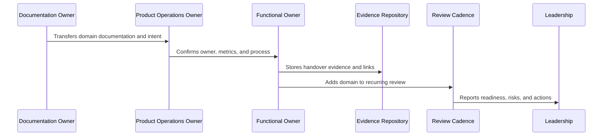

# Security and Reliability Continuous Ops Handover

> *"Defines handover for continuous security, compliance, privacy, access review, vulnerability cadence, reliability, SLOs, performance review, capacity, and incident-to-roadmap improvement."*

---

# Purpose

Defines handover for continuous security, compliance, privacy, access review, vulnerability cadence, reliability, SLOs, performance review, capacity, and incident-to-roadmap improvement.

---

# Handover Problem

Security, compliance, reliability, and performance debt grows quietly when review cadence and owners are unclear.

---

# Handover Decision

## Decision

CLARA security and reliability handover should make trust controls and reliability improvements continuous operating practices, not one-time launch checklists.

## Status

Accepted.

---

# Product Operations Handover Rule

Every CLARA product operations handover should connect:

```text
Domain -> Owner -> Cadence -> Metrics -> Evidence -> Escalation -> Roadmap Link -> Review Date
```

A handover is not mature if it cannot answer:

```text
who owns the domain
what process/cadence runs it
what metrics prove health
where evidence is stored
what escalation path exists
what roadmap/backlog link exists
what decisions are pending
what review date keeps it alive
```

---

# Recommended Handover Flow



---

# Production-Ready Checklist

- [ ] Owner is assigned.
- [ ] Cadence is defined.
- [ ] Metrics are defined.
- [ ] Evidence location is defined.
- [ ] Escalation path is defined.
- [ ] Related docs are linked.
- [ ] Open risks are listed.
- [ ] Action items are tracked.
- [ ] Review date is scheduled.
- [ ] AI coding assistant routing is clear.

---

# Acceptance Criteria

- [ ] Handover can be executed by a new team member.
- [ ] Product operations can continue after launch.
- [ ] Customer, support, growth, analytics, trust, reliability, AI, and cadence owners are visible.
- [ ] Book IX can be navigated from a master index.
- [ ] Decisions and evidence remain traceable.
- [ ] AI coding assistants can apply this safely.

---

# Anti-patterns

Avoid:

- Handover only as a meeting.
- No named owner.
- Metrics without review cadence.
- Cadence without decisions.
- Evidence scattered across chat.
- Roadmap items with no feedback link.
- Security/reliability/AI operations left outside product ops.
- Master index not created after final part.
- Documentation completed but not adopted.

---

# Related Documents

- ../PART-01-Product-Operations-Foundation/README.md
- ../PART-02-Customer-Onboarding-and-Success/README.md
- ../PART-03-Support-Operations-and-Knowledge-Loop/README.md
- ../PART-04-Growth-Experiments-and-Activation/README.md
- ../PART-05-Billing-Packaging-and-Monetization-Operations/README.md
- ../PART-06-Analytics-and-Product-Insights/README.md
- ../PART-07-Feedback-Prioritization-and-Roadmap-Operations/README.md
- ../PART-08-Continuous-Security-and-Compliance-Operations/README.md
- ../PART-09-Continuous-Reliability-and-Performance-Improvement/README.md
- ../PART-10-AI-Quality-and-Automation-Improvement/README.md
- ../PART-11-Business-Review-and-Operating-Cadence/README.md

---

# Navigation

**Previous:** `138-Analytics-and-Roadmap-Handover.md`

**Next:** `140-AI-Quality-and-Automation-Handover.md`

---

# Security Handover Areas

Handover:

```text
product security feedback loop
continuous access review
vulnerability and patch cadence
privacy and data handling review
compliance evidence operations
security customer communication
security roadmap prioritization
trust center content operations
security/compliance metrics
```

---

# Reliability Handover Areas

Handover:

```text
reliability feedback loop
SLO and error budget review
performance review cadence
capacity/scaling review
incident-to-roadmap improvement
customer-impact reliability analytics
integration/AI reliability improvement
reliability communication standards
reliability/performance metrics
```

---

# Trust/Reliability Checklist

- [ ] Access review cadence exists.
- [ ] Vulnerability owner and cadence exist.
- [ ] Privacy review path exists.
- [ ] Compliance evidence location is known.
- [ ] SLO review cadence exists.
- [ ] Incident action tracking exists.
- [ ] Capacity review cadence exists.
- [ ] Reliability communication owner is assigned.

---

# Security Reliability Rule

Trust and reliability work must be visible in product operations, not hidden as technical maintenance.
