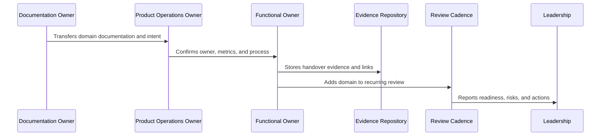

# AI Quality and Automation Handover

> *"Defines handover for AI quality feedback, human review analytics, prompt/RAG lifecycle, safety guardrails, automation review, cost/latency, explainability, incident rollback, and AI metrics."*

---

# Purpose

Defines handover for AI quality feedback, human review analytics, prompt/RAG lifecycle, safety guardrails, automation review, cost/latency, explainability, incident rollback, and AI metrics.

---

# Handover Problem

AI quality and automation risks can scale quickly when no one owns review, metrics, rollback, and guardrail improvement.

---

# Handover Decision

## Decision

CLARA AI handover should ensure AI and automation remain measurable, safe, explainable, reversible, and continuously improved.

## Status

Accepted.

---

# Product Operations Handover Rule

Every CLARA product operations handover should connect:

```text
Domain -> Owner -> Cadence -> Metrics -> Evidence -> Escalation -> Roadmap Link -> Review Date
```

A handover is not mature if it cannot answer:

```text
who owns the domain
what process/cadence runs it
what metrics prove health
where evidence is stored
what escalation path exists
what roadmap/backlog link exists
what decisions are pending
what review date keeps it alive
```

---

# Recommended Handover Flow



---

# Production-Ready Checklist

- [ ] Owner is assigned.
- [ ] Cadence is defined.
- [ ] Metrics are defined.
- [ ] Evidence location is defined.
- [ ] Escalation path is defined.
- [ ] Related docs are linked.
- [ ] Open risks are listed.
- [ ] Action items are tracked.
- [ ] Review date is scheduled.
- [ ] AI coding assistant routing is clear.

---

# Acceptance Criteria

- [ ] Handover can be executed by a new team member.
- [ ] Product operations can continue after launch.
- [ ] Customer, support, growth, analytics, trust, reliability, AI, and cadence owners are visible.
- [ ] Book IX can be navigated from a master index.
- [ ] Decisions and evidence remain traceable.
- [ ] AI coding assistants can apply this safely.

---

# Anti-patterns

Avoid:

- Handover only as a meeting.
- No named owner.
- Metrics without review cadence.
- Cadence without decisions.
- Evidence scattered across chat.
- Roadmap items with no feedback link.
- Security/reliability/AI operations left outside product ops.
- Master index not created after final part.
- Documentation completed but not adopted.

---

# Related Documents

- ../PART-01-Product-Operations-Foundation/README.md
- ../PART-02-Customer-Onboarding-and-Success/README.md
- ../PART-03-Support-Operations-and-Knowledge-Loop/README.md
- ../PART-04-Growth-Experiments-and-Activation/README.md
- ../PART-05-Billing-Packaging-and-Monetization-Operations/README.md
- ../PART-06-Analytics-and-Product-Insights/README.md
- ../PART-07-Feedback-Prioritization-and-Roadmap-Operations/README.md
- ../PART-08-Continuous-Security-and-Compliance-Operations/README.md
- ../PART-09-Continuous-Reliability-and-Performance-Improvement/README.md
- ../PART-10-AI-Quality-and-Automation-Improvement/README.md
- ../PART-11-Business-Review-and-Operating-Cadence/README.md

---

# Navigation

**Previous:** `139-Security-and-Reliability-Continuous-Ops-Handover.md`

**Next:** `141-Business-Cadence-Handover.md`

---

# AI Handover Areas

Handover:

```text
AI quality feedback loop
human review analytics
prompt and RAG improvement lifecycle
AI safety and guardrail review
automation success and failure review
cost and latency optimization
AI customer trust and explainability
AI incident and rollback workflow
AI quality metrics
AI/automation anti-patterns
```

---

# AI Owner Map

Recommended owners:

```text
AI product owner
AI engineering owner
security/AI safety owner
analytics owner
support/customer success owner
operations/reliability owner
billing/cost owner where relevant
```

---

# AI Handover Checklist

- [ ] AI quality metrics exist.
- [ ] Human review outcomes are structured.
- [ ] Prompts/RAG changes are versioned.
- [ ] Guardrails have owner and review cadence.
- [ ] Automation rollback exists.
- [ ] Kill switch/degraded mode exists.
- [ ] Cost and latency are monitored.
- [ ] AI incidents have response workflow.

---

# AI Handover Rule

AI is not handed over until quality, safety, cost, rollback, and customer trust are owned.
